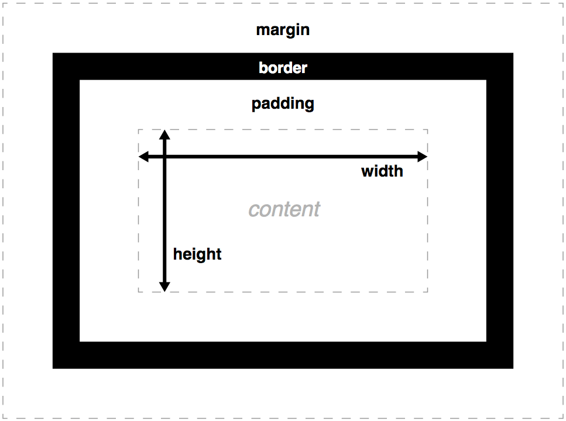
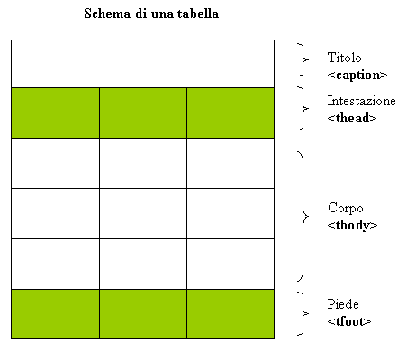

## Cos'è HTML

HTML (HyperText Markup Language) è un linguaggio di marcatura (markup, *annotazione*) di documenti ipertestuali. 

- descrive la **struttura** di una pagina web e i collegamenti tra altre pagine

- definisce un **insieme di elementi** (titoli, paragrafi di testo, liste, tabelle, immagini, ...)

## HTML, CSS e JavaScript

HTML, CSS e JavaScript sono i tre linguaggi fondamentali per lo sviluppo web. HTML fornisce la struttura del contenuto, CSS definisce la presentazione e JavaScript aggiunge interattività.

## Struttura minima di una pagina

Ogni tipo di documento ha una sua **struttura** che ne caratterizza il **genere**.

La struttura descrive:

- **parti** che compongono il documento
- **significato** di ogni parte
- **relazioni** tra le parti

### Elementi

Ogni elemento è un **contenitore** di informazioni, identificato da un **tag di apertura** e un **tag di chiusura**. Il contenuto dell’elemento è racchiuso tra i due tag.

#### Tag di apertura e chiusura

è una stringa di caratteri racchiusa tra parentesi angolari `<`e `>`.

Tag di apertura
: Stringa che specifica il nome dell'elemento `<nome_elemento>`

Tag di chiusura
: Stringa che specifica il nome dell'elemento preceduta da una barra `/` `</nome_elemento>`

Tag elementi vuoti
: sono costituiti da un unico tag `<nome_elemento_vuoto>`.
Esempio: `<br>`, ``, `<hr>`

Elemento
: composto da tag di apertura, contenuto e tag di chiusura `<nome_elemento>contenuto</nome_elemento>`

```html
<p>Questo è un paragrafo.</p>
```

### Attributi

Servono a descrivere una **proprietà** dell'elemento.

Sono composti:

- **nome**: il nome dell'attributo
- **valore**: il valore dell'attributo, racchiuso tra virgolette `" "` o apostrofi `' '` e assegnato al nome tramite il simbolo `=`

Sono inseriti nel tag di apertura dopo il nome

Esempio:

```html
<p lang="en-us">My cat is very grumpy</p>
````

### Annidamento di elementi

Un elemento può contenere altri elementi

```html
<p lang="en-us">Paragrah <br> in english</p>
```

Che risulta in:

```{=html}
<p lang="en-us">Paragrah <br> in english</p>
```

### Regole di scrittura

#### Commentare

Si usa il blocco di commento `<!-- ... -->` per inserire note nel codice che non vengono visualizzate nella pagina web.

```html
<!-- Questo è un commento -->
```

#### Regole

- tag vuoto può avere uno slash di chiusura `<br />` ma non è obbligatorio
- tag e attributi non sono **case sensitive** (ma è buona norma scriverli in minuscolo)
- per gli attributi booleani (true/false) è sufficiente scrivere il nome dell'attributo senza assegnargli un valore
- il valore di un attributo può essere racchiuso tra virgolette doppie `" "` o singole `' '` o senza virgolette (ma è buona norma usare le virgolette)

## Struttura minima di una pagina HTML

### Dichiarazione del tipo di documento &lt;!DOCTYPE html&gt;

Dichiarazione del DTD (Document Type Definition), in html5 è

```html
<!DOCTYPE html>
```

Oggigiorno serve a mettere il browser in **no-quirks mode**, ovvero a farlo comportare come un browser moderno, evitando di interpretare il codice come se fosse scritto in una versione precedente di HTML.

Posso anche riferirmi a un DTD diverso, in particolare a una versione precedente di HTML. 

### Struttura generica

Un documento HTML5 è composto da:

- **dichiarazione del tipo di documento** `<!DOCTYPE html>`
- **elemento radice** `<html>` che racchiude tutto il contenuto della pagina

L'elemento radice `<html>` contiene due elementi principali:

- **head** `<head>` contiene informazioni sul documento (metadati) non visualizzati
- **body** `<body>` contiene la specifica della struttura dei contenuti visualizzati della pagina (testi, immagini ...)


```html
<!DOCTYPE html>
<html>
    <head>
    ...
    </head>
    <body>
    ...
    </body>
</html>
```

## Head

### Metadati

Informazioni che descrivono il documento nel complesso

Introdotti mediante il tag `<meta>` all'interno del tag `<head>`. Possono essere utilizzati per:

- specificare la **codifica dei caratteri** del documento
- fornire **informazioni sul documento** (autore, descrizione, parole chiave)

### Titolo della pagina &lt;title&gt;

Il titolo della pagina è specificato mediante il tag `<title>` all'interno del tag `<head>`. Il contenuto del tag `<title>` viene visualizzato nella barra del titolo del browser e nei risultati dei motori di ricerca.

::: {.callout-tip}

### Esempi di metadati in head

```html
<head>
    <title>Titolo</title>
    <meta charset="UTF-8">
    <meta name="description" content="Descrizione della pagina">
    <meta name="keywords" content="parola1, parola2, parola3">
    <meta name="author" content="Nome Autore">
    <meta name="viewport" content="width=device-width, initial-scale=1.0">
    <meta http-equiv="refresh" content="30">
</head> 
```

:::

### Elemento style &lt;style&gt;

`<style>...</style>`utilizzato per definire i fogli di stile interni al documento

Va incluso nell'head della pagina

Generalmente oggi si usa un foglio di stile utilizzando l'elemento &lt;link&gt; nell'intestazione

## Body

### Inserimento e formattazione base del testo

### Headings &lt;h1&gt; ... &lt;h6&gt;

I titoli si suddividono in base alla gerarchia

I livelli di intestazione vanno da `<h1>` (più importante) a `<h6>` (meno importante).

Buona norma è usare un singolo `<h1>` e usare i livelli in maniera consistente

```html
<h1> Livello 1</h1>
<h2> Livello 2</h2>
<h3> Livello 3</h3>
<h4> Livello 4</h4>
<h5> Livello 5</h5>
<h6> Livello 6</h6>
```

che risultano così:

```{=html}
<h1> Livello 1</h1>
<h2> Livello 2</h2>
<h3> Livello 3</h3>
<h4> Livello 4</h4>
<h5> Livello 5</h5>
<h6> Livello 6</h6>
```

### Paragrafo &lt;p&gt; &lt;/p&gt;

`<p>...</p>`definisce un paragrafo di testo , normalmente i browser lo visualizzano con l'aggiunta di un margine superiore e uno inferiore

```html
<p>Questo è un paragrafo di testo.</p>
<p>Questo è il secondo paragrafo</p>
<p>Questo è il terzo</p>
```

```{=html}
<p>Questo è un paragrafo di testo.</p>
<p>Questo è il secondo paragrafo</p>
<p>Questo è il terzo</p>
```

### A capo &lt;br&gt;

Si tratta di un tag vuoto che forza il ritorno a capo

```html
"M'illumino<br>d'immenso"<br>Giuseppe Ungaretti
```

```{=html}
"M'illumino<br>d'immenso"<br>Giuseppe Ungaretti
```

### Horizontal rule &lt;hr&gt;

introduce un filetto orizzontale, è un tag vuoto

```html
prima della linea<hr>sotto la linea
```

```{=html}
prima della linea<hr>sotto la linea
```

### Testo in grassetto &lt;b&gt;&lt;/b&gt;

Richiama l'attenzione sul contenuto senza attribuirgli particolare importanza. (grassetto visivo)

```html
testo in <b>grassetto</b>
```

```{=html}
testo in <b>grassetto</b>
```

### Testo in italics &lt;i&gt;&lt;/i&gt;

Rappresenta una porzione di testo distinta dal testo circostante per una ragione semantica, come terminologia, espressioni idiomatiche, nomi scientifici, ecc. (corsivo visivo)

```html
testo in <i>italics</i>
```

```{=html}
testo in <i>italics</i>
```

### Enfasi a un segmento di testo &lt;strong&gt; e &lt;em&gt;

tag per l'enfasi semantica di un testo, si preferisce usare i tag

- &lt;strong&gt;&lt;/strong&gt;: per evidenziare contenuti cruciali (avvisi, scadenze)
- &lt;em&gt;&lt;/em&gt; indica invece il vero e proprio stress linguistico

### Apici &lt;sup&gt; e pedici &lt;sub&gt;

Tag per la definizione di apici e pedici

### Citazioni &lt;blockquote&gt; e &lt;q&gt;, citazioni bibliografiche &lt;cite&gt;

### abbreviazioni &lt;abbr title="..."&gt;

### Caratteri speciali

alcuni caratteri speciali vanno indicati come entità in quanto hanno significati particolari nel codice

Tabella

### Attributo style

permette di definire lo stile di alcuni elementi, per esempio paragrafi e intestazioni. Tuttavia oggigiorno lo stile del testo viene dichiarato tramite i fogli di stile [CSS](css.qmd)

`style="property:value;"`

`property`: caratteristica stilistica

`value`: valore della caratteristica stilistca (es. "red")

```html
<p style="color:red;font-family:verdana;font-size:30px;">qui va il testo</p>
```

```{=html}
<p style="color:red;font-family:verdana;font-size:30px;">qui va il testo</p>
```

esempi: `color`, `background-color`, `font-family`,`font-size`,`text-align`

### Attributi semantici id & class

#### id

Ogni elemento html può essere identificato univocamente da un identificatore grazie all'uso di **id** con il relativo *valore*

Il valore deve essere unico, non vuoto e non può contenere spazi.

Gli identificatori sono utili per applicare specifiche regole stilistiche

#### class

Ogni elemento può essere attribuito a una classe di elementi mediante l'attributo **class** con relativo *nome*, oppure a più classi contemporaneamente separando i vari nomi con degli spazi.

Serve a dare maggior significato all'elemento e all'applicazione di regole stilistiche

#### Esempi

```html
<p id="par1"> primo paragrafo ... </p>
<p id="par2"> secondo paragrafo ... </p>
<p id="par3"> terzo paragrafo ... </p>
<p class="par"> questo è un paragrafo ... </p>
<p class="par"> questo è un paragrafo ... </p>
```

### Elementi di tipo blocco (block)

Sono elementi che vengono visualizzati in una nuova linea, ovvero vanno a capo rispetto all'elemento che lo precedono

Sono generalmente strutturali (titoli, paragradi, liste...)

CSS può modificare il comportamento di un elemento di tipo blocco, rendendolo inline o viceversa


| principali elementi blocco | |
|:---|:---|
| &lt;address&gt; Contact information | &lt;h1&gt;, &lt;h2&gt;, &lt;h3&gt;, &lt;h4&gt;, &lt;h5&gt;, &lt;h6&gt; Heading |
| &lt;article&gt; Article content | &lt;header&gt; Section or page header |
| &lt;aside&gt; Aside content |&lt;hgroup&gt; Groups header information |
| &lt;blockquote&gt; Long quotation | &lt;hr&gt; Horizontal rule |
| &lt;details&gt; Disclosure widget | &lt;li&gt; List item |
| &lt;dialog&gt; Dialog box | &lt;main&gt; Contains the central content |
| &lt;dd&gt; Describes a term in a description list | &lt;nav&gt; Contains navigation links |
| &lt;div&gt; Document division | &lt;ol&gt; Ordered list |
| &lt;dl&gt; Description list | &lt;p&gt; Paragraph |
| &lt;dt&gt; Description list term | &lt;pre&gt; Preformatted text |
| &lt;fieldset&gt; Field set label | &lt;figcaption&gt; Figure caption |
| &lt;figure&gt; Groups media content with a caption |&lt;section&gt; Section of a web page |
| &lt;footer&gt; Section or page footer |&lt;table&gt; Table |
| &lt;form&gt; Input form |&lt;ul&gt; Unordered list |

### Elementi di tipo in linea (inline)

Un elemento di tipo in linea appare all'interno di un elemento blocco e può contenere altri elementi inline.

Viene visualizzato di seguito al contenuto che lo precede, senza andare a capo

CSS può modificare il comportamento di un elemento di tipo blocco, rendendolo inline o viceversa

| Elementi inline | | | |
|:---|:---|:---|:--- |
| &lt;a&gt; | &lt;em&gt; | &lt;mark&gt; | &lt;cite&gt; | &lt;select&gt; | &lt;u&gt; |
| &lt;abbr&gt; | &lt;embed&gt; | &lt;meter&gt; | &lt;code&gt; | &lt;slot&gt; | &lt;tt&gt; |
| &lt;acronym&gt; | &lt;i&gt; | &lt;noscript&gt; | &lt;data&gt; | &lt;small&gt; | &lt;var&gt; |
| &lt;audio&gt; | &lt;iframe&gt; | &lt;object&gt; | &lt;datalist&gt; | &lt;span&gt; | &lt;video&gt; |
| &lt;b&gt; | &lt;img&gt; | &lt;output&gt; | &lt;del&gt; | &lt;strong&gt; | &lt;wbr&gt; |
| &lt;bdi&gt; | &lt;input&gt; | &lt;picture&gt; | &lt;dfn&gt; | &lt;sub&gt; |
| &lt;bdo&gt; | &lt;ins&gt; | &lt;progress&gt; | &lt;sup&gt; |
| &lt;big&gt; | &lt;kbd&gt; | &lt;ruby&gt; | &lt;svg&gt; |
| &lt;br&gt; | &lt;label&gt; | &lt;s&gt; | &lt;template&gt; |
| &lt;button&gt; | &lt;map&gt; | &lt;samp&gt; | &lt;textarea&gt; |
| &lt;canvas&gt; | &lt;script&gt; | &lt;time&gt; |

## Strutturazione

### CSS Box Model

Un elemento (inline o block che sia) è un'entità costituita da:

- **contenuto**: area in cui viene visualizzata il contenuto
  - elemento block: larghezza e altezza sono speficabili con CSS
- **padding**: spazio di contorno che racchiude il contenuto
  - spessore, colore speficabili con CSS
- **border**: bordo che contiene contenuto e padding
  - spessore, colore, tipo di bordo specificabili con CSS
- **margin**: spazio di contorno esterno al bordo
  - spessore, colore di sfondo specificabili con CSS 



### Aggregazione di elementi

div
: Elemento **div** serve a raggruppare più elementi HTML in un unico segmento 
è di tipo blocco, ogni segmento inizia da una nuova riga

span 
: permette di raggruppare più elementi **inline** in un unico segmento che non va a capo. Utile per raggruppare e annotare frammenti di testo per presentarli stilisticamente in maniera diversa

Sia **div** che **span** possono possedere attributi *id* e *class*

```html
<div class="articolo" id="art120">
    <p class="intro">Lorem ipsum …</p>
    <p class="related_work">Lorem ipsum …</p>
    <p class="method">Lorem ipsum …</p>
    <p class="results">Lorem ipsum …</p>
    <p class="conclusion">Lorem ipsum …</p>
    <p class="biblio">Lorem ipsum …</p>
</div>
<div>
    <p class="profilo_utente" id="u11">Lorem ipsum …<span
    class="demografico">… dati demografici …</span>… lorem ipsum …<span
    class="psicografico">… dati psicografici …</span> …</p>
</div>
```


### Elementi per la strutturazione

In passato la struttura della pagina veniva realizzata principalmente tramite gli elementi **div**, tuttavia HTML5 ha implementato nuovi elementi specifici che migliorano l'accessibilità

### Strutturazione classica

all'interno del **body** abbiamo diversi elementi **div** identificati mediante attributi **id** o **class**.

### Nuovi elementi strutturali

&lt;header&gt; (testata)
: per rappresentare un'area di intestazione per pagina o sezione. Generalmente per elementi introduttivi (nome azienda, logo) o di ausilio alla navigazione

&lt;footer&gt; (piè di pagina)
: area a più di pagina dove raggruppare elementi come autore, informazioni di copyright, regole per accessibilità, contratti di licenza

&lt;article&gt; (articolo)
area del documento autosufficiente e potenzialmente distribuibile e usabile al di fuori del contesto originale (post, scheda prodotto, modulo standard). Può essere composto da sezioni

&lt;section&gt; (sezione)
area di un documento tematicamente omogeneo. La coerenza tematica e la presenza di titolo identificativo la distinguono da un generico div.

&lt;nav&gt; (navigazione)
per raggruppare elementi di supporto alla navigazione (es. lista non ordinata di elementi). Può far parte della testata o nell'intestazione

&lt;aside&gt; (a parte)
area che contiene contenuti correlati a quello principale

### Liste

Possono rappresentare insieme di elenchi ordinati o non ordinati. 
Abbiamo 3 tipologie di liste:

- liste ordinate
- liste non ordinate
- liste di definizione

Le liste possono essere annidate

#### Liste ordinate &lt;ol&gt; e &lt;li&gt;

assegnate per default con numeri interi crescenti

```html
<ol>
    <li>...</li>
    <li>...</li>
    <li>...</li>
</ol>
```

posso cambiare il contrassegno usando l'attributo **type**:

- **1**: numeri interi (default)
- **A**: lettere maiuscole
- **a**: lettere minuscole
- **I**: numeri romani maiuscoli
- **i**: numeri romani minuscoli

con l'attributo **start** posso cambiare il valore di partenza della numerazione 

esempio: `<ol type="A" start="3">` inizierà la numerazione con la lettera C

posso usare l'attributo **value** per cambiare il valore di un singolo elemento della lista

posso anche usare l'attributo **reversed** per invertire l'ordine della numerazione


esempio:

```html
<ol type="A">
    <li>primo elemento</li>
    <li>secondo elemento</li>
    <li>terzo elemento</li>
</ol>
```

ottengo:

```{=html}
<ol type="A">
    <li>primo elemento</li>
    <li>secondo elemento</li>
    <li>terzo elemento</li> 
</ol>
``` 

#### Liste non ordinate &lt;ul&gt; e &lt;li&gt;

Si usano gli elementi `<ul>`(unordered list) e `<li>`(list item)

```html
<ul>
    <li>...</li>
    <li>...</li>
    <li>...</li>
</ul>
```

per default il contrassegno è **disc** (pallino pieno)
posso cambiare il contrassegno usando l'attributo **list-style-type**:

- **disc**: pallino pieno (default)
- **circle**: pallino vuoto
- **square**: quadratino pieno
- **none**: nessun contrassegno

tuttavia è consigliabile definire lo stile della lista tramite CSS 

#### Liste di definizione &lt;dl&gt;, &lt;dt&gt; e &lt;dd&gt;

Le liste di definizione sono composte da un termine e una definizione.

- inizializzazione della lista: **\<dl> … \</dl>**
- tag per termine: **\<dt> … \</dt>**
- tag per la definizione: **\<dd> … \</dd>**

```html
<dl>
    <dt>...</dt>
    <dd>...</dd>
    ...
    <dt>...</dt>
    <dd>...</dd>
</dl>
```

ottime per introdurre voci di un vocabolario o lista di domande con le relative risposte

::: {.callout-tip collapse="true"}

## Esempio di lista di definizione

```html
<dl>
    <dt>Coffee</dt>
    <dd>Black hot drink</dd>
    <dt>Milk</dt>
    <dd>White cold drink</dd>
</dl>
```

```{=html}
<dl>
<dt>Coffee</dt>
<dd>Black hot drink</dd>
<dt>Milk</dt>
<dd>White cold drink</dd>
</dl>
```

:::

### Tabelle &lt;table&gt;

#### Tabelle base

permettono l'organizzazione dei dati in righe e colonne. 
Righe e colonne hanno delle intestazioni (ovvero dei nomi associati)
Ogni elemento della tabella si chiama cella.

Il contenuto viene specificato **riga per riga**

- **tr** (table row): definisce una riga della tabella
- **td** (table data): specifica il contenuto di una cella di una riga. Può essere un elemento qualsiasi

::: {.callout-tip collapse="true"}

## Esempio

Per esempio, per realizzare 

15 15 30
45 60 45
60 90 90

posso scrivere:

```html
<table>
<tr><td>15</td><td>15</td><td>30</td></tr>
<tr><td>45</td><td>60</td><td>45</td></tr>
<tr><td>60</td><td>90</td><td>90</td></tr>
</table>
```

ottenendo:

```{=html}
<table class="table table-bordered">
<tr><td>15</td><td>15</td><td>30</td></tr>
<tr><td>45</td><td>60</td><td>45</td></tr>
<tr><td>60</td><td>90</td><td>90</td></tr>
</table>
```

nota: l'esigenza di usare la classe `table table-bordered` per ottenere un aspetto migliore della tabella è dovuto all'uso di Bootstrap in questo sito.

:::

#### Intestazioni di riga e colonna &lt;th&gt;

L'elemento **th** (table header) inserisce un'intestazione. Posso usare l'attributo **scope** per specificare se l'intestazione si riferisce a una riga (scope="row") o a una colonna (scope="col"). Di default il testo dell'intestazione è centrato e in grassetto

::: {.callout-tip collapse="true"}

## Esempio

```html
<table>
<tr><th></th><th scope="col">Sabato</th><th scope="col">Domenica</th></tr>
<tr><th scope="row">Biglietti venduti:</th><td>120</td><td>135</td></tr>
<tr><th scope="row">Incasso:</th><td>1020</td><td>1148</td></tr>
</table>
```

```{=html}
<table class="table table-bordered">
<tr><th></th><th scope="col">Sabato</th><th scope="col">Domenica</th></tr>
<tr><th scope="row">Biglietti venduti:</th><td>120</td><td>135</td></tr>
<tr><th scope="row">Incasso:</th><td>1020</td><td>1148</td></tr>
</table>
```

nota: l'esigenza di usare la classe `table table-bordered` per ottenere un aspetto migliore della tabella è dovuto all'uso di Bootstrap in questo sito.

:::

#### Colspan (cella che si estende su più colonne)

L'attributo **colspan** (column span) permette a una cella di estendersi su più colonne. Si utilizza l'attributo **colspan** con un valore numerico per specificare il numero di colonne su cui si estende la cella.

La cella che dovrà estendersi sarà definita nel seguente modo:

`<td colspan="numero_di_colonne">contenuto</td>`

::: {.callout-tip collapse="true"}

## Esempio

```html
<table border="1">
<tr><th>Name</th><th colspan="2">Telephone</th></tr>
<tr><td>Tim Berners-Lee</td><td>55577854</td><td>55577855</td></tr>
</table>
```

```{=html}
<table class="table table-bordered">
<tr><th>Name</th><th colspan="2">Telephone</th></tr>
<tr><td>Tim Berners-Lee</td><td>55577854</td><td>55577855</td></tr>
</table>
```

nota: l'esigenza di usare la classe `table table-bordered` per ottenere un aspetto migliore della tabella è dovuto all'uso di Bootstrap in questo sito.

:::

#### Rowspan (cella che si estende su più righe)

L'attributo **rowspan** (row span) permette a una cella di estendersi su più righe. Si utilizza l'attributo **rowspan** con un valore numerico per specificare il numero di righe su cui si estende la cella.

`<td rowspan="numero_di_righe">contenuto</td>`

::: {.callout-tip collapse="true"}

## Esempio

```html
<table border ="1">
<tr><th>Name:</th><td>Tim Berners-Lee</td></tr>
<tr><th rowspan="2">Telephone</th><td>55577854</td></tr>
<tr><td>55577855</td></tr>
</table>
```

```{=html}
<table class="table table-bordered">
<tr><th>Name:</th><td>Tim Berners-Lee</td></tr>
<tr><th rowspan="2">Telephone</th><td>55577854</td></tr>
<tr><td>55577855</td></tr>
</table>
```

nota: l'esigenza di usare la classe `table table-bordered` per ottenere un aspetto migliore della tabella è dovuto all'uso di Bootstrap in questo sito.

:::

#### Caption (titolo della tabella)

`<caption></caption>` serve a inserire un titolo alla tabella, si usa dopo il tag `<table>` e prima del primo `<tr>`

::: {.callout-tip collapse="true"}

## Esempio

```html
<table border ="1">
<caption>Telephone numbers</caption>
<tr><th>Name:</th><td>Tim Berners-Lee</td></tr>
<tr><th rowspan="2">Telephone</th><td>55577854</td></tr>
<tr><td>55577855</td></tr>
</table>
```

```{=html}
<table class="table table-bordered">
<caption>Telephone numbers</caption>
<tr><th>Name:</th><td>Tim Berners-Lee</td></tr>
<tr><th rowspan="2">Telephone</th><td>55577854</td></tr>
<tr><td>55577855</td></tr>
</table>
```

:::

#### Tabelle complesse &lt;thead&gt;, &lt;tbody&gt;, &lt;tfoot&gt;

Nel caso le tabelle abbiano molte righe di dati, è opportuno usare:

- **thead**: contiene una riga (tr) con le intestazioni (th) delle colonne della tabella
- **tbody**: contiene le righe (tr) con i dati (td)
- **tfoot**: contiene una riga con dati (td) riassuntivi

Servono a migliorare l'accessibilità della tabella e la leggibilità del codice, evidenziando le righe delle differenti sezioni della tabella



::: {.callout-tip collapse="true"}

## Esempio

```html
<table border="1">
    <thead>
        <tr><th>Date</th><th>Income</th><th>Expenditure</th></tr>
    </thead>
    <tbody>
        <tr><th>1st January</th><td>250</td><td>36</td></tr>
        <tr><th>2nd January</th><td>285</td><td>48</td></tr>
        <tr><th>31st January</th><td>129</td><td>64</td></tr>
    </tbody>
    <tfoot>
        <tr><td></td><td>7824</td><td>1241</td></tr>
    </tfoot>
</table>
```

```{=html}
<table class="table table-bordered">
    <thead>
        <tr><th>Date</th><th>Income</th><th>Expenditure</th></tr>
    </thead>
    <tbody>
        <tr><th>1st January</th><td>250</td><td>36</td></tr>
        <tr><th>2nd January</th><td>285</td><td>48</td></tr>
        <tr><th>31st January</th><td>129</td><td>64</td></tr>
    </tbody>
    <tfoot>
        <tr><td></td><td>7824</td><td>1241</td></tr>
    </tfoot>
</table>
```

:::

#### Attributi obsoleti

Lista di attributi grafici e di formattazione ormai relegati a CSS

- width: larghezza della tabella o delle celle
- cellpadding: permette di inserire spazio tra il contenuto della cella e il bordo della cella
- cellspacing: distanza tra le celle della tabella
- border: visualizzare e definire lo spessore del bordo della tabella
- bgcolor: colore di sfondo della tabella o delle celle

#### Tabelle annidate

Posso inserire una tabella all'interno di una cella di un'altra tabella, creando così una tabella annidata.

::: {.callout-tip collapse="true"}

## Esempio

```html
<table border="1">
    <thead>
        <tr><th>Campo</th><th>Tabella</th></tr>
    </thead>
    <tbody>
        <tr>
        <td>Campo1</td>
        <td>
        <table border="1">
        <thead>
        <tr><th>Campo</th><th>Descrizione</th></tr>
        </thead>
        <tbody>
        <tr><td>Campo1</td><td>Descrizione1</td></tr>
        </tbody>
        </table>
        </td>
        </tr>
    </tbody>
</table>
```

```{=html}
<table class="table table-bordered">
    <thead>
        <tr><th>Campo</th><th>Tabella</th></tr>
    </thead>
    <tbody>
        <tr>
        <td>Campo1</td>
        <td>
        <table class="table table-bordered">
        <thead>
        <tr><th>Campo</th><th>Descrizione</th></tr>
        </thead>
        <tbody>
        <tr><td>Campo1</td><td>Descrizione1</td></tr>
        </tbody>
        </table>
        </td>
        </tr>
    </tbody>
</table>
```

:::

#### Raggruppamento di colonne &lt;colgroup&gt; e &lt;col&gt;

posso usare l'elemento **colgroup** per raggruppare le colonne di una tabella e applicare loro uno stile comune. 
All'interno di **colgroup** posso usare l'elemento **col** per definire le singole colonne attraverso l'attributo **span** per specificare il numero di colonne da raggruppare.

Ottimo per applicare uno stile comune a più colonne della tabella

::: {.callout-tip collapse="false"}

## Esempio

```html
<table>
<caption>Superheros and sidekicks</caption>
<colgroup>
<col>
<col span="2" class="batman">
<col span="2" class="flash">
</colgroup>
<tr>
<td></td>
<th scope="col">Batman</th>
<th scope="col">Robin</th>
<th scope="col">The Flash</th>
<th scope="col">Kid Flash</th>
</tr>
<tr>
<th scope="row">Skill</th>
<td>Smarts</td>
<td>Dex, acrobat</td>
<td>Super speed</td>
<td>Super speed</td>
</tr>
</table>
````

```{=html}
<table class="table table-bordered">
<caption>Superheros and sidekicks</caption>
<colgroup>
<col>
<col span="2" class="batman">
<col span="2" class="flash">
</colgroup>
<tr>
<td></td>
<th scope="col">Batman</th>
<th scope="col">Robin</th>
<th scope="col">The Flash</th>
<th scope="col">Kid Flash</th>
</tr>
<tr>
<th scope="row">Skill</th>
<td>Smarts</td>
<td>Dex, acrobat</td>
<td>Super speed</td>
<td>Super speed</td>
</tr>
</table>
```

:::


### Collegamenti ipertestuali &lt;a&gt;

L'HTML permette collegamenti ipertestuali:

- tra pagine di siti diversi
- tra pagine dello stesso sito
- tra parti diverse della stessa pagina

Posso specificare se il collegamento deve aprirsi in una nuova finestra o nella stessa finestra del browser

viene creato mediante l'elemento `<a>` (anchor)

- attributo **href**: specifica l'URL della pagina di destinazione
- riferimento può essere assoluto o relativo
- il testo contenuto tra `<a>...</a>` è l'ancora (o link test) che richiede la trasmissione

```html
<a href="https://www.uniud.it">Università degli Studi di Udine</a>
```

Per migliorare l'accessibilità è meglio

```html
<p><a href="https://www.uniud.it" title="Vai al sito dell'Università degli Studi di Udine">Università degli Studi di Udine</a></p>
```

rispetto a

```html
<p><a href="https://www.uniud.it">clicca qui</a> per andare al sito dell'Università degli Studi di Udine</p>
```

#### Riferimenti assoluti

- **riferimento assoluto**: specifica intero URL (protocollo, dominio, percorso ed eventuale identificatore del frammento)

#### Riferimenti relativi

- **riferimento relativo**: specifica solo il percorso della pagina di destinazione rispetto alla pagina corrente

Vengono risolti utilizzando l'elemento **base** che specifica l'URL di base per tutti i collegamenti ipertestuali della pagina

il tag `<base>` va inserito all'interno del tag `<head>`

```html
<base href="https://www.uniud.it/">
```

In tal caso tutti i collegamenti ipertestuali della pagina saranno risolti rispetto a questo URL di base

esempio:

```html
<base href="https://www.uniud.it/">
<a href="index.html">Home</a>
```

Ci farà accedere alla pagina `https://www.uniud.it/index.html`

#### Visualizzazione della pagina destinazione

Per visualizzare la pagina di destinazione in una nuova finestra del browser, si usa l'attributo **target** con valore `_blank`

```html
<a href="https://www.uniud.it" target="_blank">Università degli Studi di Udine</a>
```

Permette all'utente di riprendere la navigazione della pagina corrente senza dover tornare indietro

#### Collegamenti a parti specifiche della pagina

Per collegarsi a parti specifiche di una pagina, si utilizza l'attributo **href** con un riferimento al frammento della pagina preceduto dal carattere `#`.

```html
<a href="#conclusioni">Conclusioni</a>
...
<h2 id="conclusioni">Conclusioni</h2>
<p>Testo delle conclusioni...</p>
```

#### Collegamenti a parti specifiche di pagine esterne

Analogamente al collegamento a parti specifiche della stessa pagina, posso collegarmi a parti specifiche di pagine esterne utilizzando l'attributo **href** con un riferimento al frammento della pagina preceduto dal carattere `#`.

```html
<a href="https://www.uniud.it/index.html/#conclusioni">Conclusioni</a>
```

#### Download

nel tag `<a>` posso usare l'attributo **download** per indicare che il collegamento ipertestuale punta a un file da scaricare

```html
<a href="documento.pdf" download>Scarica il documento</a>
```

#### Rel

L'attributo **rel** specifica la relazione tra il documento corrente e il documento di destinazione del collegamento ipertestuale. Alcuni valori comuni includono:

- `noopener`: impedisce al documento di accedere alla proprietà `window.opener`
- `noreferrer`: impedisce l'invio del referrer al documento di destinazione
- `nofollow`: indica ai motori di ricerca di non seguire il collegamento
- `external`: indica che il collegamento punta a un sito esterno
- `author`: indica che il collegamento punta a una pagina dell'autore del documento corrente

| Valore | Scopo |
|:---|:---|
| noopener | impedisce accesso tramite `window.opener` |
| noreferrer | non inviare il referrer |
| nofollow | indica ai motori di ricerca di non seguire il collegamento |
| external | indica un collegamento esterno |
| author | collegamento alla pagina dell'autore |

#### Posta elettronica

per creare un collegamento al programma di posta elettronica si usa

```html
<a href="mailto:info@uniud.it">Invia un'email</a>
```

Posso anche eventualmente compilare alcuni campi con delle opzioni utilizzando il simbolo `?` dopo l'indirizzo email

```htm
<p><a href="mailto:daniele.salvati@uniud.it?subject=Osservazioni e
commenti">Send email</a></p>
```

#### Numero di telefono

Per creare un collegamento ad un numero di telefono si usa il
seguente formato:

```html
<a href="tel:+4733378901">+47 333 78 901</a>
```

### Immagini &lt;img&gt;

I formati (bitmap) più comuni sono:

- jpeg: per immagini con molti dettagli e colori (fotografie)
- png,gif : immagini semplici

L'elemento `` permette di inserire immagini nella pagina web

- è un tag vuoto
- è un elemento inline

#### Percorso file e test alternativo &lt;img src="..." alt="..."&gt;

L'attributo **src** specifica il percorso dell'immagine da visualizzare

L'attributo **alt** fornisce un testo alternativo che descrive l'immagine, utile per l'accessibilità e per i motori di ricerca

#### Dimensioni &lt;img width="..." height="..."&gt;

Le dimensioni dell'immagini vengono specificate mediante

- attributo **width**: larghezza in pixel o percentuale
- attributo **height**: altezza in pixel o percentuale

```html

```

```{=html}

```

#### Immagine di tipo blocco &lt;figure&gt; e didascalia &lt;figcaption&gt;

Per raggruppare un'immagine con la sua didascalia si usa l'elemento blocco `<figure>` 

- `` per l'immagine
- `<figcaption>` per la didascalia

```html
<figure>

<figcaption>A Frozen Earth</figcaption>
</figure>
```

```{=html}
<figure>

<figcaption>A Frozen Earth</figcaption>
</figure>
```

#### Immagine con collegamento ipertestuale

è sufficiente inserire l'elemento `` all'interno di un elemento `<a>`

```html
<a href="https://comarandr.github.io/" target="_blank" rel="author">
  
</a>
```

```{=html}
<a href="https://comarandr.github.io/" target="_blank" rel="author">
  
</a>
```

#### Aree attive &lt;map&gt; e &lt;area&gt;

**hotspot**: area attiva all'interno di un'immagine

- attributo **usemap** all'interno del tag ``: specifica l'ID della mappa di riferimento

L'elemento **&lt;map&gt;** definisce una mappa di immagini con aree attive.
Possiede: 

- attributo **name**: nome della mappa di immagini, preceduto da `#`
- attributo **id**: identificatore univoco della mappa di immagini
- elemento **&lt;area&gt;**: definisce un'area attiva all'interno della mappa di immagini

L'elemento **&lt;area&gt;** possiede:

- attributo **shape**: forma dell'area attiva (rect, circle, poly)
- attributo **coords**: coordinate dell'area attiva a seconda della forma specificata, partendo da [0,0] in alto a sinistra dell'immagine
- attributo **href**: URL della pagina di destinazione del collegamento ipertestuale
- attributo **target**: destinazione del collegamento ipertestuale
- attributo **alt**: testo alternativo per l'area attiva


```html
<figure>

<figcaption>Clicca sul pianeta</figcaption>
</figure>

<map name="earthmap" id="earthmap">
  <area shape="circle" coords="190,108,100" href="https://en.wikipedia.org/wiki/Earth" target="_blank" alt="Earth">
</map>
```

```{=html}
<figure>

<figcaption>Clicca sul pianeta</figcaption>
</figure>

<map name="earthmap" id="earthmap">
  <area shape="circle" coords="190,108,100" href="https://en.wikipedia.org/wiki/Earth" target="_blank" alt="Earth">
</map>
```

| formato (shape) | coordinate (coords) | significato dei parametri |
|:---|:---|:---|
| rect | $"X_1,Y_1,X_2,Y_2"$ | angolo in alto a sx ($x_1,y_1$) e in basso a destra ($x_2,y_2$) |
| circle | $"X,Y,R"$ | centro ($x,y$) e raggio ($r$) |
| poly | $"X_1,Y_1,\cdots,X_n,Y_n"$ | vertici del poligono |
| default | - | area attiva che copre tutta l'immagine |

#### srcset

Attributo dell'elemento `` che permette di dare al browser una lista di immagini alternative tra cui scegliere, specificando la larghezza reale di ogni file in pixel seguita da `w`.

```html
<!-- file diversi della stessa immagine -->


             foto-media.jpg 1000w,  
             foto-grande.jpg 2000w" 
     alt="Un bellissimo paesaggio">
```

#### sizes

Attributo dell'elemento `` che permette di specificare le dimensioni dell'immagine in base alla larghezza del viewport (area visibile dello schermo). Permette di indicare al browser quale immagine scegliere in base alle dimensioni della finestra del browser, tramite le **media query**.

```html

```

#### <picture>

Il tag <picture> ti dà il controllo totale e serve per due casi specifici:

1. Direzione Artistica (Art Direction): Ritagliare o cambiare proprio l'immagine su schermi diversi (es. una foto orizzontale su desktop e una verticale/zoommata sul volto su mobile).
2. Formati di nuova generazione: Servire formati moderni e leggeri come AVIF o WebP, mantenendo un file JPG di riserva per i browser vecchi.

Si usano i fogli di stile CSS

## Moduli &lt;form&gt;

I moduli (**form**) servono a raccogliere dati dall'utente e inviarli al server per l'elaborazione.

Il modulo può presentare diversi controlli grafici di interfaccia (**widget**) per l'inserimento dei dati

principali tipi di form:

| form | descrizione |
|:---|:---|
| text input | campo di testo a riga singola |
| password input | campo di testo a riga singola per password |
| textarea | campo di testo a più righe |
| radio button | pulsante di opzione (scelta singola) |
| checkbox | casella di controllo (scelta multipla) |
| dropdown boxes | menu a discesa |
| submit button & image button | pulsante per inviare i dati del modulo al server |
| file upload | campo per selezionare un file da inviare al server |

### elemento &lt;form&gt;

L'elemento **&lt;form&gt;** è utilizzato per creare un form

possiede i seguenti attributi principali:

- **action**: specifica l'URL del server a cui inviare i dati del form
- **method**: specifica come inviare i dati (GET o POST)
- **id**: identificatore univoco del form
- **name**: nome del form

```html
<form action="url del programma" method="get" id="form1" name="myForm">
    <!-- campi del form -->
</form>
```

### Metodo GET

Tramite il metodo **GET** i dati (es. nome=valore) vengono inviati al server come parte dell'URL, separati da un punto interrogativo `?` e concatenati con il simbolo `&`

produce una stringa visibile nella barra degli indirizzi del browser

adatto a pochi dati (URL: max 2048 caratteri), non sono dati binari, sensibili e non modificano lo stato di database. Ottimo per ricerca-recupero, non per modifica

```html
<form action="search.php" method="get">
```

### Metodo POST

- i dati sono inseriti nel corpo dell'entità del messaggio HTTP di richiesta

adatto quando i dati sono molti e sensibili. Possono essere binari o che modificano database esistente

### Input di tipo testo &lt;input type = "text"&gt;

Per l'inserimento di dati testuali a riga singola si usa l'elemento **&lt;input type="text"&gt;**.
L'attributo **name** è necessario per assumere il dato digitato dall'utente.

### Input di tipo password &lt;input type = "password"&gt;

campo a riga singola, per una password. L'attributo **name** è necessario per assumere il dato digitato dall'utente, che non viene visualizzato in chiaro

- **input di tipo password**: `<input type="password">`

### Input di tipo invia &lt;input type = "submit"&gt;

con `<input type="submit">` si crea un pulsante per inviare i dati del form al server. L'attributo **value** permette di specificare il testo visualizzato sul pulsante.

### Esempi di input di tipo testo, password e invia

::: {.callout-tip collapse="true"}

## Esempi

```html
<form action="invio.php" method="post"><br>
Nome: <input type="text" name="nome"><br>
Cognome: <input type="text" name="cognome"><br>
Password: <input type="password" name="password"><br>
<input type="submit" value="Invia">
````

```{=html}

<form action="invio.php" method="post"><br>
Nome: <input type="text" name="nome"><br>
Cognome: <input type="text" name="cognome"><br>
Password: <input type="password" name="password"><br>
<input type="submit" value="Invia">
```

```html
<form action="invio.php" method="get">
Nome e Cognome: <input type="text" name="nc">
<input type="submit" value="Invia">
```

```{=html}
<form action="invio.php" method="get">
Nome e Cognome: <input type="text" name="nc">
<input type="submit" value="Invia">
````

:::

### Pulsante &lt;button&gt;...&lt;/button&gt;

Serve a creare un pulsante con etichetta personalizzata (tramite attributo **value**) a cui posso associare un'azione tramite Javascript.

Ha un tag di apertura e uno di chiusura, quindi può contenere testo o immagini.

```html
<button type="button">Click Me!</button>
<button type="submit"><strong>Submit</strong></button>
<button type="reset">Reset</button>
```

```{=html}
<button type="button">Click Me!</button>
<button type="submit"><strong>Submit</strong></button>
<button type="reset">Reset</button>
```

### Textarea &lt;textarea&gt;...&lt;/textarea&gt;

Campo destinato a ricevere più linee di testo.

I suoi attributi principali sono:

- **name**: nome del campo, necessario per assumere il dato digitato dall'utente
- **rows**: numero di righe visibili del campo
- **cols**: numero di colonne visibili del campo

```html
<textarea name="messaggio" rows="4" cols="50">
</textarea>
```

```{=html}
<textarea name="messaggio" rows="4" cols="50">
</textarea>
```

### Input di tipo radio &lt;input type = "radio"&gt;

Controllo che permette all'utente di esprimere una scelta tra più opzioni 
La scelta è limitata a una sola opzione

```html
<input type="radio" name="età" value="minorenne">Minorenne<br>
<input type="radio" name="età" value="maggiorenne">Maggiorenne<br>
```

```{=html}
<input type="radio" name="età" value="minorenne">Minorenne<br>
<input type="radio" name="età" value="maggiorenne">Maggiorenne<br>
```

### Input di tipo checkbox &lt;input type = "checkbox"&gt;

Controllo che permette all'utente di selezionare zero o più opzioni.

- attributo **name**: nome del campo, necessario per assumere il dato digitato dall'utente
- attributo **value**: valore associato all'opzione selezionata

```html
<input type="checkbox" name="hobby" value="lettura">Lettura<br>
<input type="checkbox" name="hobby" value="musica">Musica<br>
<input type="checkbox" name="hobby" value="sport">Sport<br>
```

```{=html}
<input type="checkbox" name="hobby" value="lettura">Lettura<br>
<input type="checkbox" name="hobby" value="musica">Musica<br>
<input type="checkbox" name="hobby" value="sport">Sport<br>
```

### Selezione di un'opzione &lt;select&gt;...&lt;/select&gt;

Controllo che permette all'utente di selezionare un'opzione da un elenco a discesa.

Gli elementi usati sono **select** e **option**.

```html
<select name="frutta">
    <option value="mela">Mela</option>
    <option value="banana">Banana</option>
    <option value="arancia">Arancia</option>
</select>
```

```{=html}
<select name="frutta">
    <option value="mela">Mela</option>
    <option value="banana">Banana</option>
    <option value="arancia">Arancia</option>
</select>
```

Puoi attivare la selezione multipla aggiungendo l'attributo **multiple** all'elemento **select**.

Con CTRL (o CMD su Mac) puoi selezionare più opzioni contemporaneamente, mentre con SHIFT puoi selezionare un intervallo di opzioni.

L'attributo **size** specifica il numero di opzioni visibili senza scorrere l'elenco.

```html
<select name="frutta" multiple size="3">
    <option value="mela">Mela</option>
    <option value="banana">Banana</option>
    <option value="arancia">Arancia</option>
</select>
```

```{=html}
<select name="frutta" multiple size="3">
    <option value="mela">Mela</option>
    <option value="banana">Banana</option>
    <option value="arancia">Arancia</option>
</select>
```

### Input di tipo file &lt;input type = "file"&gt;

Serve per permettere all'utente di selezionare un file dal proprio computer da inviare al server.

L'attributo **name** è necessario per assumere il file selezionato dall'utente.

```html 
<input type="file" name="file_da_inviare">
```

```{=html}
<input type="file" name="file_da_inviare">
```

### Input di tipo immagine &lt;input type = "image"&gt;

Serve per creare un pulsante immagine che invia i dati del form al server.
Si possono usare gli attributi soliti per le immagini, come **src**, **alt**, **width** e **height**.

```html
<input type="image" src="../assets/images/A_Frozen_Earth.png" alt="A Frozen Earth" width="190" height="108">
```

```{=html}
<input type="image" src="../assets/images/A_Frozen_Earth.png" alt="A Frozen Earth" width="190" height="108">
```

### Input di tipo email &lt;input type = "email"&gt;

Serve per permettere all'utente di inserire un indirizzo email.

l'attributo **name** è necessario per assumere l'indirizzo email digitato dall'utente.

l'attributo **placeholder** permette di visualizzare un testo all'interno del campo di input, che scompare quando l'utente inizia a digitare.

```html
<input type="email" name="email" placeholder="Inserisci la tua email">
```

```{=html}
<input type="email" name="email" placeholder="Inserisci la tua email">
```


### Fieldset &lt;fieldset&gt; e legenda &lt;legend&gt;

L'elemento **fieldset** serve per raggruppare i controlli del form in un blocco logico

L'elemento **legend** serve per fornire una didascalia al blocco. Va immediatamente dopo l'apertura del tag **fieldset**.

### Pulsante di reset &lt;input type = "reset"&gt;

Permette di creare un pulsante che resetta tutti i campi del form ai valori iniziali. 
L'attributo **value** permette di specificare il testo visualizzato sul pulsante.

```html
<input type="reset" value="Reset">
```

```{=html}
<input type="reset" value="Reset">
```

### Elemento hidden &lt;input type = "hidden"&gt;

non viene visualizzato normalmente nell'interfaccia, ma il suo valore è comunque visibile e modificabile dall'utente tramite gli strumenti del browser o modificando la richiesta

```html
<input type="hidden" name="id_utente" value="12345">
```

### Attributi per elemento &lt;input&gt; (size, maxlength, pattern, required)

**required**: specifica che il campo è obbligatorio

**size**: specifica la larghezza del campo di input in caratteri (default 20)

***maxlength**: specifica il numero massimo di caratteri che l'utente può inserire nel campo di input

**pattern**: specifica un'espressione regolare che il valore del campo deve rispettare

### Etichette &lt;label&gt;

L'elemento **label** serve per associare un'etichetta a un controllo del form.

L'attributo **for** dell'elemento **label** deve corrispondere all'attributo **id** del controllo del form.

Il testo dell'etichetta è associato direttamente all'input: questo facilita l'accessibilità del sito per la tecnologia assistiva (es. screen reader).

```html
<label for="nome">Nome:</label>
<input type="text" id="nome" name="nome">
```

```{=html}
<label for="nome">Nome:</label>
<input type="text" id="nome" name="nome">   
````

```html
<h3>The label element</h1>
<p>Click on one of the text labels to toggle the related radio button:</p>
<form action="/action_page.php">
<p>
<input type="radio" id="html" name="fav_language" value="HTML">
<label for="html">HTML</label><br>
<input type="radio" id="css" name="fav_language" value="CSS">
<label for="css">CSS</label><br>
<input type="radio" id="javascript" name="fav_language" value="JavaScript">
<label for="javascript">JavaScript</label>
</p>
<input type="submit" value="Submit">
</form>
```

```{=html}
<h3>The label element</h1>
<p>Click on one of the text labels to toggle the related radio button:</p>
<form action="/action_page.php">
<p>
<input type="radio" id="html" name="fav_language" value="HTML">
<label for="html">HTML</label><br>
<input type="radio" id="css" name="fav_language" value="CSS">
<label for="css">CSS</label><br>
<input type="radio" id="javascript" name="fav_language" value="JavaScript">
<label for="javascript">JavaScript</label>
</p>
<input type="submit" value="Submit">
</form>
```

### Inserimento di data e ora

Permette all'utente di selezionare una data. Il valore inviato dal controllo segue il formato HTML standard YYYY-MM-DD.
**&lt;input type="date"&gt;**.

```html
<input type="date" name="data">
```

```{=html}
<input type="date" name="data">
```

- per inserire un orario nel formato **hh:mm** si usa l'elemento **&lt;input type="time"&gt;**.

```html
<input type="time" name="ora">
```

```{=html}
<input type="time" name="ora">
```

### Inserimento di un URL

Per inserire un URL si usa l'elemento **&lt;input type="url"&gt;**.

```html
<input type="url" name="sito">
```

```{=html}
<input type="url" name="sito">
```

### Inserimento di testo per effettuare ricerche

Per inserire un testo per effettuare ricerche si usa l'elemento **&lt;input type="search"&gt;**.

```html
<input type="search" name="ric" placeholder="Introduci keyword">
```

```{=html}
<input type="search" name="ric" placeholder="Introduci keyword">
```

### Inserimento di un numero

Per inserire un numero si usa l'elemento **&lt;input type="number"&gt;**.

```html
<input type="number" name="numero" min="1" max="10" step="1">
```

```{=html}
<input type="number" name="numero" min="1" max="10" step="1">
```

### Inserimento di un colore

Per inserire un colore si usa l'elemento **&lt;input type="color"&gt;**.

```html
<input type="color" name="colore" value="#ff0000">
```

```{=html}
<input type="color" name="colore" value="#ff0000">
```

### Inserimento di un intervallo di valori

Per inserire in un intervallo di valori si usa l'elemento **&lt;input type="range"&gt;**.

```html
<input type="range" name="intervallo" min="0" max="100" step="1" value="50">
```

```{=html}
<input type="range" name="intervallo" min="0" max="100" step="1" value="50">
```

## Audio &lt;audio&gt; e video &lt;video&gt;

HTML5 ha introdotto nuovi elementi per la gestione di contenuti multimediali come audio e video. 

Tra l'altro supporta la **riproduzione progressiva** (inizio della riproduzione prima del completamento del download)

### Audio &lt;audio&gt;

L'elemento **&lt;audio&gt;** permette di inserire un file audio nella pagina web.

I suoi attributi principali sono:

- **src**: specifica il percorso del file audio
- **controls**: visualizza i controlli per la riproduzione (play, pausa, volume)
- **loop**: riproduce il file audio in loop
- **autoplay**: avvia automaticamente la riproduzione del file audio - **muted**: disattiva l'audio del file audio
- **preload**: specifica se e come il file audio deve essere precaricato (auto, metadata, none)

I formati audio supportati sono:

- **MP3**: formato audio compresso, ampiamente supportato
- **WAV**: formato audio non compresso, di alta qualità
- **OGG**: formato audio open source, supportato da molti browser moderni

Il tag `<audio>` può essere contenere più tag `<source>` con attributo `type` (per il MIME della risorsa) per specificare più formati audio, in modo che il browser possa scegliere quello supportato.

```html
<audio controls>
    <source src="horse.ogg" type="audio/ogg">
    <source src="horse.mp3" type="audio/mpeg">
    <source src="horse.wav" type="audio/wav">
Your browser does not support the audio element.
</audio>
```

### Video &lt;video&gt;

Ci sono tre formati supportati in HTML5:

- **MP4**: formato video compresso, ampiamente supportato
- **WebM**: formato video open source, supportato da molti browser moderni
- **OGG**: formato video open source, supportato da molti browser moderni

```html
<video src="film.mp4" width="720" height="480" controls>
    <source src="film.webm" type="video/webm">
    Your browser does not support the video element.
</video>
```

### Sottotitoli &lt;track&gt;

L'elemento **&lt;track&gt;** serve per impostare etichette, sottotitoli o altri elementi per gli elemeneti <audio> e <video>.

Le tracce sono formattate in file esterni con estensione **.vtt** (WebVTT - Web Video Text Tracks)

```html
<video width="320" height="240" controls>
    <source src="forrest_gump.mp4" type="video/mp4">
    <source src="forrest_gump.ogg" type="video/ogg">
    <track src="fgsubtitles_en.vtt" kind="subtitles" srclang="en" label="English">
    <track src="fgsubtitles_no.vtt" kind="subtitles" srclang="no" label="Norwegian">
</video>
```

## iFrame &lt;iframe&gt;

Un iframe è un elemento che ti permette di inserire un documento o una pagina web esterna dentro la pagina corrente

- quadro in linea che mostra i contenuti di un'altra pagina web
- per mostrare video, mappe, pubblicità o feed social

Attributi principali:

- **src**: specifica l'URL della pagina da visualizzare
- **title**: fornisce un titolo per l'iframe, utile per l'accessibilità
- **width**: specifica la larghezza dell'iframe
- **height**: specifica l'altezza dell'iframe
- **loading**: specifica se l'iframe deve essere caricato in modo asincrono (lazy) o immediato (eager)

Posso inserire un contenuto alternativo tra i tag di apertura e chiusura dell'iframe, che verrà visualizzato se il browser non supporta l'elemento iframe.

Ulteriori attributi:

- **srcdoc**: permette di inserire direttamente l'HTML del contenuto

### Sandboxing

#### button, details, summary, dialog

#### Details &lt;details&gt;

Blocco che può essere espanso o compresso dall'utente. Può contenere qualsiasi tipo di contenuto HTML.

```html
<details>
    <summary>Dettagli</summary>
    <p>Contenuto dei dettagli...</p>
</details>
```

```{=html}
<details>
    <summary>Dettagli</summary>
    <p>Contenuto dei dettagli...</p>
</details>
```