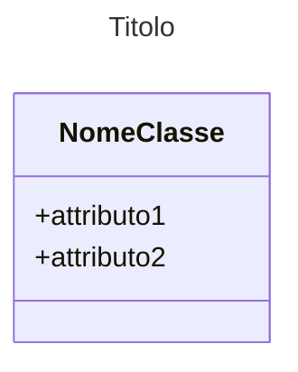

## Diagrammi classe

### Creare una classe

```mermaid
---
title: Titolo
---
classDiagram
    class NomeClasse
    NomeClasse : +attributo1
    NomeClasse : +attributo2
```

```mermaid
---
title: Titolo
---
classDiagram
    class NomeClasse
    NomeClasse : +attributo1
    NomeClasse : +attributo2
```

