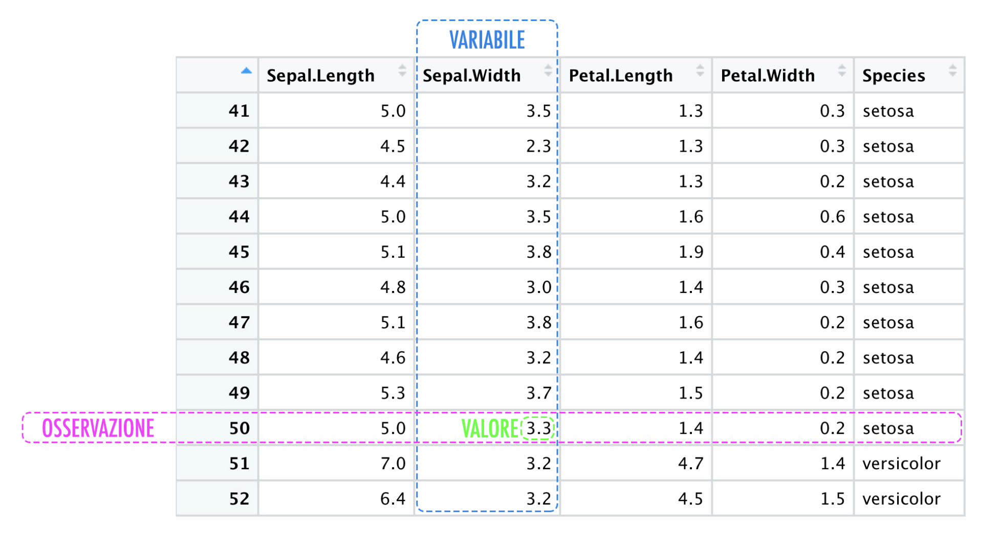

## Introduzione a Python

### gestione script python

- modulo: file che contiene definizioni e istruzioni python (.py)
- nome modulo: variabile globale `__name__`
- importare un modulo: `import nome_modulo`
- usare funzione modulo: `nome_modulo.nome_funzione()`
- importare una funzione specifica: `from modulo import funzione`, * importa tutte funzioni

### base

- commenti: `# commento`
- assegnamento di variabili: `a = 5`
- assegnamento multiplo: `a,b = 5, 6` oppure `a = b = 5`
- gestione booleani: 0 falso, altro vero
- stampa: `print('ciao')`

### aritmetica

- operazioni matematiche: + - * /
- numeri complessi: `1 + 2j` oppure `complex(1, 2)`
- conversione di tipi: `int(3.14)` oppure `float(3)`
- ultima espressione assegnata `_`

### stringhe

- dichiarazione `'stringa uno'` oppure `"stringa due"`
- quoting `\"`
- stringhe su più riche: uso del carattere `\n\` quando salto di riga
- posso usare `r` per evitare l'escape dei caratteri speciali, es. `ciao = r"ciao\n\come\n\stai?"`
- escape caratteri speciali anche con `'''` o circondate da ulteriori `"`
- concatenazione di stringhe: `a + b`
- concatenazione di ripetizione di stringa: `stringa* 3`
- stringhe dichiarate consecutivamente vengono concatenate: `'str' 'in' 'ga'` &rarr; `'stringa'`
- indicizzazione: `stringa[posizione]`
- indicizzazione a fette: `stringa[inizio:fine:step]`
- se indice posizione omesso all'inizio, parte da 0 `stringa[:2]` &rarr; `'ci'`
- se indice posizione omesso alla fine, arriva fino alla fine `stringa[2:]` &rarr; `'ao'`
- proprietà utile: `s[:i] + s[i:]` &rarr; `s`
- indicizzazione negativa: parte dal fondo `stringa[-1]` &rarr; `'a'`
- NOTA: intervalli di indicizzazioni vengono troncati se fuori intervallo
- stringhe NON possono essere modificate
- lunghezza della stringa: `len(stringa)`
- stringa unicode: `u'ciao'`

```python
stringa = 'ciao'
stringa[0] 
>> c
stringa[1:3]
>> ia
```

### liste

- dichiarazione: `lista = [1, 'stringa'', 3]`
- indicizzazione: `lista[posizione]` come nelle stringhe
- indicizzazione a fette: `lista[inizio:fine:step]` come nelle stringhe
- sono mutabili, anche attraverso indicizzazione a fette: `lista[0:2] = ['nuovi', 'elementi']`
- lunghezza della lista: `len(lista)`

### istruzione if

```python
if condizione:
    print('condizione vera')
elif altra_condizione:
    print('altra condizione vera')
else:
    print('nessuna condizione vera')
```

- `elif` e `else` sono opzionali, `elif` a cascata sostituiscono switch-case

### istruzione for

```python
for elemento in lista:
    print(elemento)
```

### funzione range

- `range(n)` genera una sequenza di numeri da 0 a n-1
- `range(n, m)` genera una sequenza di numeri da n a m-1
- `range(n, m, s)` genera una sequenza di numeri da n a m-1 con passo s
- `for i in range(len(a)): print(a[i])` &rarr; stampa tutti gli elementi di a

```python
>>> range(5)
[0, 1, 2, 3, 4]
>>> range(2, 5)
[2, 3, 4]
>>> range(2, 10, 2)
[2, 4, 6, 8]
>>> a = ['Mari', 'had', 'a', 'dog']
>>> for i in range(len(a)):
...     print i,(a[i])
0 Mari
1 had
2 a
3 dog
```

### istruzioni break, continue, else

- `break` interrompe il ciclo
- `continue` prosegue con l'iterazione seguente del ciclo
- `else` esegue un blocco di codice se il ciclo termina senza `break`

### istruzione pass

- `pass` è un'istruzione nulla, utile per evitare errori di sintassi

### funzioni e metodi

- definizione di una funzione: `def funzione(parametro):`
- funzione con più parametri: `def funzione(parametro1, parametro2):`
- ciclo si basa su indentazione
- ritornare valori, `return`
- metodi: `oggetto.metodo()`

### input

- si usa il comando `input()` per leggere da tastiera
- `input()` restituisce una stringa
- per convertire in intero si usa `int(input())`
- per ammettere input multipli si usa `input().split()`

## Numpy

Python estremamente inefficiente a causa dei tipi dinamici, i cicli non sono operazioni vettorializzate, per cui son lenti

pacchetto per il calcolo scientifico, array multidimensionali, funzioni matematiche avanzate, operazioni su array

Si chiama mediante `np.funzione()` dopo aver importato `import numpy as np`

### Generazione di array elementari

- `np.zeros(n, dtype = int)` array di zeri di lunghezza n
- `np.ones(n, dtype = int)` array di uno di lunghezza n
- `np.empty(n, dtype = int)` array di lunghezza n con valori casuali
- `np.full(n, fill_value, dtype = int)` array di lunghezza n con valori fill_value
- `np.arange(start, stop, step)` array con valori da start a stop con passo step
- `np.linspace(start, stop, num)` array con num valori equidistanti tra start e stop
- `np.random.rand(n)` array di n numeri casuali tra 0 e 1
- `np.random.randint(low, high, size)` array di numeri interi casuali tra low e high di dimensione size
- `np.random.seed(seed)` imposta il seme per la generazione di numeri casuali

### probabilità uniforme discreta

- `np.random.randint(val_min, val_max+1, (righe, colonne))` genera un array di numeri interi casuali tra val_min e val_max di dimensione (righe, colonne)

### array casuali con probabilità uniforme

- `np.random.randint(min, max+1, (righe, colonne))` genera un array di numeri interi casuali tra min e max di dimensione (righe, colonne)
- `np.random.random((righe, colonne))` genera un array di numeri casuali con probabilità uniforme **continua**tra 0 e 1 di dimensione (righe, colonne)
  - per estendere il valore basta:
    - `np.random.random(5) * (8)` 5 valori da 0 a 0 escluso
    - `np.random.random(5) * (12 -6)` 5 valori da -6 a +6 escluso

### array casuali con probabilità normale

- `np.random.normal(mu, sigma, size)` genera un array di numeri casuali con distribuzione normale con media $\mu$ e deviazione standard $\sigma$ di dimensione size

### array casuale con estrazione

- `np.random.choice(a = LISTA, size = n)` genera un array di dimensione size con estrazione casuale da a con probabilità p e sostituzione replace

nota: posso creare array da liste
  `np.random.choice(a=range(x), size = (righe, colonne), replace = boolean)`
Se replace = false posso estrarre ogni elemento 1 sola volta

(possiamo generare array 16 o 32 bit)

### np array

- attributi dimensionali (size, itembytes, shape, ...)
- indicizzazione
- slicing (python &rarr; copia lista; numpy &rarr; visita array)
- `copy()`: copia array
- `np.reshape()`: cambio dimensione matrice

### concatenazione

`np.concatenate()`: concatena array, su matrici occorre specificare assi
np.vstack() e np.hstack(): concatenazione di matrici valori diversi nei sensi opposti

**Duale**: `np.split()`, `np.hsplit()`, `np.vsplit()`

### Random generator

generare numeri casuali in modo non riproducibile

- uso di **SEED**: `np.random.default_rng(seed = 0)`, permette di riprodurli

### UFUNC (Universal Function)

Operazioni vettorializzate:

- moltiplicazioni array: `np.arange(0,5) * 10`
- divisione: array1 / array2
- potenza: 2 ** a
- `np.arange(5)` &rarr; 0,1,...4
- somma, differenza, prodotto, divisione(+, -, *, /)
- divisione intera, negazione, esponenziale, modulo (`//`, -,**, % )
- wrapper: np.add(), np.subtract(), np.absolute(), np.abs()

%timeit: ripete una riga di codice più volte e calcola tempo medio di esecuzione. Ritorna anche deviazione standard

- `%timeit operazione(argomenti)`

## Pandas

### Serie

**serie**: combina valori e indici, accessibili mediante `values`e `index`

**forma normale**:



- `serie.values(numpy_array)`
- `serie.index`

### Dizionario

### DataFrame

### Operazioni su pandas

### Import Export dati

### FIle CSV

## Matplotlib

- stile: `plt.style.use('stile')` per esempio `plt.style.use('ggplot')`

**Mostrare grafico**: `plt.show()`

  - `%matplotlib inline`: immagini statiche dei grafici
  - `%matplotlib notebook`: grafici interattivi

**FIGURA**: `plt.figure(figsize=(width, height))` per specificare dimensioni della figura

fig,ax = plt.subplots(2, figsize=(width, height)) per creare più grafici in una figura
ax[0].plot(x, y) per disegnare grafico su ax[0]
ax[1].plot(x, y) per disegnare grafico su ax[1]