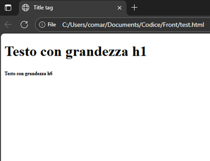

## Indice

1. [Introduzione](#introduzione)
2. [Struttura di un documento HTML](#struttura-di-un-documento-html)
3. [Attributi principali](#attributi-principali)
4. [Entità](#entità)
5. [Immagini](#immagini)
6. [Righe orizzontali](#righe-orizzontali)
7. [Tabelle](#tabelle)
8. [Link e ipertesti](#link-e-ipertesti)
9. [Ancore e link interni](#ancore-e-link-interni)
10. [Mappe d'immagine](#mappe-dimmagine)
11. [Frame](#frame)
12. [Moduli](#moduli)
13. [Input \<input>](#input-input)

## Introduzione

sistema di markup basato sui **tag**, racchiusi tra **<** e **>**

Esempio: \<br> ... \</br>

## Struttura di un documento HTML

1. Indicazione del **DTD** (Document Type Definition): `<!DOCTYPE ...>`, generalmente `<!DOCTYPE html>`
2. Inizio della **pagina** vera e propria, racchiusa tra `<html>` e `</html>`. è composta da header e body
3. **Header**, racchiuso tra `<head>` e `</head>`, contiene tag con informazioni supplementari (es. \<title>)
4. **Body**, racchiuso tra `<body>` e `</body>`, contiene ciò che viene visualizzato

Ci sono 6 livelli di intestazione, da `<h1>` (più grande) a `<h6>`(più piccolo). Si differenziano per dimensione carattere e uso del grassetto.

```html
<!DOCTYPE html>
<html>
    <head>
        <title> Title tag </title>
    </head>
    <body>
        <h1> Testo con grandezza h1 </h1>
        <h6> Testo con grandezza h6 </h6>
    </body>
</html>
```



## Attributi principali

Ogni tag può avere più **attributi**, per esempio:

- **align**, che serve ad allineare il testo. I valori possono essere **left, center, right**
  - **\<h1 align=”center”> … <\h1>** per allineare il testo al centro
- **lang**, definisce la lingua del documento \<html lang=”it”>
- **\<meta />** fornisce meta-informazioni non visibili agli utenti (autore, parole chiave, **charset**)

I colori possono in html sono indicati con formato RGB oppure con il nome. Es: “\#FF0000” oppure “red”

Gli attributi del body principali sono:

- **lang**
- **bgcolor**, che imposta un colore di sfondo per la pagina \<body bgcolor=”red”>
- **background**, permette di inserire una texture di sfondo (motivo o immagine GIF, JPEG, PNG)
- **text**, imposta il colore del testo nella pagina
- **link**, imposta il colore dei link nella pagina
- **vlink**, imposta il colore dei link visitati (visited link)
- **alink**, imposta il colore dei link attivi nella pagina
- **topmargin**, distanza in pixel dal margine superiore
- **bottommargin**, distanza in pixel dal margine inferiore
- **leftmargin**, distanza in pixel dal margine sinistro
- **rightmargin**, distanza in pixel dal margine destro

## Entità

In html esistono le **entità**, ovvero costrutti sintattici per far visualizzare correttamente i caratteri speciali
Sono delimitati da **&** e **;**
Esempio:

- `à` corrisponde a `&#224;`

_nota_: anche lo spazio è un carattere speciale, se si vuole aggiungere più spazi consecutivi vanno inseriti più volte

Per fare riferimento a un’immagine devo utilizzare il suo percorso, che può essere **assoluto** se fa riferimento al disco vero e proprio, altrimenti posso utilizzare il **percorso relativo** con ../ oppure ./ oppure /
Il percorso relativo è consigliato, così i riferimenti vengono persi in caso di spostamento delle cartelle contenenti la pagina

- \<body background=”./Sottocartella/sfondo.png”>

Il **font** del carattere è modificabile attraverso il tag **\<font> … \</font>** e possiede i seguenti attributi:

- **face**, specifica il carattere con il quale deve essere visualizzato. Posso indicarne più di uno, separati da una virgola. Se il primo non è disponibile allora passa al successivo \<font face=”arial, verdana”>
- **size**, imposta la dimensione del font, compreso tra 1 e 7. Il valore di default è 3, quindi posso anche usare i valori -1,-2,-3,+1,+2,+3,+4. \<font size=”4”>
- **color**, cambia il colore del font

Il **ritorno a capo (break)** si ottiene con il tag **\<br>** senza chiusura.

- Dopo queste parole c’è \<br> un a capo

L’inizio di un **paragrafo** viene indicato tramite il tag **\<p>**. Un paragrafo è delimitato da una riga vuota all’inizio e alla fine. La chiusura **\</p> non sarebbe necessaria**, ma è buona norma inserirla **per chiarezza**.

- **align**, con opzioni **center, right, left, justify**

Il tag **\<div>** è un contenitore generico per racchiudere una parte di testo a cui attribuire caratteristiche comuni. Produce un a capo tra la porzione antecedente e successiva, ma senza lasciare righe vuote come \<p>
L’attributo **id** è importante perché è un identificatore univoco della porzione di testo tra \<div> … \</div>

Il tag **\<center>** può essere usato al posto di \<div align=”center”> … \</div> ma non è molto usato

## Liste

Per le liste abbiamo:

- **puntata**: \<ul> … \</ul> con attributo **type** per cambiare simbolo (**disc, circle, square**)
- **numerata**: \<ol> … \</ol> con attributo **type** per cambiare numerazione (1, I, i, a, A) e **start** per cambiare il valore di partenza

Ogni elemento è inizializzato da **\<li>** (list item) senza chiusura obbligatoria

Inoltre abbiamo le **liste di definizione** in cui ogni elemento è formato da termine e definizione

- inizializzazione della lista: **\<dl> … \</dl>**
- tag per termine: **\<dt> … \</dt>**
- tag per la definizione: **\<dd> … \</dd>**

è possibile creare **liste nidificate**

Per quanto riguarda il testo ci sono dei **tag stilistici**:

- grassetto \<b> … \</b>
- corsivo \<i> … \</i>
- sottolineato \<u> … \</u>
- apice \<sup>
- apice \<sup>
- pedice \<sub>

E dei tag di contesto:

- citazione \<cite>
- codice \<code>
- esempio \<samp>
- variabili di un programma \<var>
- data \<time> con attributo datetime per il formato

## Commenti

Per commentare il codice: **\<!-- …  -->**

## Immagini

Per **inserire immagini** si usa il tag **\** senza chiusura

- l’attributo **src** specifica il percorso del file da inserire
- **align** con i valori **bottom, middle, top, left, right**
- **width** determina la larghezza dell’immagine, in pixel o percentuale
- **height** determina l’altezza, in pixel o percentuale
- **alt**, consente l’inserimento di una descrizione dell’immagine nel caso non sia reperibile
- **title**, consente di far apparire una tooltip quando il mouse sarà sopra l’immagine
- **border**, che consente di circondare con un bordo l’immagine
- **hspace**  e **vspace**, settano la distanza orizzontale e verticale in pixel dal testo

## Righe orizzontali

Per inserire una **riga orizzontale** si usa il tag **\<hr>** con attributi

- **size**, spessore della linea in pixel (da 1 a 100)
- **width**, lunghezza della linea in pixel o percentuale
- **align**, imposta collocazione della linea con valori **left, central, right**
- **color**, imposta il colore

## Tabelle

Per le tabelle si usa il tag **\<table>** … **\</table>**

- la riga è racchiusa nei tag **\<tr>** … **\</tr>**
- la singola cella è rappresentata da **\<td>** … **\</td>**
- se la cella è d’intestazione allora i tag sono **\<th>** … **\</th>**

Gli attributi di **\<table>** sono:

- **align**, può assumere i valori **left, center e right**
- **border**, spessore dei bordi della tabella (default 0: no bordi)
- **cellpadding**, spazio fra bordo tabella e il contenuto della cella (default 1 pixel)
- **cellspacing**, distanza fra celle; (default 2 pixel)
- **Width**, larghezza della tabella (in valore assoluto o in percentuale);
- **height**, altezza della tabella (in valore assoluto o in percentuale);
- **bgcolor**, colore dello sfondo della tabella;
- **bordercolor**, colore di tutti i bordi della tabella
- **background**, definisce un’immagine di sfondo

Gli attributi di **\<tr>** ovvero della cella sono:

- **align**, allineamento orizzontale di tutte le celle della riga, con valori **left, center, right**
- **valign**, allineamento verticale celle riga, **top, middle, bottom**
- **bordercolor**, colore bordo celle
- **height**, altezza riga in val. assoluto o percentuale

Gli attributi di **\<td>** sono:

- **align** definisce l’allineamento orizzontale della cella, i valori possibili sono left, center e right
- **valign** definisce l’allineamento verticale della cella, i valori possibili sono top, middle e bottom
- **width** definisce la larghezza della singola cella
- **height** definisce l’altezza della cella (in valore assoluto o in percentuale)
- **bgcolor** definisce il colore dello sfondo della singola cella
- **bordercolor** definisce il colore del bordo della singola cella
- **rowspan** fa sì che una cella risulti alta n celle, dove n è il valore attribuito a rowspan;
- **colspan** fa sì che una cella risulti larga n celle, dove n è il valore attribuito a colspan.
- **background** definisce un’immagine di sfondo

Le celle della stessa colonna devono avere la stessa larghezza e quelle della stessa riga devono avere la stessa altezza. In caso contrario il browser adotta quello più elevato.

Per creare una tabella con un numero di celle non costanti si usano gli attributi **rowspan** e **colspan** per creare celle espanse

Per aggiungere **titoli alla tabella** si usa il tag **\<caption> \</caption>** subito dopo \<table>

- **align**, per far apparire prima o dopo della tabella il titolo, con **top** o **bottom**

## Link e ipertesti

Si possono creare ipertesti tramite **link**
Se si crea un link a un’altra pagina si usa **\<a>** con attributo **title** per tooltip e **href** per indicare percorso

- \<a href=”destinazione.html” title=”testo che compare con il cursore”> testo  da cliccare \</a>

Il comportamento dipende dal tipo di file (htm: apertura pagina, immagini: vengono visualizzate, doc e pdf: vengono aperti se c’è il plugin, zip/com/exe: vengono scaricati). Possibile anche mandare una mail con \<a href=”mailto:indirizzo@mail”>

## Ancore e link interni

Per collegarsi a determinate posizioni all’interno di una stessa pagina

- Creare un riferimento a cui saltare \<**a name=”nome”**> … \</a>
- Per raggiungerla \<**a href=”\#nome”**> testo collegamento \</a>

NOTA: posso fare riferimento a un’ancora all’interno di un’altra pagina \<a href=”nomepagina#posizione”>

## Mappe d'immagine

Posso suddividere un’immagine in diverse aree. In base all’area cliccata viene richiamato un link diverso.

- Inizializzare immagine a mappa \<**img** src=”…” **usemap**=”\#nome”>, in \ con #
- Creare mappa \<**map name**=”nome_mappa”> con tag \<map> e attributo name
- Inizializzare le aree tra \<map> e \</map> con **\<area>** e i suoi attributi
  - **shape** indica la forma dell’area: rect, circle, poly
  - **coords** delimita superficie in pixel: per rettangolo (colonna vertice alto sx, riga vertice alto sx, colonna vertice basso dx, riga vertice basso dx), per cerchio (centro, raggio) e poligono (tutti vertici)
  - **href** richiama il link associato, volendo puoi usare **nohref**
  - **title** per tooltip quando cursore si ferma

## Frame

Utili per dividere la pagine in sezioni indipendenti tra loro, usati al posto del tag \<body>.

Si inzializza un frameset con i tag **\<frameset> … \</frameset>**. Non possono essere accostati uno di seguito all’altro, perché i frameset occupano tutta la pagina. **Possono essere annidati**, ovvero un frame all’interno di un frameset può essere a sua volta un frameset di frame.
Possiede i seguenti attributi

- **border**, spessore dei bordi per frame figli
- **bordercolor**, colore dei bordi dei frame figli
- **cols**, numero e dimensione dei frame verticali (pixel o percentuale). Vanno bene anche elenchi per più frame verticali “40%,30%,*” l’asterisco alloca tutta l’area rimanente
- **rows**, numero e dimensione delle righe, uso analogo a cols
- **frameborder**, specifica se frame visualizzati con bordo (0 no, 1 sì). Definibile a livello di singolo frame

All’interno dei frameset specifico le sezioni della pagina con l’attributo **\<frame>**, i cui attributi sono:

- **frameborder**: specifica se il frame è visualizzato con un bordo. Il valore 1 ne indica la presenza, mentre 0 lo disabilita.
- **name**: indica il nome con cui far riferimento al frame.
- **noresize**: se presente, evita che l’utente possa ridimensionare il frame.
- **scrolling**: specifica se deve apparire una barra di scorrimento nel frame. I valori possibili sono yes, no, auto; se impostato su auto, che è l’impostazione di default, è il browser a determinare l’eventuale creazione della barra.
- **src**: indica il file da visualizzare all’interno del frame; se non si specifica un attributo src, lo spazio in cui dovrebbe apparire il frame risulterà vuoto.
- **marginheight** e **marginwidth**: permettono di impostare la distanza verticale (marginheigth) e orizzontale (marginwidth) tra i bordi del frame e il suo contenuto

Per caricare una pagina all’interno di un frame è sufficiente assegnare all’attributo target del tag \<link> il nome del frame in cui la pagina deve comparire

## Moduli

Servono per la raccolta dati. Vengono inizializzati con il tag **\<form> … \</form>**. Presenta i seguenti attributi:

- **name**
- **method**, può assumere valore get o post in base a come vanno trasmessi dati
- **action**, indirizzo script per elaborazione dei dati trasmessi al server tramite il modulo
- **enctype**, con method POST, specifica come browser codifica I dati. Assume due valori
  - application/x-www-form-urlencoded (default)
  - multipart/form-data (per upload di file sul server, permette inviare dati come sequenza di parti)

All’interno del modulo \<form> … \</form> posso inserire gli oggetti per interfacce grafiche

## Input \<input>

**Casella di testo**: **\<input type=”text”>**, con attributi name, maxlength, size, value

**Area di testo**: **\<textarea>** testo area di testo pre-inserito **\</textarea>** con name, rows/cols (numero righe colonne) e wrap (comportamento in caso di contenuto maggiore larghezza area) con valori off (aggiunge scrollbar orizzontale), virtual o soft (a capo automaticamente, server riceve una riga), physical o hard (a capo automaticamente, server riceve più righe)

**Casella password**: **\<input type=”password”>**

**Campo nascosto**: **\<input type=”hidden” name=”” value=””>**

**Pulsante di commando per invio dati**: **\<input type=”submit”>** con name e value (testo su pulsante)

**Pulsante per ripristinare valori di default**: **\<input type=”reset”>** con name e value (testo su pulsante)

**Pulsante generico che deve essere programmato**: **\<input type=”button”>** con name e value (testo su pulsante)

**Casella di controllo**: **\<input type=”checkbox”>** con attributi name, value, checked, unchecked

**Pulsante di opzione**: **\<input type=”radio”>** con attributi:

- **name**, serve per identificarlo. Tutti i pulsanti di opzione che fanno parte dello stesso gruppo devono avere lo stesso nome (per poter essere selezionato soltanto uno)
- **value**, valore restituito quando il pulsante è selezionato (se omesso e viene selezionato allora value = on)
- **checked**, seleziona il pulsante

**Elenco a discesa**: racchiuso tra i tag **\<select> … \</select>**
Ogni opzione è rappresentata dal tag **\<option value=” ”>** _nome dell’opzione_ **\</option>**
Gli attributi possibili (facoltativi) sono:

- **size**, numero di opzioni visibili nella lista senza scrollare con barra di scorrimento
- **multiple**, se posso selezionare più elementi contemporaneamente
- **selected**, indica una voce di menù selezionata
- **value**, NON facoltativo, indica il valore che verrà inviato

File upload control: **\<input type=”file”>** con attributi **accept** (tipo di file) e **size** (larghezza del campo)
In accept posso specificare l’**estensione, audio/\*, video/\*, image/\***

**\<fieldset> … \</fieldset>** raggruppare vari elementi all’interno di un form tracciando un box
**\<legend>** nome del fieldset **\</legend>** all’interno di un fieldset per indicare il nome
