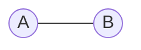
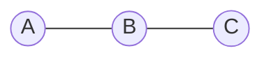
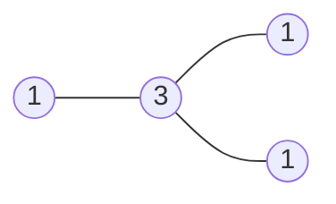
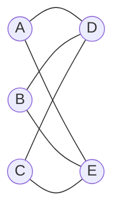
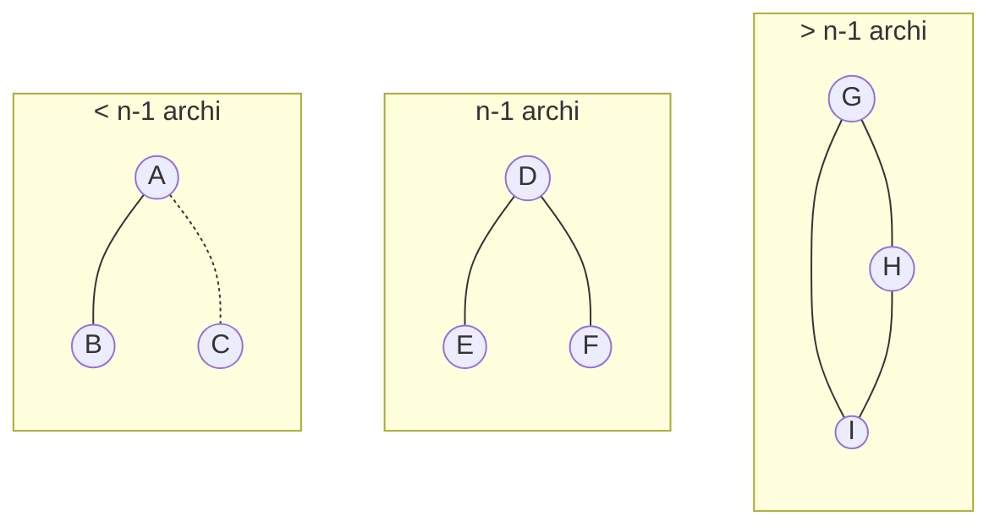
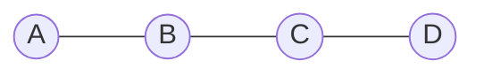
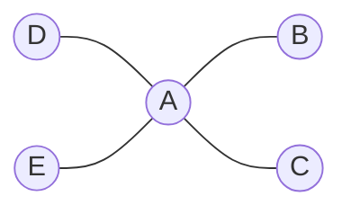
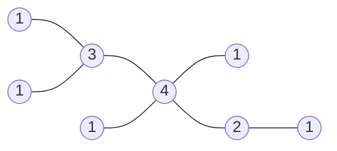
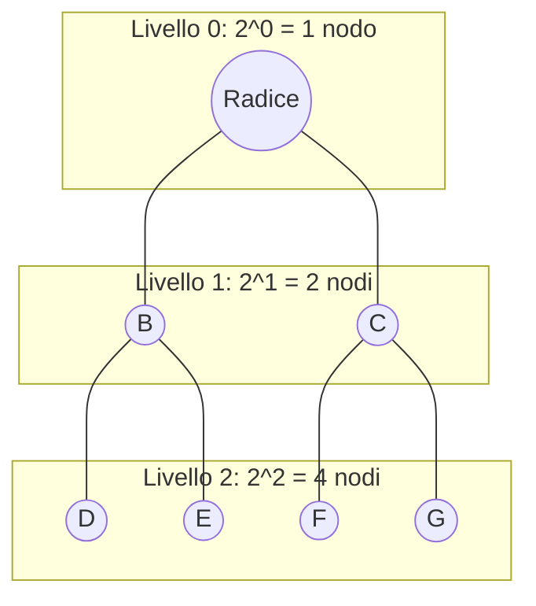

## Insiemi

**Insieme**: concetto primitivo, collezione di oggetti detti elementi

**Cardinalità $ \vert A \vert$**: numero di elementi di un insieme $ A$

**Insieme vuoto $ \emptyset$**: insieme senza elementi, $ \vert \emptyset \vert = 0$

**A sottoinsieme di B**: $ A \subseteq B$ se ogni elemento di A è anche in B

**prodotto cartesiano $ A \times B$**: insieme di tutte le coppie $ (a, b)$ con $ a \in A$ e $ b \in B$

## Relazioni

- **riflessiva**: $ x \smile x\ \forall x $
- **antiriflessiva**: $ \neg (x \smile x)\ \forall x $

- **simmetrica**: $ x \smile y \implies y \smile x $
- **antisimmetrica**: $ x \smile y\ \implies \neg (y \smile x) $

- **transitiva**: $ (x \smile y) \land (y \smile z) \implies (x \smile z) $

**D'ORDINE**: irriflessiva, antisimmetrica e transitiva

**D'EQUIVALENZA**: riflessiva, simmetrica e transitiva

Le relazioni d'equivalenza implicano una partizione dell'insieme in classi di equivalenza

### Congruenza modulo $ n $ $ x \equiv_n y $

Resto della divisione intera tra due numeri

$ 12 \mod 3 = 0$ | $ -12 \mod 3 = 0$
$ 13 \mod 3 = 1$ | $ -13 \mod 3 = 2$
$ 14 \mod 3 = 2$ | $ -14 \mod 3 = 1$

dato $ x \equiv_n y$ allora:

- $ x-y \equiv_n 0 $
- $ x + z \equiv_n y + z $
- $ x \cdot z \equiv_n y \cdot z $

considerando anche $ z_1 \equiv_n z_2 $:

- $ x+z_1 \equiv_n y+z_2 $
- $ x \cdot z_1 \equiv_n y \cdot z_2 $

## Funzioni

- **iniettiva**: $ x \neq x' \implies f(x) \neq f(x') $
- **suriettiva**: $ f: A \to B\ f(A) = B $
- **biiettiva**: iniettiva e suriettiva, invertibile

- **ceiling**: $ \lceil x \rceil = \min \{v \in \mathbb{Z} : v \geq x\} $ più piccolo intero maggiore o uguale a $ x$
- **floor**: $ \lfloor x \rfloor = \max \{v \in \mathbb{Z} : v \leq x\} $ più grande intero minore o uguale a $ x $

**composta**: $ f \circ g(x) = f(g(x)) $

## Induzione

- Base: $ P(0) $ è vera
- Passo induttivo: $ \forall n \geq 0,\ P(n+1)\ vera \implies P(n)\ vera $

## Sommatorie

$$ \sum_{k=1}^n a_k\ = a_1 + a_2 + \ldots + a_n $$

### Regole

$ \sum_{k \in K}\ \textbf{c} \cdot a_k = \textbf{c} \cdot \sum_{k \in K}\ a_k $

$ \sum_{k \in K}\ (a_k + b_k) = \sum_{k \in K}\ a_k + \sum_{k \in K}\ b_k $

$ \sum_{k \in K}\ a_k = \sum_{\Pi (k) \in K}\ a_{\Pi(k)} $

$ \sum_{k=1}^\textbf{m}\ a_k + \sum_{k = \textbf{m}}^n\ a_k = a_{\textbf{m}} + \sum_{k=1}^n\ a_k $

$ \sum_{k \in K}\ a_k = \sum_{(k + c) \in K}\ a_{(k + c)} $

$ \sum_{k = 1}^n\ a_k = \sum_{k = 1}^{\textbf{m}}\ a_k + \sum_{k = \textbf{m+1}}^n\ a_k $

### Somme multiple

$$ \begin{matrix} a_1 b_1 & a_1 b_2 & a_1 b_3 \\ a_2 b_1 & a_2 b_2 & a_2 b_3 \\ a_3 b_1 & a_3 b_2 & a_3 b_3 \end{matrix} $$

| tipologia | formula | estesione |
| --- | --- | --- |
| per righe | $$ \sum_{i=1}^3\ \sum_{j=1}^3\ a_i b_j $$ | $$ a_1 \sum_{j=1}^3 b_j + a_2 \sum_{j=1}^3 b_j + a_3 \sum_{j=1}^3 b_j $$ |
| per colonne | $$ \sum_{j=1}^3\ \sum_{i=1}^3\ a_i b_j $$ | $$ \sum_{i = 1}^3 (a_i)\ b_1 + \sum_{i = 1}^3 (a_i)\ b_2 + \sum_{i = 1}^3 (a_i)\ b_3 $$ |

### Scambio di indici

$$ \sum_{i \in I} \sum_{j \in J(i)} a_{ij} = \sum_{j \in J} \sum_{i \in I(j)} a_{ij} $$

| $$ \sum_{i=0}^n \sum_{j=i}^n s_ij $$ | $$ \sum_{j=0}^n \sum_{i=0}^j s_ij $$ |
| --- | --- |

$ J(i) = \{0, \ldots, n\} $
$ I(j) = \{0, \ldots, j\} $

### Somme notevoli

- somma numeri consecutivi: $$ \sum_{i=1}^n i = \frac{n(n+1)}{2} $$

- somma quadrati numeri consecutivi: $$ \sum_{k=1}^n k^2 = \frac{n(n+1)(2n+1)}{6} $$

- somma potenze consecutive: $$ \sum_{k=1}^n k^m = \frac{1}{m+1} \sum_{j=0}^m \binom{m+1}{j} B_j n^{m+1-j} $$

### Metodo di perturbazione

$$ s_n + a_{n+1} = \sum_{k=0}^{n+1} a_k = \sum_{k=0}^n a_{k+1} $$

$$ s_n + a_{n+1} = a_0 + \sum_{k=0}^n a_{k+1} $$

$ s(n) $ sia a sinistra che a destra ma con coefficienti diversi per non elidersi

## Probabilità

**universo $ S $**: $ Pr(S) = P \vert S \vert = 1 $

**distribuita uniforme**: $ Pr(A) = p \vert A \vert= \frac{\vert A \vert}{\vert S \vert} $

**probabilità condizionata**: $ Pr(A \vert B) = \frac{Pr(A \cap B)}{Pr(B)} $

**probabilità eventi indipendenti**: $ Pr(A \cap B) = Pr(A) \cdot Pr(B) $

**teorema di Bayes**: $ Pr(B \vert A) = \frac{Pr(A \vert B) \cdot Pr(B)}{Pr(A)} $

## Matematica degli interi

### divisibilità, MCD, mcm

**divisibilità:** $ a \mid b $ se $ \exists m \in \mathbb{Z} : \textbf{b =}\ \textbf{a} \cdot \textbf{m} $

**MCD (a,b)**: $ \max \text{\{divisori a,b\}} $
**mcm (a,b)**: $ \min \text{\{multipli a,b\}} $

**Algoritmo di Euclide**:

Calcolo di $ MCD(a,b) $

1. $ a : b = r $
2. $ r = 0 \implies MCD(a,b) = b $
3. $ r \neq 0 \implies b : r = ... $ (ricomincio)

**Teorema di Bezout**: $ MCD(a,b) = ax + by $
 $ 1 = ax + by $ allora $ a $ e $ b $ sono coprimi

### Numeri primi

**Numero primo**: divisori di p: \{1, p\}

- 1 no primo, no composto

**primi in intervallo di n naturali**: $ \Pi(N) \sim \frac{N}{\ln N} $

**Primi di Mersenne**: $ M(n) = 2^n - 1\ \text{primo} \implies n\ \text{primo} $

**Primi di Fermat**: $ F(n) = 2^{2^n} + 1 $

**Fattorizzazione in numeri primi**:

$ p \in \mathbb{N}, p \gt 1. $

- $ p \text{ primo} \iff \forall a, b \in \mathbb{N} \text{ se } \ p \vert  ab \implies p \vert a \lor p \vert b $
- $ \text{se } p \mid a_1 \cdot a_2 \cdot \ldots \cdot a_r \implies p \vert a_i \text{ (almeno un } i \in [1, r]) $

**Teorema fondamentale dell'aritmetica**:

$$ \forall n \in \mathbb{N}, n \geq 2\\ n = p_1 \cdot p_2 \cdot \ldots \cdot p_i \ \text{ con } p_i = \text{fattore primo} $$

Per cui dati $ a,b $ con $ a = p_1^{n_1} \cdot p_2^{n_2} \cdot \ldots \cdot p_k^{n_k}$ e $ b = p_1^{m_1} \cdot p_2^{m_2} \cdot \ldots \cdot p_k^{m_k} $

- $$ mcm(a,b) = p_1^{\max(n_1,m_1)} \cdot p_2^{\max(n_2,m_2)} \cdot \ldots \cdot p_k^{\max(n_k,m_k)} $$
- $$ MCD(a,b) = p_1^{\min(n_1,m_1)} \cdot p_2^{\min(n_2,m_2)} \cdot \ldots \cdot p_k^{\min(n_k,m_k)} $$

**Primo contenuto in un fattoriale $ N!$**

$ p $ in $ n! $ contenuto $ \sum_{k \geq 1} \lfloor \frac{n}{p^k} \rfloor $ volte

$ n! = \sum_{k \geq 1} \lfloor \frac{n}{p^k} \rfloor$ quante volte $ p $ è contenuto in $ n $

esempio con $ 15!$

- quante volte $ 2 $ contenuto in $ 15! $:
$$ \lfloor \frac{15}{2} \rfloor + \lfloor \frac{15}{2^2} \rfloor + \lfloor \frac{15}{2^3} \rfloor = 7 + 3 + 1 = 11 $$
- quante volte $ 3 $ contenuto in $ 15! $: $$ \lfloor \frac{15}{3} \rfloor + \lfloor \frac{15}{9} \rfloor + \lfloor \frac{15}{27} \rfloor = 5 + 1 + 0 = 6 $$

**proprietà**:

$ a \in \mathbb{Z},\ p \text{ primo} $

- $ p \nmid a \implies ia \not\equiv_p ja\ \text{ con } \ i,j \in\{1, 2, \ldots, p-1\} $
- $ p \nmid a \implies a^{p-1} \equiv_p 1 $
- $ a^p \equiv_p a $

### Segno permutazioni (parità e disparità)

$ S_n = \pi \{1,2, \ldots, n\} $: insieme permutazioni

data $ \pi ={\pi_1, \ldots, \pi_n} $ permutazione, tutti i modi per trasformarla in permutazione identica

- o richiedono un numero **pari** di trasposizioni
- o richiedono un numero **dispari** di trasposizioni

## Principio della piccionaia

**Teorema**: $ n+1 $ oggetti in $ n $ contenitori, un contenitore ha $ 2 $ o più oggetti

**Teorema**: se $ r_1 + r_2 + \ldots + r_n - n + 1 $ oggetti in $ n $ contenitori, allora o 1 contiene ha $ r_1 $ o 2 contiene $ r_2 $ o n-esimo contiene $ r_n $

## Principio di somma e del prodotto

$ k $ elementi diversi, $ n_1 $ del primo tipo, $ n_2 $ del secondo tipo, $ \ldots $, $ n_k $ del k-esimo tipo. In quanti modi posso

- un elemento del primo tipo **o** del secondo **o** ...
- un elemento del primo tipo **e** del secondo **e** ...

### Principio di somma

$ S = S_1 \cup S_2 \cup \ldots \cup S_k $
$ \vert S \vert = \vert S_1 \vert + \vert S_2 \vert + \ldots + \vert S_k \vert $

**conteggio indiretto**: $ \vert A \vert = \vert S \vert + \vert S' \vert \implies \vert S \vert = \vert A \vert - \vert S' \vert $

### Principio di prodotto

$ S$: insieme di tute le coppie $ (a,b)$: $ a$ in $ p$ modi, $ b$ in $ q$ modi dato il primo

$ \vert S \vert = p \cdot q$

dimostrazione mediate principio somma

### Scelte su sequenze

$ a_1 a_2 a_3 \ldots a_n$ con $ a_1 $ in $ p_1 $ modi, $ a_2 $ in $ p_2 $ modi

$$ \text{n-ple: } S = p_1 \cdot p_2 \cdot \ldots \cdot p_n $$

### Combinazioni (sottoinsiemi)

dato $ A = \{a_1, a_2, \ldots, a_n\} $ il sottoinsieme è un booleano per ogni elemento (è incluso? T/F)

$$\mathcal{P}(A) = 2^{\vert A \vert} $$

## Coefficiente binomiale

$ \binom{n}{k}$ k-oggetti su $ n$

$$\binom{n}{k} = \frac{n!}{k! (n-k)!} $$

sottoinsiemi di $ k$ elementi su $ n $

**proprietà del coefficiente binomiale**:

1. $$ \binom{n}{k} = \binom{n}{n-k} $$
stesso numero di sottoinsiemi per $ k $ elementi o $ n-k $ elementi (in quanto complementare)

2. $$ \binom{n}{n} = 1 \text{ , } \binom{n}{1}=n $$
insieme completo e numero sottoinsiemi di un elemento

3. $$ \binom{n}{k} = \binom{n-1}{k} + \binom{n-1}{k-1} $$

4. $$ \binom{n}{k} = \sum_{i=0}^p \binom{p}{i} \binom{n-p}{k-i} $$

5. $$ \binom{n}{k} = \sum_{m = k}^n \binom{m-1}{k-1} $$

6. $$ \sum_{k=0}^n \binom{n}{k} = 2^n $$

7. $$ \text{con } 0 \leq k \leq \frac{n}{\lfloor 2 \rfloor} \text{ succede } \binom{2k}{k} \leq \binom{n}{k} $$

8. $$ \text{con } 0 \leq k \leq n \text{ succede } \binom{n}{k} \leq \binom{n}{\frac{n}{\lfloor 2 \rfloor}} $$

9. $$ \forall n \gt 1 \in \mathbb{N} \text{ succede } \binom{2n}{n} \geq 2^n $$

10. $$ \forall n \in \mathbb{N^+} \text{ succede } \binom{2n}{n} \geq \frac{2^n}{2n} $$

11. $$ \sum_{k=1}^n k \cdot \binom{n}{k} = n \cdot 2^{n-1} $$

12. $$ \sum_{k=0}^n \binom{n}{k} 2^k = 3^n $$

### Triangolo di Pascal

$$ (a+b)^n = \sum_{i=0}^n \binom{n}{i} a^i b^{n-i} $$

### Processi Bernoulliani

Gli esiti sono indipendenti dai precedenti: $ p $, $ q = 1-p $

probabilità di $ k $ successi in $ n $ prove:
$$ Pr(n,k) = \binom{n}{k} p^k q^{n-k} $$

probabilità di almeno $ k $ successi in $ n $ prove:
$$ Pr(n, \geq k) = \sum_{i=k}^n \binom{n}{i} p^i q^{n-i} $$

### Disposizioni (insiemi ordinati)

prendere un sottoinsieme ma l'ordine conta

$$ D(n,k) = \binom{n}{k} \cdot k! $$

$ \binom{n}{k} $: in quanti modi posso scegliere il sottoinsieme (quanti sottoinsiemi ci sono)
$ k! $: permutazioni possibili del sottoinsieme

### Multinsiemi (insiemi con elementi ripetuti)

$ S = \{a_1, a_2, \ldots, a_k\} $ con $ \{a_1 \cdot n_1, a_2 \cdot n_2, \ldots, a_k \cdot n_k\} $

**permutazioni**: $$ \Pi_s=\frac{n!}{n_1! \cdot n_2! \cdot \ldots \cdot n_k!} $$

### Combinazioni con ripetizioni

**r-combinazioni**: sottoinsiemi di un multinsieme $ S = \{a_1 \cdot n_1, \ldots, a_k \cdot n_k\} $

- $ n_i \geq r\ \forall i $
$$ \binom{r-k+1}{r} \text{ oppure } \binom{r+k-1}{k-1} $$
$ r $: cardinalità r-combinazione
$ k $: tipologie di elementi

**a valori interi limitati - lower bound**:

$$ r \geq \sum_{i=1}^k b_i $$

quante soluzioni intere ha l'equazione $ \sum_{i=1}^k x_i = r $ con $ x_i \geq b_i\ \forall i \in [1, \ldots, k] $?

$$ x_1 + x_2 + \ldots + x_k = r $$

sostituisco con $ y_i = x_i - b_i \implies x_i = y_i + b_i $ ovvero mi riconduco al caso senza vincoli

$$ \sum_{i=1}^k y_i = r - \sum_{i=1}^k b_i \implies \binom{r - \sum_{i=1}^k b_i - k + 1}{k - 1} $$

## Principio di inclusione-esclusione

### Principio base

$ S = \text{\{insieme di elementi con } p_1, p_2, \ldots, p_m \text{ proprietà\}} $

insieme degli elementi che non possiedono alcuna proprietà $ p_1, \ldots, p_m $:

$$ \begin{array}{ll} \vert \bar{A_1} \cap \bar{A_2} \cap \ldots \cap \bar{A_m}  \vert = & \vert S \vert \\ \; & - \sum \vert A_{i_1} \vert \\ \; & + \sum \vert A_{i_1} \cap A_{i_2} \vert \\ \; & \ldots \\ \; & + (-1)^d \vert A_1 \cap A_2 \cap \ldots \cap A_d \vert \\ \; & \ldots \\ \; & + (-1)^m \vert A_1 \cap A_2 \cap \ldots \cap A_m \vert \end{array} $$

### Spiazzamenti

**spiazzamento**: permutazione $ \pi = (\pi_1, \pi_2, \ldots, \pi_n)$ con $ \pi_i \neq i\ \forall i \in [1, \ldots, n] $

esempi:

- $ (2,1,4,5,3)$ è uno spiazzamento
- $ (4,1,\textbf{3},2,\textbf{5})$ **non** è uno spiazzamento (3 è nella 3a posizione, 5 è nella 5a posizione)

**numero di spiazzamenti $ z_n$**:

- $ n \geq 1$
$$ z_n = n! \cdot \left(1 - \frac{1}{1!} + \frac{1}{2!} - \frac{1}{3!} + \ldots + (-1)^n \frac{1}{n!}\right) $$

approsimmazione: $ z_n \approx \frac{n!}{e}$

**formule ricorsive**:

- $ z_n = (n-1) \cdot (z_{n-1} + z_{n-2})$
- $ z_n = n \cdot z_{n-1} + (-1)^n$

## Teoria dei Grafi

### Grafi non orientati

**grafo non orientato**: $ G = (V, E)$ con

- $ V$ insieme di vertici
- $ E$ insieme di archi (coppia non orientata di vertici)

**vertici adiacenti**: $ (i,j \in V) \land (ij = e \in E)$

**archi adiacenti**: condividono un vertice

**grado di un vertice $ d(v)$**: numero di archi incidenti in $ v$

**grafo regolare**: tutti i nodi hanno lo stesso grado ($ d(i) = d(j)\ \forall i,j \in V$)

- **grafo k-regolare**: tutti i nodi hanno grado $ k$ ($ d(i) = k)$

**vertice isolato**: ha grado 0 ($ d(v) = 0$)

**Teorema somma dei gradi dei vertici**: $$\sum_{v \in V} d(v) = 2 \vert E \vert $$ sommatoria dei gradi dei vertici è il doppio della cardinalità degli archi



$ \vert E \vert = 1, \; d(A) + d(B) = 1 + 1 = 2 $

<br>



$ \vert E \vert = 2, \; d(A) + d(B) + d(C) = 1 + 2 + 1 = 4 $

**Teorema numero di vertici di grado dispari**: in ogni grafo c'è un numero pari di vertici di grado dispari


$ \implies $ deve esserci un altro nodo di grado dispari, magari NON adiacente

<br>



$ \implies \vert v: d(v) \text{ dispari} \vert = \vert \{a,b,c,d\} \vert = 4 $

**Sequenza grafica**: $ (d_1, \ldots, d_n)$ è una sequenza grafica se esiste un grafo $ G$ in cui $ d_1, \ldots, d_n$ corrisponde ai gradi di $ G$

- non ci può essere un numero $ \geq n \implies (d_i < n)$
- non ci possono essere sia $ 0$ che $ n-1$
- ci devono essere un numero pari di dispari
- $ \sum_{i=1}^n d_i \leq \frac{n(n-1)}{2}$ sommatoria notevole di gauss

**grafi isomorfi**: quando è possibile rinominare i nodi di un grafo ottenendo l'altro grafo
presi $ G = (V, E), G' = (V', E')$
$ \exists f: V \to V' \mid f(v)f(w) \in E' \iff vw \in E$

**sottografo**: $ G' = (V', E')$ è un sottografo di $ G = (V, E)$ se $ V' \subseteq V$ e $ E' \subseteq E$

**grafo di supporto (spanning)**: tutti i vertici, sottoinsieme degli archi
$ G' = (V', E')$ è un grafo di supporto di $ G = (V, E)$ se $ V' = V$ e $ E' \subseteq E$

**sottografo indotto**: scelto un sottoinsieme S dei nodi di un grafo, il grafo con gli archi di quei nodi
$ G_{[S]} = (S, E')$ con $ S \subseteq V$, è composto da $ ij \in E$ con $ i,j \in S$

**grafo completo**: ogni coppia di nodi è collegata da un arco

- Si indica con $ K_n$, con $ n$ vertici e $ \vert E \vert = \frac{n(n-1)}{2}$ lati
- Si chiama **clique** se è un sottografo

**clique**: sottografo completo. Insieme di elementi mutualmente compatibili

**Grafo complementare**: dato $ G = (V, E)$ si definisce con $ \bar{G} = (V, \bar{E})$ con $ \bar{E} = \{uw \mid v,w \in V, vw \not\in E\}$

**Insieme indipendente (stabile) di vertici**: dato $ S \subseteq V,\ ij \not\in E\ \forall i,j \in S$. Soltanto se il grafo indotto è una clique

**Lati grafo completo $ n$ vertici**: Sia $ G$ completo. $ \vert V \vert = n \implies \vert E \vert = \frac{n(n-1)}{2}$

**Cammino**: sequenza di vertici $ v_0, v_1, \ldots, v_k$ per cui dato $ i \in (0, k-1)$ allora $ v_i v_{i+1} \in E$

**Distanza**: lunghezza del cammino minimo tra due vertici

**diametro**: distanza massima tra due vertici

**ciclo**: cammino chiuso, $ v_0 = v_k$

**circuito hamiltoniano**: circuito elementare che attraversa tutti i nodi di $ G$

**circuito euleriano**: circuito semplice (senza lati ripetuti) che attraversa tutti i nodi di $ G$

**grafo connesso**: ogni coppia di vertici è connessa da un cammino

**taglio**: insieme di lati che se rimossi aumento il numero di componenti connesse

Partendo da $ S $, posso definire taglio

$$ \delta(S):= \{ij : i \in S,\ j \in V-S \} $$ taglio, esiste coppia di nodi adiacenti ($ V,V-S $)

**circuito hamiltoniano (permutazione circolare)**: permutazione in cui ogni vertice è preceduto / seguito da un vertice che gli è adiacente in $ G$

**grafo hamiltoniano**: contiene un circuito hamiltoniano

**grafo bipartito** nodi ripartiti in 2 insiemi $ v_1$ e $ v_2$ tale che ogni arco collega un estremo in $ v_1$ e uno in $ v_2$.
Si denota con $ G = (V_1, V_2, E)$

**Teorema**: $ G$ bipartito se e solo se ogni ciclo in $ G$ numero pari di nodi
_nota_: $ G$ può essere bipartito con $ \vert V \vert$ dispari, ma in tal caso non hamiltoniano per il teorema precedente

**grafo bipartito completo**: $ ij \in E \quad \forall i \in V_1\ \land \forall j \in V_2$



**Teorema**: $ G = (V, E)$ con $ n \geq 3$ vertici. Se $ d(v) + d(w) \geq n\quad \forall v,w \in V $ allora è hamiltoniano

**Corollario**: $ \forall v \in V \quad d(v) \geq \frac{n}{2} \implies G \text{ è hamiltoniano}$

**grafo planare**: può essere disegnato senza che 2 archi si intersechino

**grafo minore**: grafo ottenibile tramite **contrazione di un arco**

- **contrazione di un arco**: rimuovo arco $ ij$ e sostituisco con nodo $ e'$. Gli archi in $ i$ e $ j$ ora coincidono in $ e'$.

  ```mermaid
  graph LR
      A((a)) --- I((i))
      I((i)) -.- J((j)) 
      J((j)) --- B((b))
  ```

  ```mermaid
  graph LR
      A((a)) --- E((e'))
      E((e')) --- B((b)) 
  ```

**Teorema**: $ G$ planare se e solo se non ha $ k_5$ o $ k_{3,3}$ fra i suoi minori

**grafo euleriano**: grafo che contiene un circuito euleriano (non attraversa 2 volte lo stesso arco)

**Teorema**: $ G$ è euleriano $ \iff d(v)$ è pari per ogni $ v \in V$

**cammino euleriano**: cammino che attraversa tutti gli archi una e una sola volta

**Corollario**: $ G$ connesso ha un cammino euleriano $ \iff$ ha al più $ 2$ vertici di grado dispari

### Alberi

**foresta**: grafo **aciclico**

**albero**: grafo **aciclico** e **connesso**

**proprietà albero**: $ n$ nodi, $ n-1$ archi

- grafo con $ n \geq 3$ nodi e $ \vert E \vert \gt n-1$ non è aciclico
- grafo con $ n \geq 3$ nodi e $ \vert E \vert \lt n-1$ non è connesso



**proprietà albero**:

1. connesso e aciclico (definizione)
2. connesso e $ \vert E \vert = \vert V \vert -1$
3. aciclico e $ \vert E \vert = \vert V \vert -1$
4. connesso e $ \forall i,j \in V$ esiste cammino $ ij$ ed è unico
5. connesso e la rimozione di un qualsiasi arco sconnette $ G$
6. aciciclico e $ \forall i,j \in V : ij \not\in E$, se aggiungo l'arco $ ij$ diventa ciclico

**foglia**: se $ d(v) = 1$
**nodo interno**: se $ d(v) > 1$

**albero di diametro massimo**: cammino lineare



**albero di diametro minimo**: albero a stella (un solo nodo interno)



**albero di supporto**: $ T = (V, E_T)$ dati i vertici di un grafo e **alcuni** archi appartenti a $ E$, la rimozione di un arco sconnette $ T$

**taglio fondamentale**: dato arco $ e=ij$ e $ T$ albero di supporto, arco $ e$ individua due partizioni di nodi:

- $ V_i$ : nodi raggiungibili da $ i$ senza passare per arco
 $ e$)
- $ V_j = V - V_i$ : nodi raggiungibili da $ j$ senza passare per arco $ e$

**circuito fondamentale associato ad $ a$ in $ T$**: aggiungere a $ T$ l'arco $ a=ij \in E - E_T$ definisce circuito fondamentale da $ i$ a $ j$

- unico cammino da $ i$ a $ j$ in $ T$ + arco $ a = ij$

**Teorema**: $ n$ nodi $ \implies n^{n-2}$ alberi distinti.
Inclusi isomorfi ma non identici: 3 nodi, 3 alberi. 3 nodi, 1 albero non isomorfo.

**numero di alberi non isomorfi $ T_n$**: $$ \frac{n^{n-2}}{n!} \leq T_n \leq 4^{n-1}$$

### Indici di Wiener

**indice**: funzione che a ogni grafo associa un numero

**indice di Wiener**: $$W(G) = \sum_{i,j \in V} d_G(i,j)$$

- valore basso: indica grafi compatti
- valore alto: grafi sparsi, cammini lunghi

Rappresenta la sommatoria di tutte le distanze tra i vertici



**Teorema**: $ \forall t \neq 2, 5$ esiste un grafo $ G$ tale che $ W(G) = t$

**Lemma**: Per ogni $ G = (V, E)$ di diametro $ 2$, $ G' = (V,E \cup \{e\})$ per ogni $ e \not\in E$ $$W(G') = W(G) - 2$$

**calcolo indice di Wiener**: dato $ T=(V,E)$, arco $ e=uv \in E$

- **carico arco**: $ \lambda (e) = n_u \cdot n_v$
$ n_u, n_v (= \vert V \vert - n_u)$ sono numero di nodi delle componenti connesse indotte dal taglio di $ e$ in $ T$

**formula calcolo indice di Wiener**:
$$ W(T) = \sum_{e \in E} \lambda (e)$$

per ogni arco calcolo il **prodotto** tra il **numero di nodi** delle due **componenti connesse**, poi **sommo** tutti i prodotti

**lemma**: $ T=(V,E) \quad \vert V \vert$ dispari $ \implies W(T)$ pari


$ W(T) = \lambda (AB) + \lambda (BC) = 1^{\{A\}} \cdot 2^{\{B,C\}} + 2^{\{A,B\}} \cdot 1^{\{C\}} = 4$

### Grafi orientati (diretto, digrafo)

$ G=(N,A) \quad N:\{\text{nodi}\},\ A:\{\text{archi}\}$

**arco**: coppia orientata $ ij, i \neq j$

Dato un insieme di nodi $ S$:

- **insieme di archi uscenti** $ \delta^+(S) := \{ij \in A \mid i \in S, j \in N-S\}$
- **insieme di archi entranti** $ \delta^-(S) := \{ij \in A \mid i \in N-S, j \in S\}$

circuiti e cammini definiti analogamente ai grafi non orientati

**grafo non orientato sottostante**: grafo ottenuto rimuovendo orientazione degli archi

**grafo debolmente connesso**: per ogni coppia $ i,j$ esiste un cammino

- nota: grafo fortemente connesso se e solo se ogni coppia di nodi è contenuta in un circuito

**albero orientato (arborescenza)**: grafo orientato aciclico

- con **radice** nodo $ r$, in cui esiste ed è unico il cammino per ogni nodo
- $ d^-(r) = 0$ radice non ha archi entranti
- $ d^+(v) = 1$ un solo arco uscente per ogni nodo
- nelle **foglie** $ d^+(v) = 0$ nessun arco uscente

**albero $ k$-ario**: se ogni nodo NON foglia ha $ k$ archi uscenti $ d^+(v) = k$

Dato un albero orientato $ T$ $ k$-ario

- **livello nodo**: lunghezza del cammino dalla radice al nodo
- **altezza**: livello massimo di un qualsiasi nodo
- **numero di nodi**: al più $ k^l$ nodi di livello $ l$



### Grafi pesati

**grafo pesato**: $ G = (V,E,p)$ con $ p$ funzione $ p:E \rightarrow \mathbb{R}$ oppure $ p:V \rightarrow \mathbb{R}$
analogo se orientato $ G = (N,A,p)$

$ p(e)/p(a)$: peso arco/lato
$ p(v)/p(n)$: peso vertice nodo
