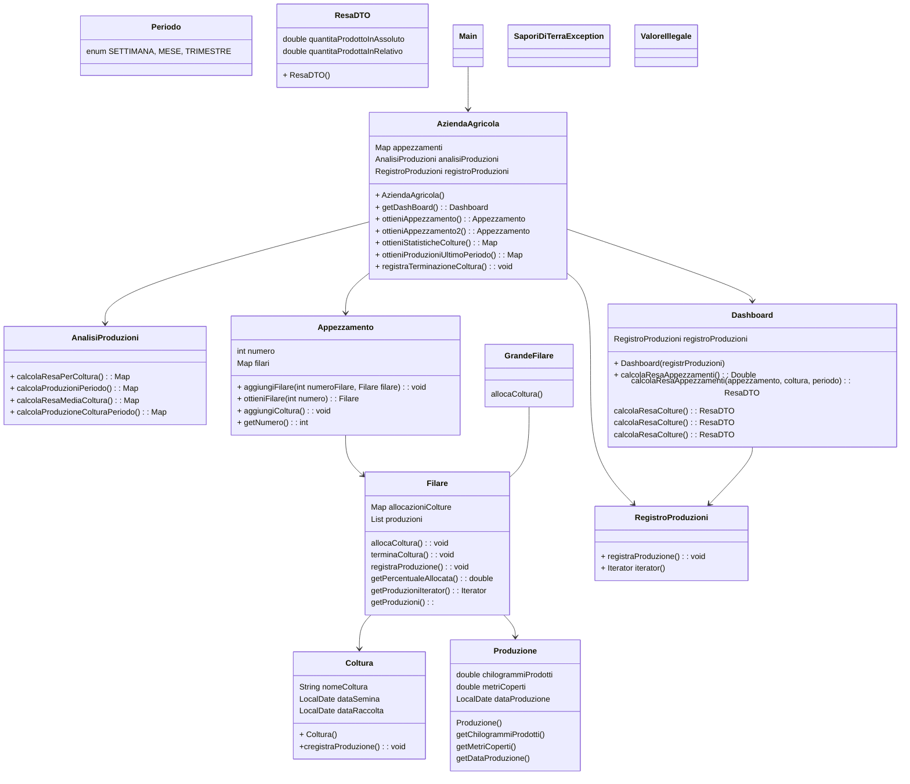

```mermaid
classDiagram

class AnalisiProduzioni{
+ calcolaResaPerColtura() : Map<String,Double>
+ calcolaProduzioniPeriodo() : Map<String,Double>
+ calcolaResaMediaColtura() : Map<String,Double>
+ calcolaProduzioneColturaPeriodo() : Map<String,Double>

}
class Appezzamento{
int numero
Map<Integer,Filare> filari
+ aggiungiFilare(int numeroFilare, Filare filare) : void
+ ottieniFilare(int numero) : Filare
+ aggiungiColtura() : void
+ getNumero() : int
}

class AziendaAgricola{
Map<Integer, Appezzamento> appezzamenti
AnalisiProduzioni analisiProduzioni 
RegistroProduzioni registroProduzioni
+ AziendaAgricola()
+ getDashBoard() : Dashboard
+ ottieniAppezzamento() : Appezzamento
+ ottieniAppezzamento2() : Appezzamento
+ ottieniStatisticheColture() : Map<String, Double>
+ ottieniProduzioniUltimoPeriodo() : Map<String, Double>
+ registraTerminazioneColtura() : void
}

class Filare{
Map<Coltura,Double> allocazioniColture
List<Produzione> produzioni
allocaColtura() : void
terminaColtura() : void
registraProduzione() : void
getPercentualeAllocata() : double
getProduzioniIterator() : Iterator
getProduzioni() : 
}

class Coltura{
String nomeColtura
LocalDate dataSemina
LocalDate dataRaccolta
+ Coltura()
+cregistraProduzione() : void
}

class Dashboard{
RegistroProduzioni registroProduzioni
+ Dashboard(registrProduzioni)
+ calcolaResaAppezzamenti() : Double
calcolaResaAppezzamenti(appezzamento, coltura, periodo) : ResaDTO
calcolaResaColture(): ResaDTO
calcolaResaColture(): ResaDTO
calcolaResaColture(): ResaDTO
}

class GrandeFilare{
allocaColtura()
}

class Periodo{
enum SETTIMANA, MESE, TRIMESTRE
}

class RegistroProduzioni{
+ registraProduzione() : void
+ Iterator<Coltura> iterator()
}

class ResaDTO{
double quantitaProdottoInAssoluto
double quantitaProdottaInRelativo
+ ResaDTO()
}


class Main{

}

class Produzione{
double chilogrammiProdotti
double metriCoperti
LocalDate dataProduzione
Produzione()
getChilogrammiProdotti()
getMetriCoperti()
getDataProduzione()
}

class SaporiDiTerraException{}

class ValoreIllegale{}

Main --> AziendaAgricola

AziendaAgricola --> Appezzamento
AziendaAgricola --> RegistroProduzioni
AziendaAgricola --> AnalisiProduzioni
AziendaAgricola --> Dashboard

Appezzamento --> Filare

Dashboard --> RegistroProduzioni

GrandeFilare -- Filare

Filare --> Coltura
Filare --> Produzione
```