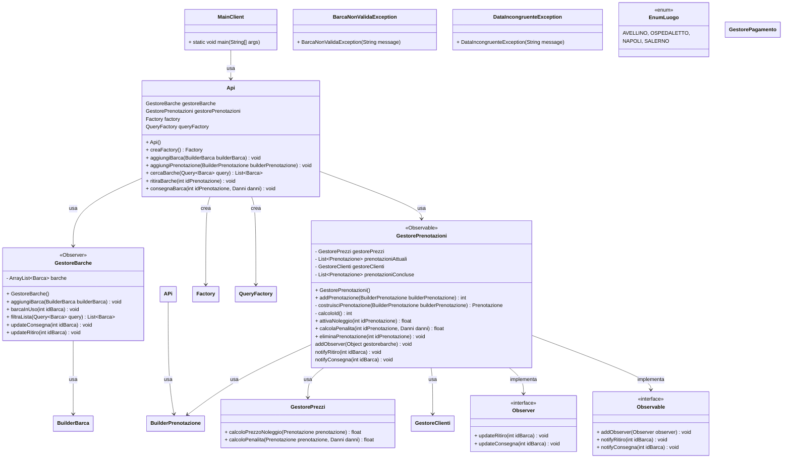

```mermaid
---
config:
    class:
        hideEmptyMembersBox: true
---
classDiagram
    class Api{
        GestoreBarche gestoreBarche
        GestorePrenotazioni gestorePrenotazioni
        Factory factory
        QueryFactory queryFactory

        + Api()
        + creaFactory() Factory
        + aggiungiBarca(BuilderBarca builderBarca) void
        + aggiungiPrenotazione(BuilderPrenotazione builderPrenotazione) void
        + cercaBarche(Query~Barca~ query) List~Barca~
        + ritiraBarche(int idPrenotazione) void
        + consegnaBarca (int idPrenotazione, Danni danni) void
    }

    class MainClient{
        + static void main(String[] args)
    }

    class BarcaNonValidaException{
        + BarcaNonValidaException(String message)
    }

    class DataIncongruenteException{
        + DataIncongruenteException(String message)
    }

    class EnumLuogo{
        <<enum>>
        AVELLINO, OSPEDALETTO, 
        NAPOLI, SALERNO
    }

    class BuilderBarca{
    }

    class GestoreBarche{
        <<Observer>>
        - ArrayList~Barca~ barche
        + GestoreBarche()
        + aggiungiBarca(BuilderBarca builderBarca) void
        + barcaInUso(int idBarca) void
        + filtraLista(Query~Barca~ query) List~Barca~
        + updateConsegna(int idBarca) void
        + updateRitiro(int idBarca) void
        }
    
    class GestorePrenotazioni{
        <<Observable>>
        - GestorePrezzi gestorePrezzi
        - List~Prenotazione~ prenotazioniAttuali
        - GestoreClienti gestoreClienti
        - List~Prenotazione~ prenotazioniConcluse
        + GestorePrenotazioni()
        + addPrenotazione(BuilderPrenotazione builderPrenotazione) int
        - costruisciPrenotazione(BuilderPrenotazione builderPrenotazione) Prenotazione
        - calcoloId() int
        + attivaNoleggio(int idPrenotazione) float
        + calcolaPenalita(int idPrenotazione, Danni danni) float
        + eliminaPrenotazione(int idPrenotazione) void

        addObserver(Object gestorebarche) void
        notifyRitiro(int idBarca) void
        notifyConsegna(int idBarca) void
    }

    class GestorePrezzi{
        + calcoloPrezzoNoleggio(Prenotazione prenotazione) float
        + calcoloPenalita(Prenotazione prenotazione, Danni danni) float
    }

    class GestorePagamento{}

    class Observer{
        <<interface>>
        + updateRitiro(int idBarca) void
        + updateConsegna(int idBarca) void
    }

    class Observable{
        <<interface>>
        + addObserver(Observer observer) void
        + notifyRitiro(int idBarca) void
        + notifyConsegna(int idBarca) void
    }

    Main Client --> Api : usa

    Api --> GestoreBarche : usa
    Api --> GestorePrenotazioni : usa
    Api --> Factory : crea
    Api --> QueryFactory : crea
    APi --> BuilderPrenotazione : usa

    GestoreBarche --> BuilderBarca : usa
    GestorePrenotazioni --> BuilderPrenotazione : usa
    GestorePrenotazioni --> GestorePrezzi : usa
    GestorePrenotazioni --> GestoreClienti : usa
    GestorePrenotazioni --> Observer : implementa
    GestorePrenotazioni --> Observable : implementa
```