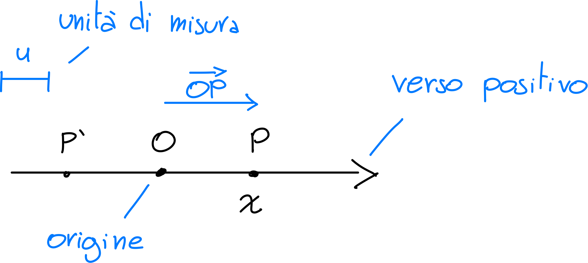
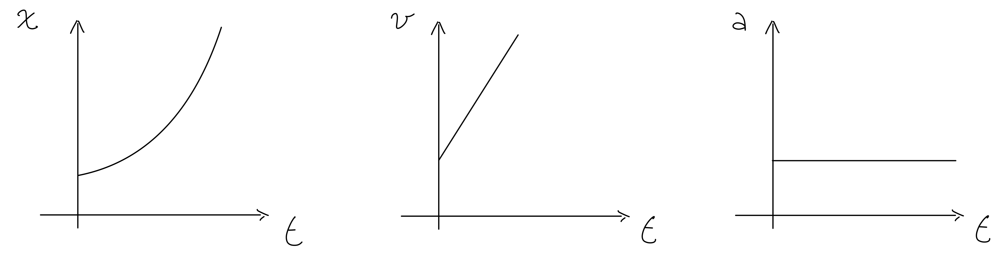
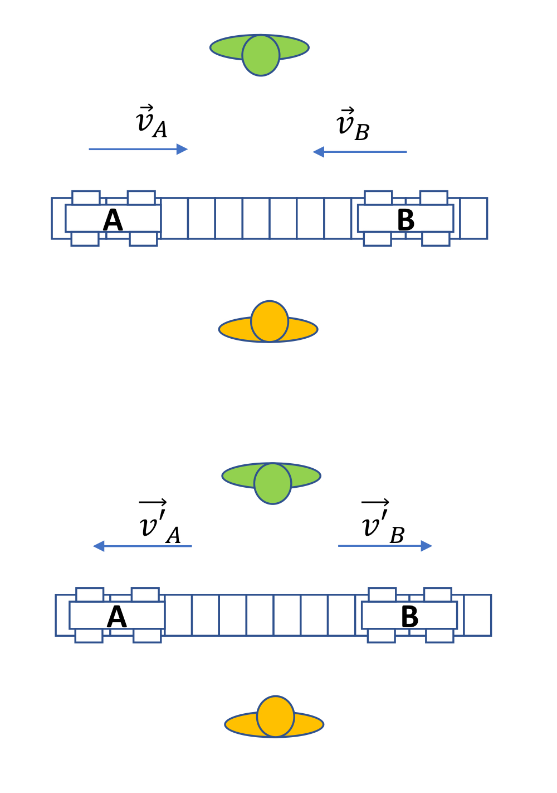
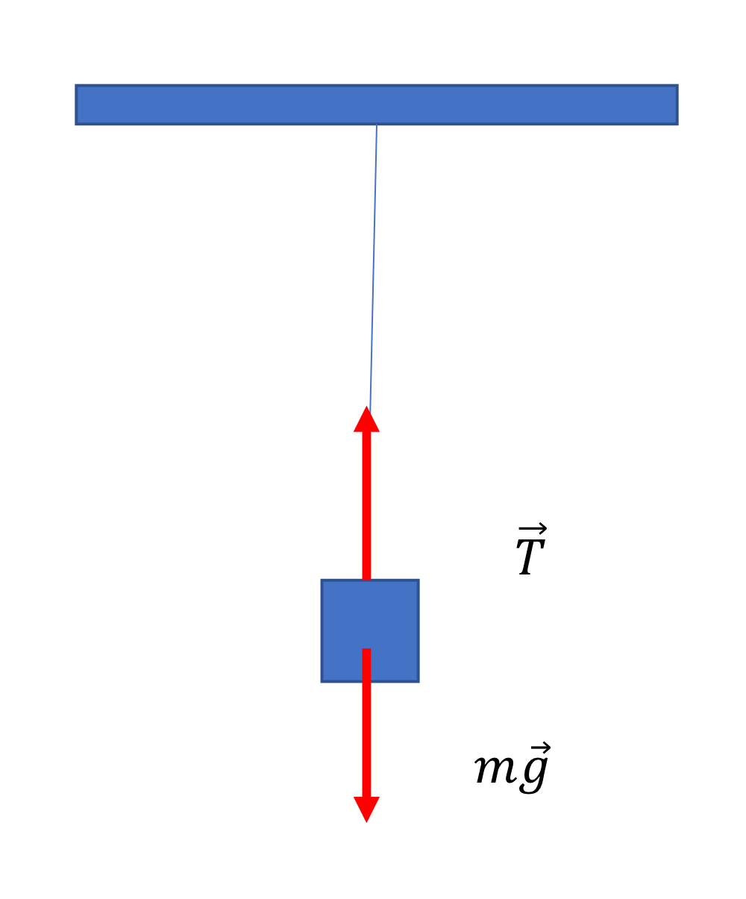
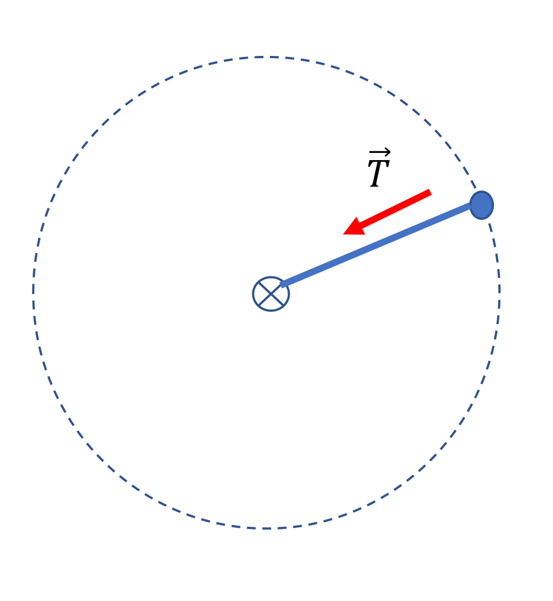
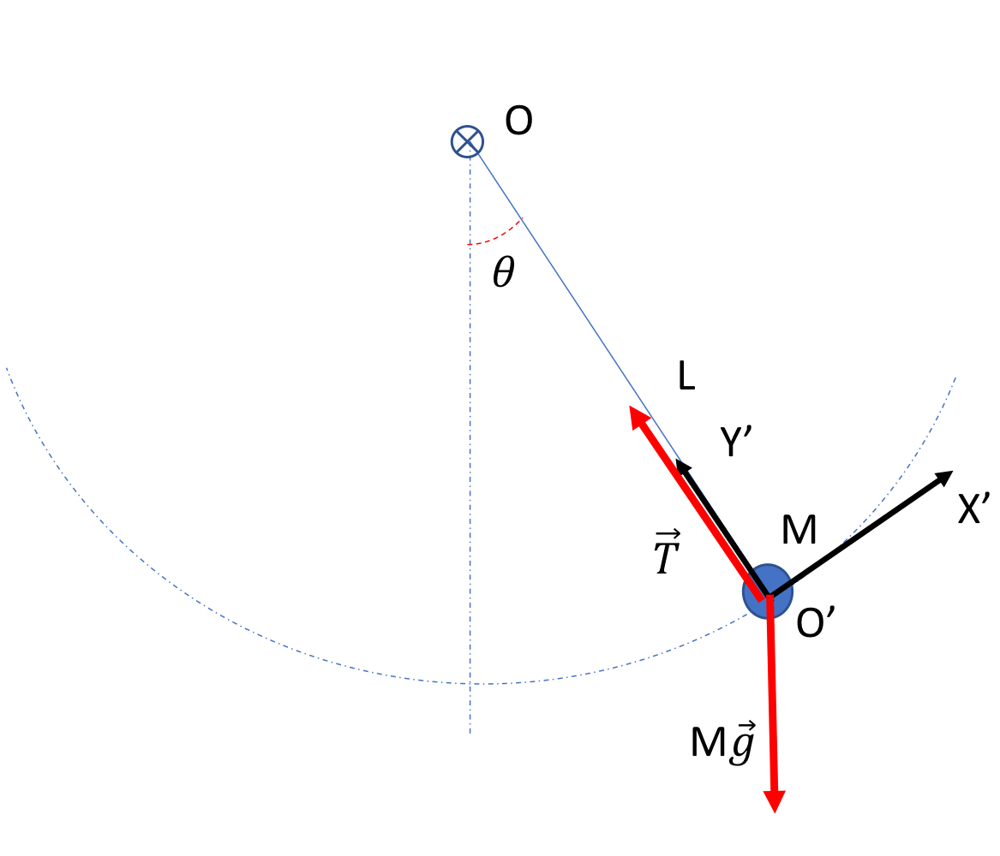
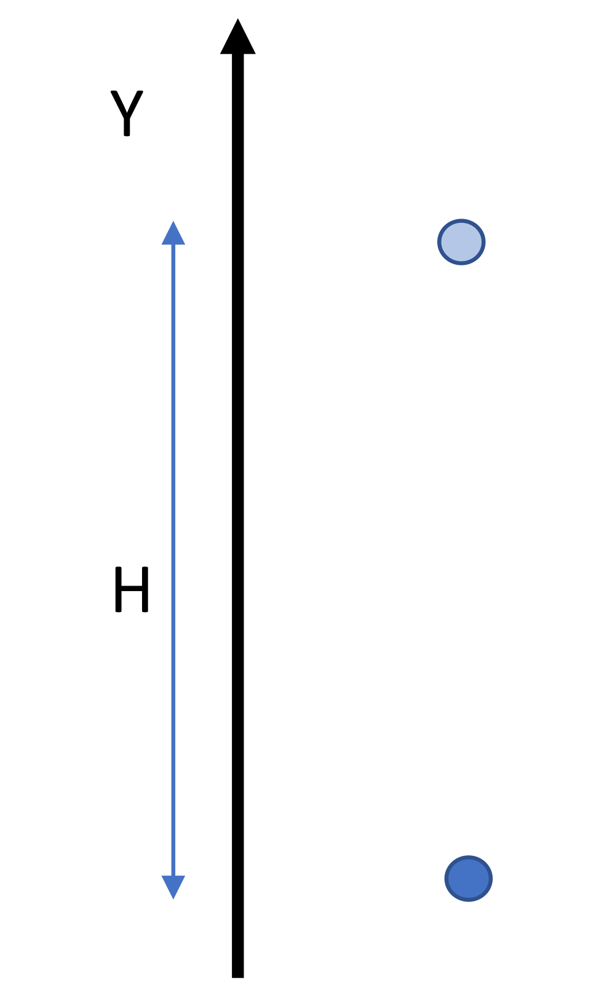

## Fisica parte 1 - Cinematica

**RISULTATO DI MISURA**: $ x + \Delta x $

$x$ = valore di misura

$\Delta x$ = incertezza di misura

**MISURA INDIRETTA** $ Y = F(X_1, X_2, ... , X_n) $

$Y$ = grandezza derivata

$F$ = funzione

$X_1, X_2, ... , X_n$ = grandezze fisiche

**GRANDEZZE FONDAMENTALI**:

| Grandezza | Unità di misura | Simbolo |
| --- | --- | --- |
| Massa | chilogrammo | kg |
| Lunghezza | metro | m |
| Tempo | secondo | s |
| Temperatura | kelvin | K |
| Quantità di sostanza | mole | mol |
| Intensità di corrente | ampere | A |
| Intensità luminosa | candela | cd |

**CALCOLO DIMENSIONALE**:

omogenee = stesse dimensioni

- $A = B\ \iff\ [A] = [B]$ omogenee
- $A+B\ \iff\ [A] = [B]$ omogenee
- $[A\cdot B]\ \iff\ [A]\cdot[B]$ prodotto di dimensioni
- $[\Pi] \iff 1$ costanti sono adimensionali

**CIFRE SIGNIFICATIVE**:

$S: (97 \pm 1)m$

$\Delta T = (22 \pm 1)m$

| $ S \Delta T $ | 21 | 23 |
| --- | --- | --- |
| 96 | 4.571... | 4.173... |
| 98 | 4.619... | 4.217... |

$Vm$ varia da 4.619 - 4.173 = 0.446

**errore massimo assoluto**:

$Vm = (4.409... \pm 0.223...) m/s$

$ Vm = (4.4 \pm 0.2) m/s$

$0.2$ ordine grandezza errore

**NOTAZIONE SCIENTIFICA ED ERRORI**:

$250 \pm 10$ &rarr; $(2.50 \pm 0.10) \cdot 10^2$

$30.0 \pm 0.2$ &rarr; $(3.00 \pm 0.02) \cdot 10^1$

$0.0005 \pm 0.001$ &rarr; $(5 \pm 1) \cdot 10^{-3}$

**CIFRE SIGNIFICATIVE OPERAZIONI**:

- **SOMMA**: $A=2.5 \cdot 10^2 , B=30.0$ &rarr; $ A+B = 2.8 \cdot 10^2 $

  notare ordine di grandezza di $A$ sono le decine, di $B$ sono i decimi

- **PRODOTTO**: $A=2.5 \cdot 10^2 , B=30.0$ &rarr; $ A\cdot B = 7.5 \cdot 10^3 $

  notare che $A$ ha 2 cifre significative, $B$ ne ha 3, quindi il risultato avrà 2 cifre significative

- **FUNZIONE UNARIA**: $A=2.5 \cdot 10^2$ &rarr; $ \sqrt{A} = 1.6 \cdot 10^1 $

  notare che $A$ ha 2 cifre significative, quindi il risultato avrà 2 cifre significative

### CINEMATICA

**CINEMATICA**: descrizione del moto dei corpi

**POSIZIONE**: relativa a un PUNTO DI RIFERIMENTO

**ASSE COORDINATO**:

$P = x = \vec{OP}$

$ \vert \vec{OP'} \vert = \vert \vec{OP} \vert $

$ x \text{ posizione} \begin{cases} \vert \vec{OP} \vert \text{ se } \vec{OP}  \text{ concorde nel verso positivo} \\\\ - \vert \vec{OP} \vert \text{ se } \vec{OP} \text{ discorde nel verso positivo} \end{cases} $

**DUE DIMENSIONI**:

#### Legge oraria del moto

descrive la posizione in un dato istante

#### Moto rettilineo uniforme

intervalli di tempo uguali = spostamenti uguali

LEGGE ORARIA:

$$x(t) = At + x_0$$

$x_0$: posizione iniziale

$t$: istante di tempo

$A$: costante di proporzionalità

$n\Delta x=A \cdot n\Delta t$ &nbsp; &nbsp; con $n$ numero di istanti

VELOCITÀ MEDIA: $$v_m = \frac{\Delta x}{\Delta t}$$

VELOCITÀ ISTANTANEA: $$v = \lim_{\Delta t \to 0} \frac{\Delta x}{\Delta t}$$

#### Moto rettilineo uniformemente accelerato

accelerazione costante, velocità aumenta linearmente

$v(t) = Bt + v_0$

$a_m = \frac{\Delta v}{\Delta t}$

$v(t) = a_m t + v_0$

**ACCELERAZIONE MEDIA**: $$a_m = \frac{\Delta v}{\Delta t}$$

**ACCELERAZIONE ISTANTANEA**: $$a(t) = \lim_{\Delta t \to 0} \frac{\Delta v}{\Delta t} = \frac{dv(t)}{dt}$$

 

#### IN BREVE

**SPAZIO**: legge oraria $x = x(t)$

**VELOCITÀ**: derivata della legge oraria $v = \frac{dx}{dt}$

**ACCELERAZIONE**: derivata della velocità $a = \frac{dv}{dt} = \frac{d^2x}{dt}$

#### Interludio matematico

basi di matematica

#### Moto uniformemente accelerato

| 1 dimensione | |
| --- | --- |
| legge oraria: | $$ x(t) = \frac{1}{2} a_0 t^2 + v_0 t + x_0 $$ |
| velocità: | $$ v(t) = a_0 t + v_0 $$ |
| accelerazione: | $$ a(t) = a_0 $$ |

| 2 dimensioni | |
| --- | --- |
| legge oraria: | $$ \vec{r}(t) = \frac{1}{2} \vec{a_0} t^2 + \vec{v_0} t + \vec{r_0} $$ |
| velocità: | $$ \vec{v}(t) = \vec{a_0} t + \vec{v_0}$$ |
| accelerazione: | $$ \vec{a}(t) = \vec{a} $$ |

Scegliamo asse y parallelo ad $a_0$

In questo modo scomponiamo il moto in due moti indipendenti:

- componente $ P_y $: moto uniformemente accelerato
- componente $ P_x $: moto rettilineo uniforme

Ottenendo quindi 

$$
\begin{cases}
x(t) = v_{0x} t + x_0 \\\\
y(t) = \frac{1}{2} a_0 t^2 + v_{0y} t + y_0
\end{cases}
$$

#### Moto armonico

La legge oraria del moto armonico è:

$$
x(t) = x_0 \cos(\omega t + \varphi_0)
$$

ed è caratterizzata dai 3 parametri:

- $x_0$: ampiezza del moto
- $\omega$: frequenza angolare o pulsazione
- $\varphi_0$: fase iniziale

##### $\omega_0$: pulsazione

La posizione in $ t $ e in $ t+T $ deve essere la stessa, per definizione di periodo $T$.
Poichè $\cos$ ha periodo $2\pi$, si ricava la seguente relazione:

$$
\omega_0 T = 2\pi \qquad T = \frac{2\pi}{\omega_0} \qquad \omega_0 =\frac{2\pi}{T}
$$

##### $x_0$: ampiezza

$x(t)$ oscilla tra $-x_0$ e $x_0$. Questo si può facilmente dimostrare considerando $ x = x_0 \cos(\omega t + \varphi_0) $, in quanto la funzione $\cos$ oscilla tra -1 e 1 indipendentemente dall'argomento.

$$
x_{\max} = x_0 \cdot \cos_{\max} = x_0 \cdot 1 = x_0 \\\\
x_{\min} = x_0 \cdot \cos_{\min} = x_0 \cdot (-1) = -x_0
$$

##### $\varphi_0$: fase iniziale

disallineamento della funzione rispetto all'origine degli istanti di tempo. Poichè la funzione è
$$
x(t) = x_0 \cos(\omega_0 t + \varphi_0) \\\\ x = x_0 \cos(\alpha + k)
$$
possiamo facilmente osservare che $\varphi_0 = k$ indica il disallineamento rispetto allo zero del coseno ponendo $t=0$.

##### Velocità del moto armonico

Poichè abbiamo $x(t) = x_0 \cos(\omega_0 t + \varphi_0)$, possiamo ricavare la velocità derivando la legge oraria:
$$
v(t) = \frac{dx}{dt} = -\omega_0 x_0 \sin(\omega_0 t + \varphi_0)
$$

Osservo attentamente che:

- ampiezza dipende dalla pulsazione: $-x_0 \omega_0, +x_0 \omega_0$
- fase invariata: $\varphi_0$
- periodo invariato: $T = \frac{2\pi}{\omega_0}$

##### Accelerazione del moto armonico

Analogamente, ricaviamo l'accelerazione derivando la velocità:

$$
a(t) = -\omega_0^2 \cdot x_0 \cos(\omega_0 t + \varphi_0) = -\omega_0^2 \cdot x(t)
$$

Noto : $x_0 \cos(\omega_0 t + \varphi_0) = x(t)$

Osserviamo che:

- ampiezza dipende dalla pulsazione: $-x_0 \omega_0^2, +x_0 \omega_0^2$
- fase invariata: $\varphi_0$
- periodo invariato: $T = \frac{2\pi}{\omega_0}$

L'accelerazione è **proporzionale** alla posizione del corpo.

##### Relazione $ x^2 \omega_0^2 + v^2 $

Considerando la quantità $ x^2 \omega_0^2 + v^2 $, sostituiamo $x$ e $v$ con le rispettive leggi orarie:

$$
x^2 \omega_0^2 + v^2 = x_0^2 \omega_0^2
$$

ovvero una quantità che rimane costante nel moto, conservandosi.

#### Moto circolare

moto che avviene lungo una circonferenza di raggio $R$ con centro in $O$.

La legge oraria risulta pertanto essere:

$$
\theta = \theta t
$$

in un moto essenzialmente unidimensionale, con

- velocità angolare $\omega = \frac{d\Theta}{dt}$
- accelerazione angolare $\alpha = \frac{d\omega}{dt}$

##### Moto circolare uniforme

Moto nel quale la velocità angolare è costante

$$
\Theta = \omega_0 t + \theta_0
$$

con velocità angolare $ \omega = \omega_0 $ e accelerazione angolare $ \alpha = 0 $.

Nel piano cartesiano pertanto le due componenti risultano essere:

$$
\begin{cases}
x(t) = R \cos(\omega_0 t + \theta_0) \\\\
y(t) = R \sin(\omega_0 t + \theta_0)
\end{cases}
$$

Derivando il sistema per ottenere la velocità delle componenti, otteniamo:

$$
\begin{cases}
v_x(t) = -R \omega_0 \sin(\omega_0 t + \theta_0) \\\\
v_y(t) = R \omega_0 \cos(\omega_0 t + \theta_0)
\end{cases}
$$

Il vettore velocità $\vec{v}$ risulta ortogonale a $\vec{r}$, con modulo $$v = R \vert \omega_0 \vert$$

Mentre l'accelerazione risulta essere:

$$
\vert \vec{a} \vert = R \omega_0^2
$$

Nel caso del moto circolare uniforme, l'accelerazione centripeta rivolta verso $O$ è l'unica componente non nulla dell'accelerazione.

##### Moto circolare vario

Nel caso considerassimo un moto circolare con legge oraria $\vartheta(t)$ qualsiasi funzione, otteniamo:

$$
\text{legge oraria:} \quad
\begin{cases}
x(t) = R \cos(\vartheta(t)) \\\\
y(t) = R \sin(\vartheta(t))
\end{cases}
$$

In questo caso, la velocità è una derivata di una composta, ricordando che $\vartheta ' = \omega(t)$:

$$
\text{velocità:} \quad
\begin{cases}
v_x(t) = -R \sin(\vartheta(t)) \cdot \omega(t) \\\\
v_y(t) = R \cos(\vartheta(t)) \cdot \omega(t)
\end{cases}
$$

Derivando ulteriormente, otteniamo l'accelerazione:

$$
\text{accelerazione:} \quad
\begin{cases}
a_x(t) = -R \cos(\vartheta(t)) \cdot \omega (t)^2 - R \sin(\vartheta(t)) \cdot \alpha(t) \\\\
a_y(t) = -R \sin(\vartheta(t)) \cdot \omega (t)^2 + R \cos(\vartheta(t)) \cdot \alpha(t) 
\end{cases}
$$

Ne deduciamo che:

$$
\vec{a}(t) = R \alpha(t) \hat{t} -R \omega(t)^2 \hat{r} = \alpha_{tang} \hat{t} + \alpha_{centr} \hat{r}
$$

L'accelerazione tiene conto di:

-componente centripeta (verso $O$): $-R \omega(t)^2\hat{r}$
-componente tangenziale (verso il senso di rotazione): $R \alpha(t) \hat{\theta}$

## parte 2 - Dinamica

Un corpo tende a conservare proprio moto (velocità si conserva, accelerazione nulla) finché non avviene un'interazione con l'ambiente esterno

### Sistemi di riferimento inerziali

**Principio di inerzia**: esiste classe di sistemi di riferimento inerziali per i quali un corpo non sottoposto a interazioni con l'ambiente esterno permane nel suo stato di moto.

### Massa e quantità di moto

- due corpi $A$ e $B$ si scontrano, la loro velocità varia: $\vec{v_A} \rightarrow \vec{v_A '}$ e $\vec{v_B} \rightarrow \vec{v_B '}$
- in particolare consideriamo $\vec{v_A} = - \vec{v_B}$ e lo scontro frontale di due oggetti identici su una traiettoria retta

- ne segue che la variazione della velocità risulta: $\Delta \vec{v_A} = -\Delta \vec{v_B}$ indipendentemente dall'osservatore e anche indipendentemente da un termine di trascinamento.
-  aggiungendo un oggetto $X$ al corpo $B$ (ad esempio una massa) e ripetendo l'esperimento, osserviamo che $\Delta \vec{v_A} < -\Delta \vec{v_B}$, ovvero la variazione di velocità di $A$ è minore in modulo rispetto a quella di $B$. In questo caso la relazione è $\Delta \vec{v_A} = - K(A,B+X) \cdot \Delta \vec{v_B}$.
- tale $K$ costante di proporzionalità è definita **massa inerziale**
- pertanto possiamo riscrivere la relazione precedente come $m_A \Delta \vec{v_A} = - m_B \Delta \vec{v_B}$
- possiamo quindi definire la **quantita di moto** come $\vec{p} = m \vec{v}$, con $m$ massa inerziale e $\vec{v}$ velocità del corpo

**quantita di moto $p$**: prodotto tra massa e velocità $p = m \cdot v$

**impulso $I$**: variazione della quantità di moto $I = \Delta \vec{p}$

**forza $F$**: variazione della quantità di moto per unità di tempo $$F = \lim_{\Delta t \to 0} \frac{\vec{I}}{\Delta t}$$

Da cui conseguono le 3 leggi della Dinamica così formulate:

- principio di inerzia
- legge del moto: data $R = \sum_i F_i$ risultante di tutte le forze che agiscono su un corpo, si ha $$R = \frac{d\vec{p}}{dt} \implies \vec{R} = m\vec{a}$$ in quanto la massa inerziale si conserva
- principio di azione e reazione: l'interazione tra due coppie di forze $\vec{F_A}$ e $\vec{F_B}$ è tale che $\vec{F_A} = -\vec{F_B}$

### Forze elastiche

Analizziamo la relazione tra l'allungamento $\Delta L$ e l'intensità della forza applicata $F$

Considerando deformazioni abbastanza piccole da essere considerate elastiche, otteniamo:

$$
F = K \cdot \Delta L
$$

Con $K$ **costante elastica**: a valori più alti corrispondono oggetti più rigidi

Esiste però anche una quantità chiamata **tensione**. Dalla legge di Hooke, possiamo ricavare la seguente relazione:

$$
\vec{T}= -K \vec{\Delta L}
$$

#### Fune inestensibile

Prendiamo due esempi:

Consideriamo di una massa $m$ sospesa al soffitto tramite cavo in condizioni statiche.
La situazione di equilibrio è data dalla relazione $T + mg = 0$

  

Consideriamo una massa che ruota su un piano, in cui la massa è collaga al cavo di lunghezza $L$ il quale è fissato a un punto del piano.
Se in un dato istante la massa $m$ ha velocità $v$, la sua $a_{\text{centr}} = \frac{v^2}{L}$, per cui $T = m \cdot a_{\text{centr}} = m \frac{v^2}{L}$

La tensione deriva dalla cinematica della forza del corpo in entrambi i casi.

### Attrito

Forza generata dal contatto tra due corpi, che si oppone al moto relativo tra di essi.

- proporzionale alla forza normale $N$ che agisce tra i corpi
- non contiene riferimenti all'area di contatto tra i corpi

$$
F_{attr} = \mu_{din} \cdot N
$$

Immaginiamo due spazzole con le rispettive setole incastrate. Supponiamo di applicare due forze uguali e contrarie ai corpi. Se le due forze non sono abbastanza intense, le setole si deformeranno ma le spazzole non si muoveranno, dinamicamente i corpi risulteranno fermi.

Questo fenomeno lo spieghiamo con due forze vincolari $\vec{F}_{stat}$ dette **forze di attrito statico**

Non hanno una direzione prefissata, ma la direzione è contenuta nel piano della superficie di contatto tra i corpi, opponendosi al relativo moto.

Ha un valore massimo $F^{stat}_{max}$. Superato questo valore, i corpi iniziano a muoversi.

$F_{stat} \leq F^{stat} _{max} = \mu _{stat} \cdot N$

Ne consgue anche che $ \mu_{din} < \mu_{stat} $, entrambi non negativi (e nei nostri casi minori di 1)

### Pendolo

Il pendolo è un sistema è costituito da una massa $M$ di dimensioni trascurabili, sospesa a un filo inestensibile di lunghezza $L$ privo di massa.

- la posizione del corpo è descritta da $\theta$: è sufficiente in quanto la distanza da $O$ è sempre $L$

Le forze agenti sono:

la forza peso $F_P = M \vec{g}$

la tensione della fune $T$

Equazione del moto diventa:

$$
\begin{cases}
M a_{\text{tang}} =  - Mg \sin(\theta) \\\\
M a_{\text{centr}} = T - Mg \cos(\theta)
\end{cases}
$$

$Y'$ determina unicamente la tensione della fune

Invece $a_{\text{tang}} = L \cdot \theta ''$, da cui otteniamo $ M L \theta '' = - Mg \sin(\theta) $

Riconduciamo tutto a:

$$
\theta '' = - \frac{g}{L} \sin(\theta)
$$

$\sin(\theta) \approx \theta$ per $\theta$ piccoli, da cui otteniamo $\theta '' = - \frac{g}{L} \theta$

#### Formule essenziali moto del pendolo

Pertanto in un moto armonico con pulsazione:

$$
\omega = \sqrt{\frac{g}{L}}
$$

l'equazione del moto diventa:

$$
\theta(t) = \theta_0 \cos(\omega t + \varphi_0)
$$

con periodo:

$$
T = \frac{2\pi}{\omega} = 2\pi \sqrt{\frac{L}{g}}
$$

Il moto pertanto risulta indipendente dalla massa $M$ e dall'ampiezza $\theta_0$ (in questa approssimazione).

### Energia

definizione approssimativa di energia:

**energia**: se è possibile prevedere con esattezza l'evoluzione dello stato di un sistema fisico, allora esiste una grandezza calcolata sulle grandezze che definiscono questo stato, che si conserva nel tempo.

esempi con **macchine virtuali**.

#### Energia cinetica

Consideriamo il moto di un grave che cade da un'altezza $h$, partendo da una situazione di quiete.

La sua variazione di energia potenziale è la seguente:

$$
\Delta U_{peso} = \Delta (ymg) = - Hmg
$$

L'energia dunque non si è conservata.  Questo perché dobbiamo considerare anche il suo stato di moto:

$$
K = \frac{1}{2} m v^2
$$

da completare

#### Principio di conservazione dell'energia meccanica

Per un sistema isolato, l'energia totale del sistema si conserva nella evoluzione di quest'ultimo

### Lavoro

Data una forza $\vec{F}$ supponiamo che il suo punto di applicazione si sposti da $\vec{r_1}$ a $\vec{r_2}$ lungo una traiettoria $C$. Definiamo lavoro:

$$
L = \int_{\vec{r_1}}^{\vec{r_2}} \vec{F} \cdot d\vec{r}
$$

Nel caso di una forza costante, otteniamo:

$$
L = \vert \vec{F} \vert \cdot \vert \Delta \vec{r} \vert \cdot \cos(\theta)
$$

Con l'angolo $\theta$ compreso tra direzione della forza e quello dello spostamento.

Non vale per le forze non costanti, ad esempio per la forza elastica (formula)

#### Teorema dell'energia cinetica

