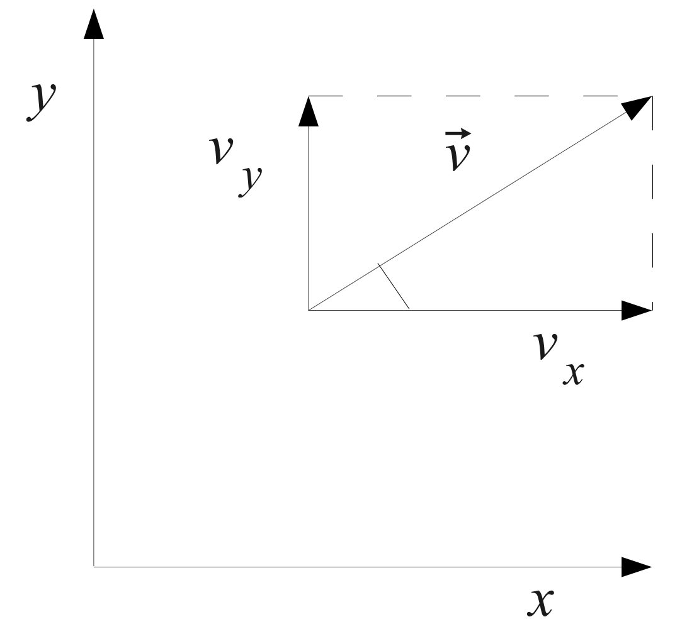

## Introduzione

Fisica: descrizione dei fenomeni naturali attraverso modelli matematici.

Grandezze fisiche: entità osservabili nei fenomeni naturali a cui è possibile associare quantità matematiche.

Legge fisica: relazione tra almeno due grandezze fisiche

### Cinematica

#### Concetti fondamentali

**moto**: variazione di posizione nel tempo di un corpo rispetto ad altri corpi considerati fissi

**sistema di riferimento**: usato per descrivere il moto di un corpo

**traiettoria**: linea descritta da un punto materiale durante il suo moto

**Legge oraria**: relazione fra il tratto di traiettoria percorso $s$ e il tempo $t$

Il tratto di traiettoria percorso durante un moto è una quantità vettoriale detta spostamento $s$

#### Velocità

**velocità scalare media**: rapporto tra lo spazio percorso $s$ e l'intervallo di tempo $t$ impiegato a percorrerlo

$$
v_m = \frac{s(t_2)-s(t_1)}{t_2-t_1}
$$

**velocità istantanea**: limite della velocità media per $t_2 \to t_1$
$$
v = \lim_{\Delta t \to 0} \frac{s(t + \Delta t)-s(t)}{\Delta t} = \frac{ds}{dt}
$$

la velocità istantanea è la tangente

Calcolo dimensionale della velocità:

$$
[V] = \frac{[L]}{[T]}
$$

$$
\vert \vec{v} \vert = \sqrt{v_x^2 + v_y^2}
$$

$$
\text{componente orizzontale } = \vert \vec{v_x} \vert = \vert \vec{v} \vert \cos \alpha
$$

$$
\text{componente verticale } = \vert \vec{v_y} \vert = \vert \vec{v} \vert \sin \alpha
$$

#### Accelerazione

variazione nel tempo della velocità

**accelerazione media**: rapporto tra la variazione di velocità $\Delta v$ e l'intervallo di tempo $\Delta t$ in cui avviene

$$
\vec{a_m} = \frac{\vec{v}(t_2)-\vec{v}(t_1)}{t_2-t_1}
$$

**accelerazione istantanea**: limite dell'accelerazione media per $t_2 \to t_1$

$$
\vec{a} =\frac{d\vec{v(t_1)}}{dt}
$$

calcolo dimensionale dell'accelerazione:

$$
[L][T]^{-2}
$$

#### Moti notevoli

**moto rettilineo**: la direzione della velocità è costante e coincidente con la traiettoria

**moto curvilineo**: il vettore accelerazione **non** è tangente alla traiettoria, ovvero possiede una componente, detta **normale**, perpendicolare alla traiettoria

##### Moto rettilineo uniforme

- traiettoria rettilinea
- $v$ costante in modulo
- $a = 0$

- legge oraria: $$x = x_0 + v_0t$$

##### Moto rettilineo uniformemente accelerato

- corpo parte da fermo e si muove in linea retta
- $a$ costante in modulo e direzione
- velocità varia soltanto in modulo

Se corpo non parte da fermo, l'importante è che $v_0$ abbia la stessa direazione di $a$.

$$
v = v_0 + at
$$

Legge oraria:

$$
x = x_0 + v_0t + \frac{1}{2}at^2
$$  

- grafico spazio-tempo: parabola
- grafico velocità-tempo: retta con coefficiente angolare $a$

##### Moto circolare uniforme

Moto di un punto $P$ che si muove a velocità $v$ con modulo costante e direzione variabile.

velocità lineare periferica: velocità con cui $P$ si muove lungo la circonferenza

velocità angolare $w$: velocità di rotazione del raggio $R$ nel seguire $P$

per definizione

$$
w = \frac {\Delta \theta}{\Delta t}
$$

velocità lineare periferica:

$$
v = wR
$$

accelerazione:

$$
a = v \omega = \frac{v^2}{R} = w^2 R
$$

accelerazione normale o **centripeta**: direzione perpendicolare alla traiettoria, verso il centro della circonferenza

##### Moto armonico

moto di un punto che percorre avanti e indietro con periodicità un segmento

legge oraria:

$$
x = A \sin (\omega t + \phi)
$$

con:

- $A$: ampiezza del moto
- $\omega$: pulsazione del moto
- $\phi$: fase iniziale del moto

La pulsazione $\omega$ è legata alla **frequenza** del moto, definita come numero di cicli per secondo:

$$
\omega = 2 \pi f
$$

L'inverso della frequenza è il **periodo** del moto, ovvero il tempo necessario a compiere un ciclo completo:

$$
T = \frac{1}{f} = \frac{2 \pi}{\omega}
$$

### Dinamica

#### Forze e leggi di Newton

studio del moto in relazione alle cause che lo generano, ovvero le **forze** (grandezze vettoriali)

Posso causare:

- variazione dello stato di moto (corpo non vincolato), misurata con metodo dinamico
- deformazione (corpo vincolato), misurata con metodo statico

**principio di relatività galileiana**: le leggi fisiche sono invarianti nei sistemi di riferimento inerziali

1. **principio di inerzia**: ogni corpo persiste nel suo stato di quiete o di moto rettilineo uniforme a meno che non sia costretto a cambiare stato da forze applicate
2. **principio fondamentale della dinamica**: la forza agente imprime al moto un'accelerazione proporzionale ad essa, con costante di proporzionalità pari alla massa del corpo

$$
\vec{F} = m \vec{a}
$$

3. **principio di azione e reazione**: a ogni forza di azione corrisponde una forza di reazione uguale in modulo, opposta in direzione e applicata su un corpo diverso

**Newton (N)**: unità di misura statica di forza, 1 Newton è la forza che imprime a un corpo di massa 1 kg un'accelerazione di 1 $m/s^2$

**Diagramma corpo libero**: rappresentazione grafica delle forze che agiscono su un corpo

### Quantità di moto

**quantità di moto**: prodotto tra massa e velocità di un corpo

$$
\vec{p} = m \vec{v}
$$

**Teorema della conservazione della quantità di moto**: in un sistema isolato, la quantità di moto totale è costante

Dato che $ p = m \cdot v$, possiamo riscrivere il secondo principio della dinamica come:

$$
\vec{F} = \frac{d\vec{p}}{dt}
$$

Quando agiscono forze esterne la variazione della quantità di moto nel tempo è uguale alla risultante delle forze esterne

### Termodinamica

### Elettromagnetismo

#### Elettrostatica

I fenomeni elettrici dipendono dalla propietà della materia di possedere **carica elettrica**, che può essere **positiva** o **negativa**.

- attrazione tra cariche di segno opposto
- repulsione tra cariche di segno uguale

**Principio di conservazione della carica elettrica**: carica elettrica di una quantità di materia è uguale alla somma algebrica delle cariche elementari che la costituiscono

#### Legge di Coulomb

(copilot) La forza elettrostatica tra due cariche puntiformi è direttamente proporzionale al prodotto delle cariche e inversamente proporzionale al quadrato della distanza che le separa:

$$
\vec{F} = K \frac{q_1 q_2}{r^2} \frac{\vec{r}}{r}
$$

**Coulomb (C)**: carica posta nel vuoto a distanza di 1 metro da una carica uguale ad essa

$$ K = 8.99 \times 10^9 \frac{N \cdot m^2}{C^2} $$

Si può anche riscrivere analogamente come:

$$
K = \frac{1}{4 \pi \epsilon_0} \qquad \epsilon_0 = 8.85 \times 10^{-12} \frac{C^2}{N \cdot m^2}
$$

#### Legge di Coulomb nei mezzi materiali

Le interazioni sono attenuate dalla **costante dialettrica relativa** che dipende dal materiale del mezzo dialettrico

$$
\vec{F} = \frac{K}{\epsilon_r} \frac{q_1 q_2}{r^2} \frac{\vec{r}}{r}
$$

Nel vuoto vale $\epsilon_r = 1$, mentre nei materiali $\epsilon_r > 1$.

#### Unità di misura dell'elettrostatica

**Ampere (A)**: unità di misura della corrente

**Coulomb (C)**: unità di misura della carica elettrica.

1 Coulomb = quantità di carica trasportata in 1 secondo da una corrente di 1 Ampere

**carica elementare**: $1.6 \times 10^{-19} C$

**costante dialettrica del vuoto**: $\epsilon_0 = 8.85 \times 10^{-12} \frac{C^2}{N \cdot m^2}$

#### Elettrostatica e corpi

forze elettriche sono più intense tra cariche elementari, in quanto le masse macroscopiche sono tendenzialmente elettricamente neutre

#### Campo elettrico

**campo di forze**: regione dello spazio dove agiscono forze note in ogni punto

campo di forze elettrico è esprimibile come prodotto della carica q per un campo vettoriale detto **campo elettrico**.

Il **vettore intensità del campo elettrico** :

$$
\vec{E} = \frac{\vec{F}}{q} = \frac{1}{4 \pi \epsilon_0 \epsilon} \frac{Q}{r^2} ( \frac{\vec{r}}{r} )
$$

con

- $E$: intensità del campo elettrico
  - direzione coincide con quella della forza
  - verso coincide solo se $q$ è positiva
- $\vec{F}$: forza elettrica che agisce su una carica di prova
- $q$: carica di prova

Nel caso che il campo elettrico sia generato da una moltitudine di cariche, il vettore $E$ è dato dalla somma vettoriale dei campi elettrici generati da ciascuna carica

#### Campo elettrostatico e energia potenziale

**campo elettrostatico**: campo che non varia nel tempo. È conservativo (il lavoro compiuto per spostare una carica tra due punti è indipendente dal percorso seguito)

Essendo conservativo, è possibile definire una funzione **energia potenziale $U(r)$** che caratterizza il campo.

$$
U(\vec{r}) = \frac{Qq}{4 \pi \epsilon_0 \epsilon} \frac{1}{r}
$$

Dividendo per la carica di prova $q$ otteniamo il **potenziale elettrico**:

$$
V(\vec{r}) = \frac{U(\vec{r})}{q} = \frac{Q}{4 \pi \epsilon_0 \epsilon} \frac{1}{r}
$$

Se il campo è generato da una sola carica lo definiamo monopolo

#### Tabella riassuntiva per una carica q

$$
\begin{matrix}
\vec{F} = \frac{1}{4 \pi \epsilon_0 \epsilon} \frac{Qq}{r^2} ( \frac{\vec{r}}{r} ) &
\vec{E} = \frac{1}{4 \pi \epsilon_0 \epsilon} \frac{Q}{r^2} (\frac{\vec{r}}{r} ) \\
U(\vec{r}) = \frac{Qq}{4 \pi \epsilon_0 \epsilon} \frac{1}{r} &
V(\vec{r}) = \frac{Q}{4 \pi \epsilon_0 \epsilon} \frac{1}{r}
\end{matrix}
$$

#### Differenza potenziale elettrico

**potenziale elettrico**: due definizioni

- grandezza intensiva corrispondente all'energia potenziale elettrostatica
- grandezza scalare collegata al campo elettrostatico

**differenza di potenziale elettrico $\Delta V$**: lavoro compiuto per spostare una carica di prova $q$ tra due punti A e B del campo elettrostatico

$$
\Delta V = V(B) - V(A) = \frac{U(B)-U(A)}{q} = \frac{L_{AB}}{q}
$$

L'unità di misura del potenziale elettrico è il **Volt (V)**

**elettron-volt (eV)**: energia cinetica acquisita da un elettrone accelerato da una differenza di potenziale di 1 Volt. Corrisponde a $1.6 \times 10^{-19} J$

#### Teorema di Gauss

Il flusso elettrico totale attraverso una superficie chiusa è uguale al prodotto della carica totale all’interno della superficie per la costante $\frac{1}{4\pi\epsilon_0\epsilon}$

**flusso elettrico**: grandezza scalare che rappresenta numericamente il flusso del vettore $\vec{E}$ per una superficie attraversata da linee di forza del campo elettrico

(... slide 30 elettricità)

#### Capacità di un conduttore

**materiali conduttori**: materiali con cariche libere che propagano una perturbazione elettrica

**materiali isolanti o dialettrici**: materiali che non contengono cariche libere

**materiali semiconduttori**: materiali che hanno un comportamento intermedio, se drogati forniscono cariche di un solo segno

Il punto con minor potenziale in un conduttore è la superficie esterna, dove agiscono due componenti:

- componente nella direzione della superficie, che è nulla (o le cariche si sposterebbero lungo la superficie)
- componente ortogonale, generalmente diversa da zero

Pertanto il flusso corrisponde a

$$
\Phi (\vec{E})= E_{out} \Delta S 
$$

mentre il teorema di Gauss ci dice che

$$
\Phi (\vec{E}) = \frac{Q}{\epsilon_0 \epsilon} = \frac{1}{\epsilon_0 \epsilon} \sigma \Delta S
$$

in cui $Q$ è espresso in funzione della densità superficiale di carica $\sigma$.

Ne consegue

$$
E_{out} = \frac{\sigma}{\epsilon_0 \epsilon}
$$

Il potenziale raggiunto dal conduttore rappresenta lavoro svolto per portare una carica dall'infinito alla superficie del conduttore. Indichiamo pertanto la **capacità del conduttore $C$**:

$$
C = \frac{Q}{V}
$$

Il **farad** è l'unità di misura della capacità. 1 farad è la capacità di un conduttore che, portato a una differenza di potenziale di 1 Volt, accumula una carica di 1 Coulomb.

#### Condensatori

un condensatore è un insieme formato da due armature conduttrici affacciate a distanza $d$ e separate da un materiale isolante

In caso di presenza di due cariche uguali e opposte sulle armature, si genera una differenza di potenziale $\Delta v$

La **capacità elettrica** di un condensatore è data da

$$
C = \frac{Q}{\Delta V}
$$

La densità di carica $\sigma$ dipende ovviamente dalla superficie $S$ delle armature:

$$
\sigma = \frac{Q}{S}
$$

Dal teorema di Gauss

$$
ES = \frac{\sigma S}{\epsilon_0 \epsilon} \implies E = \frac{\sigma}{\epsilon_0 \epsilon}
$$

Differenza di potenziale tra le armature è il lavoro per unità di carica per spostare una carica da un'armatura all'altra:

$$
\Delta V = \frac{L}{q} = \frac{qEd}{q} = \frac{\sigma d}{\epsilon_0 \epsilon_r} = Q \frac{d}{S} \frac{1}{\epsilon_0 \epsilon_r S}
$$

Da cui segue la **capacità del condensatore**:

$$
C = \epsilon_0 \epsilon_r \frac{S}{d}
$$

**condensatore cilindrico**: due cilindri conduttori di lunghezza $l$ e raggi $r+d$ e $r-d$ con $d << r$ la capacità si esprime:

$$
C = \epsilon_0 \epsilon_r \frac{2 \pi r l}{d}
$$

### Condensatori in serie e in parallelo

Collegamento in serie:

$$
V_A - V_B = \Delta V_1 + \Delta V_2 = \frac{Q}{C_1} + \frac{Q}{C_2} = Q \left( \frac{1}{C_1} + \frac{1}{C_2} \right)
$$

$$
\frac{1}{C_{eq}} = \frac{1}{C_1} + \frac{1}{C_2}
$$

Collegamento in parallelo:

$$
Q = Q_1 + Q_2 = C_1 \Delta V + C_2 \Delta V = (C_1 + C_2) \Delta V
$$

$$
C_{eq} = C_1 + C_2
$$

### Entropia