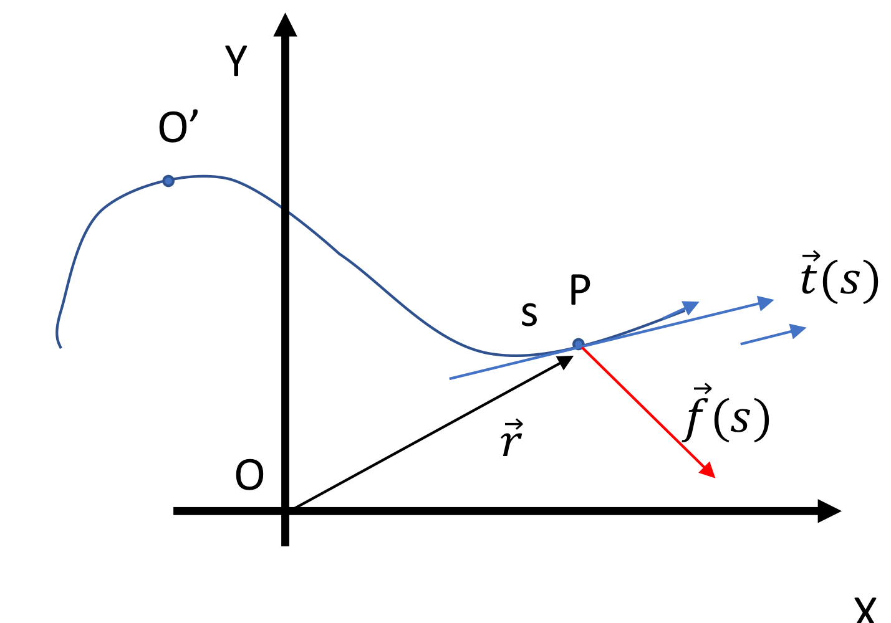

## Equazioni

### Equazioni di secondo grado

$$
y = ax^2 + bx + c
$$

**determinante** $\Delta = b^2 - 4ac$ 

$$
\text{soluzioni} \quad
\begin{cases}
x_1 = \frac{-b + \sqrt{b^2 - 4ac}}{2a} \\\\
x_2 = \frac{-b - \sqrt{b^2 - 4ac}}{2a}
\end{cases}
$$

- $\Delta > 0 \quad x_1, x_2 \in \mathbb{R} \land x_1 \neq x_2$
- $\Delta = 0 \quad x_1 = x_2 \in \mathbb{R}$
- $\Delta < 0$ impossibile in $\mathbb{R}$.
$x_1, x_2 \in \mathbb{C} \land x_1 = \overline{x_2}$ (impossibile)

[grafici di 3 parabole]

- coefficiente $a$ determina la concavità della parabola
- coefficiente $b$ determina la posizione del vertice lungo l'asse x
- coefficiente $c$ determina l'intersezione con l'asse y

## Derivazione

### Derivata di una funzione

Per comodità indichiamo la derivata $$\frac{d}{dx} F = F'$$

#### Somma

$$
\frac{d}{dx} (F + G) = F' + G'
$$

Derivata di una somma:

1. derivo ogni funzione separatamente
2. sommo i risultati

#### Prodotto

$$
\frac{d}{dx} (F \cdot G) = F \cdot G' + G \cdot F'
$$

Derivata di un prodotto:

1. moltiplico la prima funziona per la derivata della seconda
2. moltiplico la seconda funzione per la derivata della prima
3. sommo i risultati

#### Potenza

$$
\frac{d}{dx} X^{\alpha} = \alpha \cdot X^{\alpha-1}
$$

Derivata di una potenza:

1. l'esponente diventa il coefficiente
2. l'esponente si riduce di 1

#### Costante moltiplicativa

$$
\frac{d}{dx} (k \cdot F) = k \cdot F'
$$

la costante rimane invariata

#### Funzione composta

$$
\frac{d}{dx} F(G) = F'(G) \cdot G'
$$

Derivata di una funzione composta:

1. derivo la funzione esterna mantenendo invariata la funzione interna
2. moltiplico per la derivata della funzione interna

### Derivate di funzioni elementari

- derivata di una costante

$$
k' = 0
$$

- derivata di una funzione lineare

$$
(ax + b)' = a
$$

- derivata di una potenza

$$
(x^n)' = n \cdot x^{n-1}
$$

- derivata di una radice

$$
(\sqrt[n]{x})' = \frac{1}{n} \cdot x^{\frac{1}{n} - 1}
$$

- derivata di un'esponenziale

$$
(e^x)' = e^x
$$

- derivata di un logaritmo

$$
(\ln(x))' = \frac{1}{x}
$$

- derivata di una reciproca

$$
\left(\frac{1}{x}\right)' = -\frac{1}{x^2}
$$

- derivata del seno

$$
\sin^{'}(x) = \cos(x)
$$

- derivata del coseno

$$
\cos^{'}(x) = -\sin(x)
$$

- derivata della tangente

$$
\tan^{'}(x) = \sec^2(x)
$$

- derivata della cotangente

$$
\cot^{'}(x) = -\csc^2(x)
$$

## Integrali

Determinare area sottesa a una curva. Operazione inversa alla derivazione.

$$
\int f(x) dx = F(x) + k
$$

Tuttavia non definisce un'unica funzione, ma una famiglia di funzioni che differiscono per una costante $k$.

### Integrazione definita

Il problema non si pone per gli integrali definiti, ovvero per l'integrazione di una funzione in un intervallo $[x_1,x_2]$:

$$
\int_{x_1}^{x_2} f(x) dx = F(x_2) - F(x_1)
$$

### Proprietà fondamentali dell'integrazione

#### Integrale di una somma

$$
\int (f(x) + g(x)) dx = \int f(x) dx + \int g(x) dx
$$

#### Integrale di funzione con costante moltiplicativa

$$
\int k \cdot f(x) dx = k \cdot \int f(x) dx
$$

#### Potenza (per $\alpha \neq -1$)

$$
\int x^{\alpha} dx = \frac{1}{\alpha + 1} x^{\alpha + 1}
$$

#### Integrazione per parti

$$
\int f(x) \cdot g(x) dx = f(x) \cdot \int g(x) dx - \int \left( f'(x) \cdot \int g(x) dx \right) dx
$$

#### Integrazioni con sostituzione di variabile

$$
\int f(x) dx = \int f(x(y)) \cdot \frac{dx}{dy} dy
$$

#### Integrazione delle funzioni principali

- integrale di una costante

$$
\int k dx = k \cdot x
$$

- integrale del coseno

$$
\int \cos(x) dx = \sin(x)
$$

- integrale del seno

$$
\int \sin(x) dx = -\cos(x)
$$

### Integrazione di linea

Consideriamo una curva in 2 dimensioni

Definiamo integrale di linea:

$$
\int \vec{F}(\vec{r}) \cdot d\vec{r} = \int (F_x dx + F_y dy) = \int F_x dx + \int F_y dy
$$

Equivale alla somma degli integrali calcolati lungo le direzioni degli assi x e y.

## Trigonometria

Definizione di **angolo $\alpha$**:

$$
\text{angolo }\alpha = \frac{\text{arco}}{\text{raggio}}
$$

### Circonferenza goniometrica

Circonferenza di raggio unitario ($r=1$) con origine in $(0,0)$, in questo caso la misura dell'angolo coincide a quella dell'arco.

radiante: $x \text{ rad} = x \cdot \frac{2 \Pi}{360°}$

| radiante : gradi |  |
| --- | --- |
|$$\frac{\pi}{6} : 30°$$ | $$\frac{\pi}{3} : 60°$$|
|$$\frac{\pi}{4} : 45°$$| $$\frac{\pi}{2} : 90°$$|
|$$\pi : 180°$$| $$2\pi : 360°$$|

Tuttavia è necessario anche introdurre un **verso di rotazione**: antiorario (positivo) e orario (negativo)

$$
\alpha \text{ valore }= \begin{cases}
\vert \hat{AP} \vert \text{ se rotazione antioraria} \\\\
-\vert \hat{AP} \vert \text{ se rotazione oraria}
\end{cases}
$$

I complementari rimangono uguali anche introducendo il verso di rotazione.

### Funzioni trigonometriche

[immagine con seno, coseno e tangente]

#### Funzione coseno

associa a ogni angolo $\alpha$ la coordinata x del punto P sulla circonferenza goniometrica

#### Funzione seno

associa a ogni angolo $\alpha$ la coordinata y del punto P sulla circonferenza goniometrica

#### Funzione tangente

associa a ogni angolo $\alpha$ il rapporto tra la coordinata y e la coordinata x del punto P sulla circonferenza goniometrica

### Proprietà fondamentale dell'algebra 

## Vettori e algebra lineare

