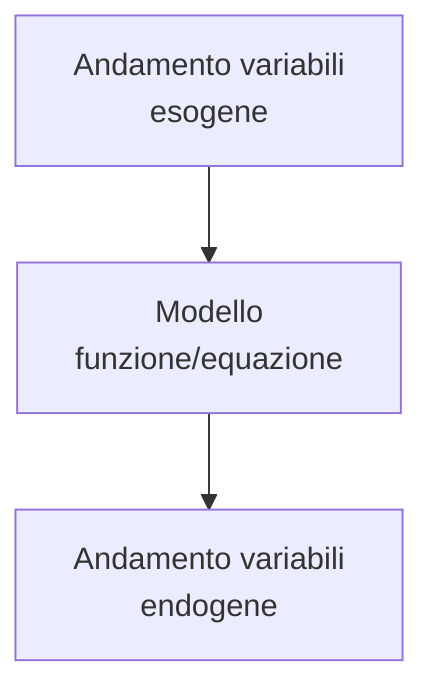

## Concetti base di microeconomia

Suddivisione dell'economia politica:

**Microeconomia**
  studia il funzionamento dei sistemi economici a partire dall'analisi del comportamento dei singoli agenti e spiega i fenomeni economici come risultato delle interazioni dei singoli agenti nei vari mercati.

**Macroeconomia**
  si occupa principalmente di variabili aggregate e caratteristiche globali. Trascura i dettagli, tuttavia poiché le variabili aggregate sono aggregazioni di singoli agenti, si basa anche sulla microeconomia.

Entrambe cercano teorie che descrivano il funzionamento dei fenomeni economici moderni, ovvero:

- processi di consumo
- processi di produzione
- processi di scambio dei beni

### Elementi concettuali di base dell'economia

1. **Beni economici** sono di tipo materiale o immateriale

2. **Agenti economici**: ovvero i consumatori e le imprese
   1. **consumatori**:
      1. domandano beni sui mercati
      2. utilizzano beni economici per consumo finale, ovvero per soddisfare i loro bisogni
   2. **imprese**:
      1. domandano **input**, offrono **output** sui mercati
      2. utilizzano alcuni beni (input) per produrne altri (output)

3. **Mercati**:per ciascun bene economico esiste un mercato, ovvero il luogo in cui avvengono **tutti** gli scambi del bene considerato

4. **Prezzi di mercato**: sul mercato di ciascun bene vige un prezzo al quale agenti possono offrire o domandare il bene considerato

### Strumenti della teoria economica

Costruzione di **modelli**: riassumono in *termini matematici* le relazioni che intercorrono tra le variabili economiche. Sono *rappresentazioni semplificate* della realtà economica, ci aiutano a tralasciare i dettagli irrilevanti

Il modello teorico è costituito da 3 insiemi di elementi:

1. **Variabili esogene**: sono i parametri, valori forniti dall'esterno del modello, determinati da fattori esterni

2. **variabili endogene**: determinate dal modello matematico, dalle forze descritte dal modello

3. **ipotesi del modello**: comportamento degli agenti o funzionamento di parti del sistema, descrivono le relazioni fra variabili

Ricaviamo risultati in modo tale da descrivere in che modo l'andamento delle variabili esogene influenza le variabili endogene.

Schema:



Uso della matematica per formulare con rigore i risultati

Strumenti:

- calcolo differenziale
- studio di funzione
- Massimi e minimi, vincolati e non
- algebra lineare

## Teoria del singolo consumatore

Il singolo consumatore opera in un sistema in cui esistono diversi beni economici che egli può utilizzare per soddisfare i propri bisogni

### Ipotesi

- Nel sistema esistono due beni: bene$_1$ e bene$_2$.
- Entrambi i beni sono acquistati nel proprio mercato ad un dato prezzo(prezzo$_1$ per bene$_1$ e prezzo$_2$ per bene$_2$)
- il consumatore deve scegliere le *quantità di beni* che intende consumare (che sono le *variabili endogene*)

Le analisi e i risultati ottenuti valgono per $n$ beni economici $n \in \mathbb{N}, n \gt 2$

**Ipotesi di razionalità**:

supponiamo che gli agenti compiano scelte razionali, ovvero che il consumatore scelga fra i panieri di consumo a lui disponibili quello che considera il paniere *migliore*, quello che preferisce.
Pertanto il consumatore segue un *criterio di ottimizzazione*, e il paniere scelto sarà quello per lui *ottimale*.
Prendiamo due beni il cui consumo procuri *godimento* al consumatore, pertanto il consumatore se potesse acquisterebbe quantità più grandi di entrambi i beni (criterio *più è meglio*)

In questo grafico notiamo che:

$x_1$ &rarr; quantità bene 1
$x_2$ &rarr; quantità bene 2

$X=(x_1, x_2)$ è la *combinazione* o *paniere* dei deu ben che il consumatore intende consumare

Il piano rappresenta tutte le possibili combinazioni per il consumatore (motivo per cui quantità negative sono insensate)

```{python}
import matplotlib.pyplot as plt

# 1. Configura la figura e le coordinate del punto generico
fig, ax = plt.subplots(figsize=(6, 6))
px, py = 2, 3  # Coordinate reali nel grafico per posizionare il punto

# 2. Rimuove la scatola esterna e sposta gli assi al centro (0,0)
ax.spines["left"].set_position("zero")
ax.spines["bottom"].set_position("zero")
ax.spines["top"].set_color("none")
ax.spines["right"].set_color("none")

# 3. Imposta i limiti del grafico per lasciare spazio visivo
ax.set_xlim(-1, 5)
ax.set_ylim(-1, 5)

# 4. Nasconde i numeri di default e i trattini (ticks) standard
ax.set_xticks([])
ax.set_yticks([])

# 5. Aggiunge le frecce geometriche alla fine degli assi
ax.plot(1, 0, ">k", transform=ax.get_yaxis_transform(), clip_on=False)
ax.plot(0, 1, "^k", transform=ax.get_xaxis_transform(), clip_on=False)

# 6. Disegna le linee di proiezione tratteggiate dal punto agli assi
ax.vlines(px, 0, py, colors="black", linestyles="dashed", linewidth=1.2)
ax.hlines(py, 0, px, colors="black", linestyles="dashed", linewidth=1.2)

# 7. Disegna il punto generico P
ax.scatter(px, py, color="black", s=60, zorder=5)
ax.text(
    px + 0.15, py + 0.15, "$X(x_1, y_2)$", fontsize=12, verticalalignment="bottom"
)

# 8. Inserisce le etichette personalizzate x1 e y2 esattamente sulle proiezioni
# Usiamo il pedice matematico con la sintassi LaTeX
ax.text(px, -0.3, "$x_1$", fontsize=12, horizontalalignment="center")
ax.text(-0.3, py, "$x_2$", fontsize=12, verticalalignment="center", horizontalalignment="right")

# Nomi degli assi (X e Y) vicino alle frecce finali
ax.text(4.8, -0.3, "$x_1$", fontsize=12)
ax.text(-0.3, 4.8, "$x_2$", fontsize=12)

plt.legend(["$x_1 \\geq 0$", "$x_2 \\geq 0$"], loc="upper right")

plt.show()
```

Tuttavia nella scelta il consumatore è soggetto a dei vincoli

**Vincolo di bilancio**
: la scelta della combinazione $X = (x_1,x_2)$ deve essere tale che la spesa complessiva dell'acquisto dei due beni ai prezzi dati *non* superi la quantità di moneta di cui il consumatore dispone
: vincolo che il consumatore *deve* rispettare nella scelta. 

### Schema della teoria del singolo consumatore

- **Ipotesi**
  - 2 beni (bene 1, bene 2) &rarr; estendiamo i risultati a $n$ beni $n \in \mathbb{N}, n \gt 2$
    - quantità di beni:
      - $x_1$ &rarr; quantità bene 1
      - $x_2$ &rarr; quantità bene 2
      - $X=(x_1,x_2)$ panieri disponibili
  - 2 prezzi dati
  - **ipotesi di razionalità del consumatore**
  - bene 1 e bene 2 sono **beni in senso stretto**
  - presenza del **vincolo di bilancio**
(...)

### Insieme di bilancio

Chiamiamo insieme del bilancio del consumatore l'insieme delle combinazioni di consumo $(x_1,x_2)$ che soddisfano la relazione:

$$
p_1 x_1 + p_2 x_2 \leq m
$$

Insieme delle relazioni che il consumatore può acquistare in corrispondenza dei parametri $p_1, p_2, m$ :

$$
p_1 x_1 + p_2 x_2 = m
$$

Si tratta di un'equazione di una retta implicita 
$$
p_1 x_1 + p_2 x_2 = m \quad \rightarrow \quad ax+by = -c
$$

## Domanda di mercato complessivo

## Teoria della singola impresa

## Surplus

## Equilibrio

##
