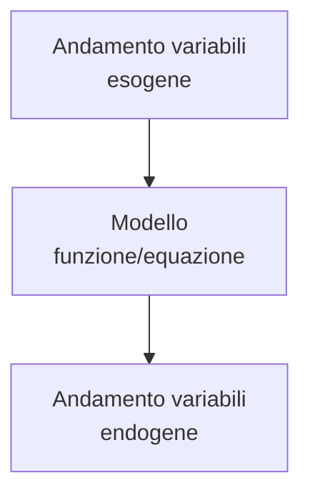

## Concetti base di microeconomia

Suddivisione dell'economia politica:

**Microeconomia**
  studia il funzionamento dei sistemi economici a partire dall'analisi del comportamento dei singoli agenti e spiega i fenomeni economici come risultato delle interazioni dei singoli agenti nei vari mercati.

**Macroeconomia**
  si occupa principalmente di variabili aggregate e caratteristiche globali. Trascura i dettagli, tuttavia poiché le variabili aggregate sono aggregazioni di singoli agenti, si basa anche sulla microeconomia.

Entrambe cercano teorie che descrivano il funzionamento dei fenomeni economici moderni, ovvero:

- processi di consumo
- processi di produzione
- processi di scambio dei beni

### Elementi concettuali di base dell'economia

1. **Beni economici** sono di tipo materiale o immateriale

2. **Agenti economici**: ovvero i consumatori e le imprese
   1. **consumatori**:
      1. domandano beni sui mercati
      2. utilizzano beni economici per consumo finale, ovvero per soddisfare i loro bisogni
   2. **imprese**:
      1. domandano **input**, offrono **output** sui mercati
      2. utilizzano alcuni beni (input) per produrne altri (output)

3. **Mercati**:per ciascun bene economico esiste un mercato, ovvero il luogo in cui avvengono **tutti** gli scambi del bene considerato

4. **Prezzi di mercato**: sul mercato di ciascun bene vige un prezzo al quale agenti possono offrire o domandare il bene considerato

### Strumenti della teoria economica

Costruzione di **modelli**: riassumono in *termini matematici* le relazioni che intercorrono tra le variabili economiche. Sono *rappresentazioni semplificate* della realtà economica, ci aiutano a tralasciare i dettagli irrilevanti

Il modello teorico è costituito da 3 insiemi di elementi:

1. **Variabili esogene**: sono i parametri, valori forniti dall'esterno del modello, determinati da fattori esterni

2. **variabili endogene**: determinate dal modello matematico, dalle forze descritte dal modello

3. **ipotesi del modello**: comportamento degli agenti o funzionamento di parti del sistema, descrivono le relazioni fra variabili

Ricaviamo risultati in modo tale da descrivere in che modo l'andamento delle variabili esogene influenza le variabili endogene.

Schema:

Uso della matematica per formulare con rigore i risultati

Strumenti:

- calcolo differenziale
- studio di funzione
- Massimi e minimi, vincolati e non
- algebra lineare

## Teoria del singolo consumatore

Il singolo consumatore opera in un sistema in cui esistono diversi beni economici che egli può utilizzare per soddisfare i propri bisogni

### Ipotesi

- Nel sistema esistono due beni: bene$_1$ e bene$_2$.
- Entrambi i beni sono acquistati nel proprio mercato ad un dato prezzo(prezzo$_1$ per bene$_1$ e prezzo$_2$ per bene$_2$)
- il consumatore deve scegliere le *quantità di beni* che intende consumare (che sono le *variabili endogene*)

## Domanda di mercato complessivo

## Teoria della singola impresa

## Surplus

## Equilibrio

##
