## Concetti di base

Utile il collegamento alla pagina di [java](/linguaggi/java.html)

### ASTRAZIONE

Permette di ignorare i dettagli implementativi e concentrarsi sul comportamento di un oggetto.

Tramite:

- **parametrizzazione**: generalizzazione, riuso del codice con dati differenti (es. 2+3, 2+4, 1+5 &rarr; x+y, x=, y=)

- **specificazione**: rimozione dei dettagli implementativi (incapsulamento) e definizione di un contratto (se mi dai qualcosa &rarr; ti prometto qualcosa). Ottiene il disaccoppiamento

#### CONTRATTO

- **precondizioni**: cosa deve essere vero prima di chiamare il metodo affinché i risultati siano ben definiti, si riferiscono agli argomenti o allo stato dell'oggetto (implica funzione parziale)
- **postcondizioni**: cosa deve essere vero dopo l'esecuzione del metodo, si riferiscono all'output

#### TIPI DATI ASTRATTI (ADT)

L'Obiettivo degli adt è creare una struttura che ricacalchi il problema.
Si tratta di un tipo di dato **definito dal suo comportamento**, non dalla sua implementazione.

Un ADT è composto da:

- **rappresentazione**: strutture dati, componenti
- **operazioni**: metodi dell'ADT

Generalmente in un ADT abbiamo:

- variabili d'istanza **private** (stato)
- metodi **non static** (comportamento)

**SPECIFICAZIONE**:

- STATO ASTRATTO: valori possibili adt (es. matrice bidimensionale di float)
- PROTOCOLLO: operazioni su valori, vale anche sequenza di chiamate di operazioni, con contratti riferiti allo stato astratto

esempio. ADT = insieme di interi. Metodo ha delle POST condizioni su eccezione

- `//solleva EmptyIntSetException se array ha 0 elementi`: NON VA BENE, riferito a implementazione
- `//solleva EmptyIntSetException se insieme è vuoto`: OTTIMO, riferito a stato astratto

**MISSION**: cosa sa (stato) e cosa può fare (transizioni di stato)

**INVARIANTE**: "matrice valida m definita come m è NxM con N,M > 0"

- indipendente da implementazione
- funge da pre per tutti i metodi (tranne per costruttore)
- vale per tutti gli stati

**INVARIANTE DI RAPPRESENTAZIONE:**

- legato alla funzione di astrazione f: dato astratto &rarr; stato concreto
- descritto nella classe

### CLASSE

**NORMALE**: definizione e implementazione di un tipo

**INTERFACCIA**: solo definizione e metodi astratti (no body)

**ASTRATTA**: definizione + implementazione parziale (presenza metodi astratti)

**CLASSE GENERICA**: parametrizzata su più tipi (riutilizzabile con più tipi)

**ACCESSIBILITÀ DI UNA CLASSE:**

- **public**: accessibile da qualsiasi classe
- **default**: accessibile da classi nello stesso package o sottoclassi
- **protected**: solo per classi interne
- **private**: accessibile solo all'interno della classe

#### CLASSE TIPO CONCRETO

- MISSION: cosa sa e cosa può fare
- ABSTRACT FUNCTION: metodi astratti che devono essere implementati dalle sottoclassi
- INVARIANTE: proprietà che deve essere sempre vera per tutti gli stati dell'oggetto


```java
public class MyClass{
    //MISSION:
    //abstract function:
    //invariante:

    private Tipo variabiledistanza1
    private Tipo variabiledistanza2

    public costruttoreMyClass(){...}

    public Tipo metodo1(Tipo arg1, Tipo arg2, ...){...}
    public Tipo metodo2(Tipo arg1, Tipo arg2, ...){...}
}//end MyClass
```

#### CLASSE MAIN

generalmente possiede il metodo `public static void main(String[] args)` che è il punto di ingresso del programma

```java
public class Main{
    public static void main(String[] args){
        //inizializza, per esempio API
        Tipo nome1 = new Tipo();
        Tipo nome1 = new Tipo();

        //esempio uso, magari con try/catch
    }
}//end Main
```

#### INTERFACCIA

Interfaccia fornisce:

- nome tipo, senza implementazione
- metodi astratti con relativi contratti
- costanti uniche variabili d'istanza ammesse
- strumento per **dependency inversion**

Classe che implementa interfaccia:

- tutti i metodi dell'interfaccia (essendo astratti)
- eventualmente altri metodi + variabili d'istanza

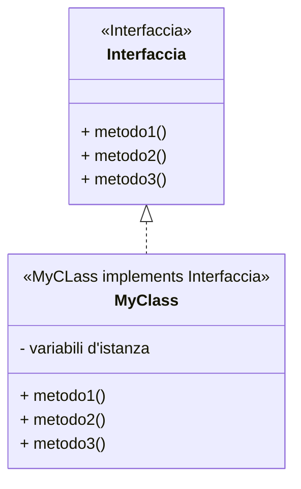

```java
public interface Interfaccia{
    //metodi astratti
    Tipo metodo1(Tipo argomento);
    Tipo metodo2(Tipo argomento);
    Tipo metodo3(Tipo argomento);
}

public MyClass implements Interfaccia{
    //eventuali variabili d'istanza
    //implementazione metodi astratti con body
}
```

#### CLASSE ASTRATTA

Classe con costrutto `abstract` che prevede un'implementazione parziale per la presenza di **metodi astratti**.

```java
public abstract class MyClass{
    protected Tipo variabile;
    //costruttore
    public MyClass(Tipo variabile){...}
    //metodi concreti con body
    public void nomeMetodo(Tipo arg){ body; }
    //metodi astratti
    public abstract tipo nomeMetodo();
}//end
```

#### INTERFACCIA o CLASSE ASTRATTA?

Usare una **classe astratta** quando:

- famiglia di tipi che condividono comportamento
- sottoclassi condividono parte dello stato
- variabili non statiche o final
- non può essere istanziata

Usare un'**interfaccia** quando

- sottotipi sono completamente scollegati
- comportamento specifico ma senza implementazione
- sfruttare **multi-ereditarietà**

### TIPI

**PRIMITIVI**: rappresentano valori

- byte, short, int, long, float, double, char, boolean

**RIFERIMENTO**: rappresentano oggetti mutabili (cambiano stato) o immutabili (stato non cambia). Possono essere shared se sono condivisi in 2 o più variabili.

**CONCRETO** (classe concreta): può essere istanziato, implementazione completa

**ASTRATTO** (classe astratta o interfaccia): non può essere istanziato, funge da contratto o base per altri tipi

**REALE**: classe concreta a cui appartiene l'oggetto

**APPARENTE**: tipo dichiarato di variabile, definisce i metodi e campi visibili al compilatore. Deve essere uguale o **supertipo** del tipo reale.

**SUPERTIPO**: classe generale, include operazioni comuni ai sottotipi

**SOTTOTIPO**: estende o implementa il supertipo,deve rispettare contratto del supertipo

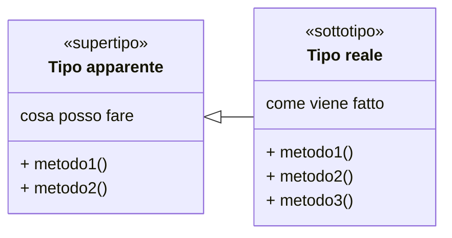

Quando si fa una dichiarazione il compilatore guarda solo il lato sinistro per

- verificare quali metodi sono accessibili
- verificare correttezza del codice

```java
SuperClasse x = new SottoClasse();
TipoApparente nomeVariabile = new TipoReale();
```

Il tipo apparente definisce cosa posso fare, il tipo reale definisce come viene fatto.

posso evocare soltanto i metodi dichiarati nel tipo apparente o nelle sue super-classi/interfacce.

```java
class SuperClasse{
    public void metodoSuper(){}
    public void Condiviso(print "Super"){}
    static void Statico(print "Super"){}
}

class SottoClasse extends SuperClasse{
    public void metodoSotto(){}
    @Override public void Condiviso(print "Sotto"){}
    static void Statico(print "Sotto"){}
}

SuperClasse x = new SottoClasse();

x.metodoSuper(); //ok
x.metodoSotto(); //errore di compilazione
x.Condiviso(); // print "Sotto"
x.Statico(); //print "Super"
```

Analogamente funziona con le variabili d'istanza:

- le variabili d'istanza sono legate al tipo apparente
- devo usare un metodo per ottenere il valore della variabile d'istanza del tipo reale

```java
class SuperClasse{
    public int x = 10;
    public int metodoget(){ return this.x; }
    public int getNonOverride(){ return this.x; }
}

class SottoClasse extends SuperClasse{
    public int x = 37;
    @Override public int metodoget(){ return this.x; }
}

class Estrai{
    static int print(SuperClasse o){return o.x;}
    }

SuperClasse x = new SottoClasse();
Estrai.print(x); //10
x.getNonOverride(); //10
x.metodoget(); //37
```

esempio con array:

```java
int [] a = new int[3];
Object x = a;

//tipo reale, apparente di a: int[]
//tipo reale di x: int[]
//tipo apparente di x: Object

a.length(); //3
a = x; //errore di compilazione
x.length(); //errore di compilazione (Object non ha length())
((int[]) x).length(); //3
```

#### EREDITARIETÀ e GERARCHIA DI CLASSI

Deve valere il **principio di sostituibilità di Liskov**: sottotipo deve portarsi sostituire al supertipo

- firma: sottotipo deve essere compatibile con supertipo

  - TUTTI metodi astratti presenti e con stessa firma
  - metodi concreti non sovrascritti ereditati automaticamente

- metodi: sottotipo deve chiedere di meno e promettere di più
  - sottotipo più generale: meno eccezione o in meno casi PRE_super => PRE_sottotipo
  - sottotipo promette di più: (PRE_super & POST_sotto) => POST_super
    esempio. post_super val >0, post_sotto > 1
- proprietà: sottotipo mantiene proprietà supertipo
  - proprietà invariante per oggetti
  - proprietà evolutive

APPARENTE: **supertipo** (meno funzioni) &rarr; REALE: **sottotipo** (più funzioni, richiede meno vincoli, può sollevare meno eccezioni)

```java
List<Student> lista = new ArrayList<Student>(); //apparente: List, reale: ArrayList
```

##### GERARCHIA DI CLASSI

```java
public class Sottotipo extends Supertipo{
    //variabili d'istanza super
    //variabili d'istanza sottotipo
    //@Override metodi super (obbligatori se astratti)
    //metodi sottotipo
}
```

##### Ereditarietà multipla

In java una classe può estendere una sola classe concreta o astratta, ma può implementare più interfacce.

```java
public class Sottotipo implements Interfaccia1, Interfaccia2{
    //variabili d'istanza 
    //@Override metodi interfaccia1
    //@Override metodi interfaccia2
}
```

#### POLIMORFISMO

- metodi: posso instradare verso metodi diversi in una classe in base alle firme
- oggetti: istanza supertipo castata in istanza sottotipo

principio Liskov

- rispettato: uso gerarchia + ereditarietà
- non rispettato: delega o associazione

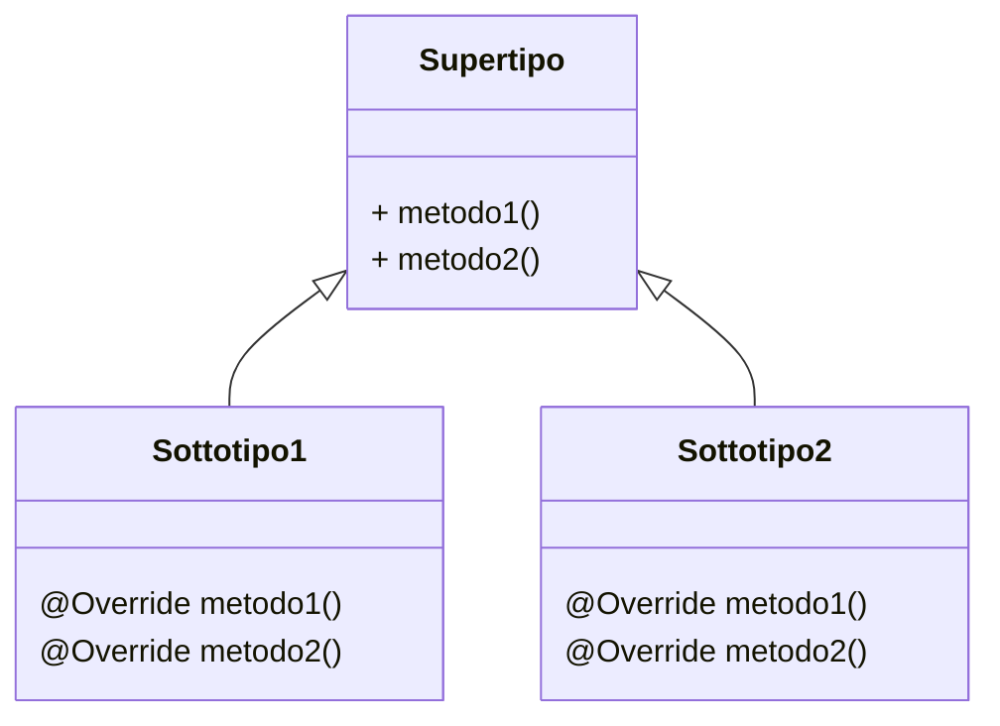

```java
class Animale{
    public void faiVerso(){System.out.println("Verso generico");}
}

class Cane extends Animale{
    @Override
    public void faiVerso(){System.out.println("Bau Bau");}
}

class Gatto extends Animale{
    @Override
    public void faiVerso(){System.out.println("Miao Miao");}
}

Animale a = new Cane(); // Polimorfismo
a.faiVerso(); // Stampa: Bau Bau
```

#### Uso di super

Il metodo `super()` serve a richiamare membri (metodi, costruttori o variabili) della classe padre (superclasse) da una sottoclasse. Può essere usato per:

- richiamare il costruttore della superclasse; in tale caso deve essere sempre la prima istruzione
  - serve a passare i dati necessari a inizializzare le variabili ereditate dalla classe padre

- richiamare un metodo con `super.metodo()`, utile soprattutto per richiamare il comportamento della superclasse quando si fa l'override di un metodo nella sottoclasse

- accedere a una variabile del padre con `super.variabile`

```java
class Animale{
    protected String nome;
    public Animale(String nome){this.nome = nome;}
}

class Cane extends Animale{
    public Cane(String nome){super(nome);}
}
```

#### TIPO GENERICO

garantisce type safety a compile-time

```java
public class Box<T> {
    private T value; //var d'ist.
    public void set(T value) {this.value = value;}
    public T get() {return value;}
}

//uso
Box<Integer> b = new Box<>();
b.set(10);
Integer x = b.get();
```

Anche con interfaccia

```java

public interface Repository<T> {
    void save(T obj);
    T findById(int id);
}

public class Utils {
    public static <T> void stampa(T obj) {
        System.out.println(obj);
    }
}
```

#### WILDCARD

Indicata dal simbolo `?`, rende metodi e classi più flessibili, permette di usare sottotipi senza specificare il tipo esatto

- `<?>`: qualsiasi tipo
- `<? extends T>`: qualsiasi sottotipo di T
- `<? super T>`: qualsiasi tipo genitore di T

Attenzione: esempio `List<?>` non indica che la lista può contenere qualsiasi tipo, ma è una lista di cui non conosci a priori la parametrizzazione concreta.

`List<? extends Number>` qualunque lista assegnata sarà di tipo \<Number\> o un suo sottotipo (Integer, Double, Float...)

`List<? super Integer>` indica una lista di oggetti che sono supertipi di Integer (Number, Object). Di conseguenza sarà sicuramente in grado di contenere Integer.

### METODI

accessibilità dei metodi:

- **PUBLIC**: da qualsiasi classe &rarr; API, servizi, operazioni ADT
- **PROTECTED**: nel package o da sottoclassi esterne &rarr; per design pattern come
- **DEFAULT**: solo nel package &rarr; collaborazioni tra classi nel package, logica condivisa
- **PRIVATE**: solo all'interno della classe &rarr; per metodi di supporto, logica e uso interni

come si chiama un metodo:
espressione0.metodo(espressione1, espressione2, ...)

- parte da oggetto e poi valuta espressione 1, 2, ...
- se non esiste oggetto solleva NullPointerException

```java
public Tipo NomeMetodo(Tipo argomento) throws Tipo exception{
    //PRE: pre-condizioni affinchè il metodo ritorni valore atteso, meglio se assenti
    //POST: post-condizioni, eccezioni sollevate
    //MODIFIES: elenco variabili d'istanza modificate

    body;
}
```

#### OVERRIDE

- ridefinizione di un metodo ereditato da supertipo o interfaccia
- firma identica (nome, parametri, tipo ritorno)
- non funziona con metodi statici

```java
class Animale{
    public void faiVerso(){
        System.out.println("Verso generico");
        }
}

class Cane extends Animale{
    @Override
    public void faiVerso(){
        System.out.println("Bau Bau");
        }
}
```

#### OVERLOAD

- definizione di più metodi con stesso nome ma firme diverse (diversi tipi o numero di parametri)

```java
class Calcolatrice{
    public int somma(int a, int b){ return a + b; }
    public double somma(double a, double b){ return a + b; }
    public int somma(int a, int b, int c){ return a + b + c; }
}
```

### ECCEZIONI

Stato di un programma: combinazione di variabili d'istanza e stack di chiamate attive

tipi di errori di programazione:

- **fault**: bug nel codice (es. divisione per 0)
- **failure**: comportamento anomalo in fase di esecuzione (es. file non trovato)
- **error**: problema grave che impedisce l'esecuzione (es. memoria insufficiente)
- **design mistake**: errore concettuale nel design (es. violazione del principio di sostituibilità di Liskov)

Eccezioni: servono a gestire situazioni eccezionali

- non infliscono il flusso normale del programma
- non influenzano il set dei risultati attesi
- chiamante può decidere se gestirle o propagare
- esplicita rappresentazione di errori

#### ECCEZIONI CHECKED

- verificate a compile-time
- devono essere dichiarate nel metodo con `throws` o gestite con `try-catch`

```java
public class MyCheckedException extends Exception{
    public MyCheckedException(){
        super();
    }
    public MyCheckedException(String message){
        super(message);
    }
}
```

#### ECCEZIONI UNCHECKED

- verificate a runtime
- non è obbligatorio dichiararle o gestirle
- rappresentano violazioni di precondizioni, logicamente non recuperabili

```java
public class MyUncheckedException extends RuntimeException{
    public MyUncheckedException(){
        super();
    }
    public MyUncheckedException(String message){
        super(message);
    }
}
```

#### TRY - CATCH - FINALLY

Il costrutto `try-catch-finally` permette di gestire le eccezioni in modo strutturato

L'esecuzione avviene nel seguente ordine:

- `try`: eseguito, eventualmente non completato
- `catch`: eseguito se viene sollevata un'eccezione del tipo specificato
- `finally`: eseguito sempre e per ultimo, indipendentemente dalle eccezioni

```java
try {
    // codice che può generare eccezioni
} catch (TipoEccezione1 e1) {
    // gestione eccezione di tipo TipoEccezione1
} catch (TipoEccezione2 e2) {
    // gestione eccezione di tipo TipoEccezione2
} finally {
    // codice che viene eseguito sempre, indipendentemente dalle eccezioni
}
```

### ASSERZIONI

- condizioni logiche verificate durante l'esecuzione
- usate per validare stati interni del programma

```java
assert condizione_logica : "Messaggio di errore se l'asserzione fallisce";
//esempio
assert x > 0 : "x deve essere positivo";
```

### ITERATORI

- oggetti che permettono di attraversare una collezione senza esporre la sua rappresentazione interna
- possono essere definiti anche all'interno di una classe come classi interne
- hanno come metodi principali `hasNext()`, `next()` e `remove()`

#### ITERATORE INTERNO

- mediante class annidation, fortemente accoppiato ma offre maggior incapsulamento

##### Interfaccia Iterable

L'interfaccia `Iterable<T>` definisce soltanto un metodo:

`iterator()`: ritorna un oggetto di tipo `Iterator<T>`

Serve a implementare l'iteratore

##### Interfaccia Iterator

L'iteratore è l'oggetto che attraversa la collezione, definisce due metodi fondamentali:

- `hasNext()`: ritorna true se ci sono altri elementi da visitare
- `next()`: ritorna l'elemento successivo e avanza l'iteratore

Posso ovviamente aggiungere funzioni opzionali come:

- `remove()`: rimuove l'elemento corrente dalla collezione

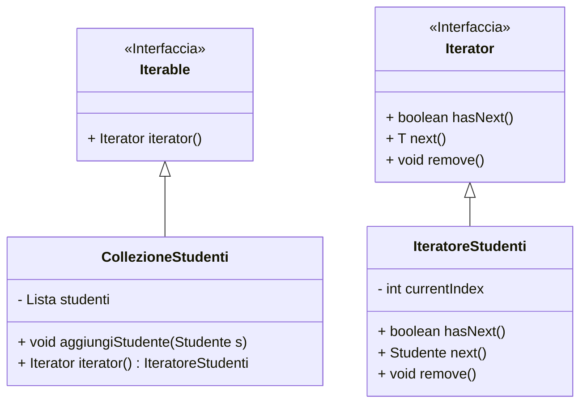

L'iterator concreto può essere definito internamente alla classe che implementa Iterable, oppure esternamente come classe separata.

```java
import java.util.Iterator;
import java.util.List;
import java.util.ArrayList;
import java.util.NoSuchElementException;

public class CollezioneStudenti implements Iterable<Studente> {

    // collezione privata interna
    private List<Studente> studenti = new ArrayList<>();

    public void aggiungiStudente(Studente s) {studenti.add(s);}

    @Override
    public Iterator<Studente> iterator() { return new IteratoreStudenti();}

    // ITERATORE INTERNO (classe annidata)
    private class IteratoreStudenti implements Iterator<Studente> {

        private int currentIndex = 0;

        @Override public boolean hasNext() {...}
        @Override public Studente next() { ... }
        @Override public void remove() {...}
    }
}

```

#### ITERATORE ESTERNO

```java
public class CollezioneStudenti implements Iterable<Studente> {
    private List<Studente> studenti = new ArrayList<>();

    public void aggiungiStudente(Studente s) {studenti.add(s);}
    // metodi di accesso usati dall’iteratore esterno
    public int size() { return studenti.size(); }
    public Studente get(int index) { return studenti.get(index); }

    @Override
    public Iterator<Studente> iterator() {
        return new IteratoreStudenti(this);
    }
}
// ITERATORE ESTERNO
public class IteratoreStudenti implements Iterator<Studente> {
    private CollezioneStudenti collezione;
    private int currentIndex = 0;

    public IteratoreStudenti(CollezioneStudenti collezione) {
        this.collezione = collezione;
    }

    @Override public boolean hasNext() {...}
    @Override public Studente next() {...}
    @Override public void remove() {...}
}
```

### ENUM

- insieme finito di costanti statiche e immutabili

```java
public enum MyEnum{
    ENUM1("Valore1"),
    ENUM2("Valore2"),
    ENUM3("Valore3");

    private String valore;

    private MyEnum(String valore){this.valore = valore;}
    public String getValore(){return valore;}
}
```

### SET

- collezione di oggetti unici, senza ordine

```java
Set<String> set = new HashSet<>();
set.add("elemento1");
set.add("elemento2");

set.contains("elemento1"); // true
set.remove("elemento2"); // rimuove elemento2

set.size(); // 1
```

### MAP

- collezione di coppie chiave-valore
- la chiave è unica, ogni chiave può mappare al massimo un solo valore
- l'eventuale ordine dipende dal tipo di mappa (HashMap = non ordinata, TreeMap = ordinata per chiave)

```java

Map<String, Integer> map = new HashMap<>();
map.put("chiave1", 100);
map.put("chiave2", 200);

map.get("chiave1"); // 100

map.containsKey("chiave2"); // true

map.remove("chiave1"); // rimuove la coppia chiave1-100

map.size(); // 1
```

### LIST

- collezione ordinata di oggetti, può contenere duplicati
- List è un'interfaccia, le implementazioni più comuni sono ArrayList e LinkedList

```java
List<String> list = new ArrayList<>();
list.add("elemento1");
list.add("elemento2");

list.get(0); // "elemento1"
list.remove(1); // rimuove elemento2

list.contains("elemento1"); // true

list.size(); // 1
```

### DESIGN PATTERN

- soluzioni riutilizzabili a problemi comuni di progettazione software

#### SINGLETON

- garantisce che una classe abbia una sola istanza e fornisce un punto di accesso globale a essa

```java
public class Singleton{
    private static Singleton instance = null;

    private Singleton(){ //costruttore privato
    }

    public static Singleton getInstance(){
        if(instance == null){
            instance = new Singleton();
        }
        return instance;
    }
}
```

#### FACTORY

Fornisce un'interfaccia per creare oggetti in una superclasse, ma permette alle sottoclassi di alterare il tipo di oggetti che verranno creati

- interfaccia comune a tutti i prodotti
- classi concrete che implementano l'interfaccia
- interfaccia factory con metodo statico per creare oggetti in base a argomenti

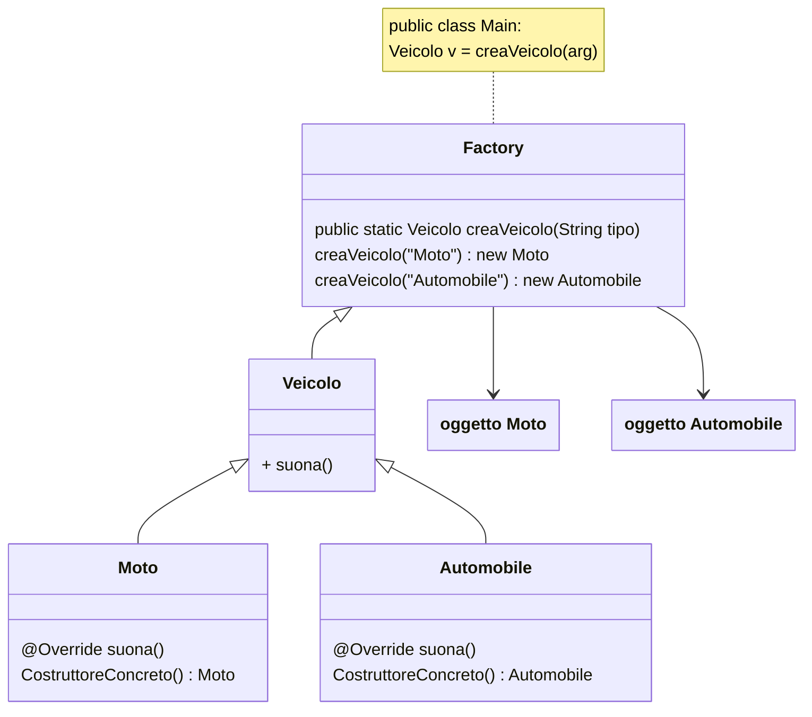

```java

//interfaccia prodotto
public interface Veicolo {
    void muovi();
}

//classi concrete prodotto
public class Auto implements Veicolo {
    @Override public void muovi() { System.out.println("L'auto si muove");}
}

public class Moto implements Veicolo {
    @Override public void muovi() { System.out.println("La moto si muove");}
}

//factory
public class VeicoloFactory {
    public static Veicolo creaVeicolo(String tipo) {
        if (tipo.equalsIgnoreCase("auto")) {
            return new Auto();
        } else if (tipo.equalsIgnoreCase("moto")) {
            return new Moto();
        }
        return null;
    }
}

//uso della factory
Veicolo veicolo1 = VeicoloFactory.creaVeicolo("auto");
veicolo1.muovi(); // Output: L'auto si muove
Veicolo veicolo2 = VeicoloFactory.creaVeicolo("moto");
veicolo2.muovi(); // Output: La moto si muove
```

#### BUILDER

provvede flessibilità quando inizializzi un tipo con molti attributi, opzionali e non.

- classe prodotto esterna, con costruttore privato con argomento builder
- classe interna builder statica con attributi pubblici corrispondenti
  - costruttore con attributi obbligatori
  - metodi per attributi opzionali che ritornano `this`

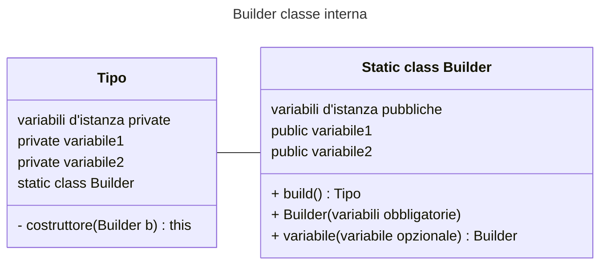

NOTA: il builder non può essere utilizzato una volta che l'oggetto è stato costruito, quindi non è possibile modificare l'oggetto dopo la costruzione.

```java
//classe prodotto
public class Persona{
    private String nome;
    private String cognome;
    private int età;
    private String email;

    private Persona(PersonaBuilder builder){
        this.nome = builder.nome;
        this.cognome = builder.cognome;
        this.età = builder.età;
        this.email = builder.email;
    }

    //classe builder interna
    public static class PersonaBuilder{
        public String nome;
        public String cognome;
        public int età;
        public String email;

        //costruttore con campi obbligatori
        public PersonaBuilder(String nome, String cognome){
            this.nome = nome;
            this.cognome = cognome;
        }

        //metodi per campi opzionali
        public PersonaBuilder età(int età){
            this.età = età;
            return this;
        }
        
        public PersonaBuilder email(String email){
            this.email = email;
            return this;
        }
        //metodo build essenziale per costruire 
        public Persona build(){
            return new Persona(this);
        }
    }
}

//uso del builder
Persona persona = new Persona.PersonaBuilder("Mario", "Rossi")
                        .età(30)
                        .email("mario.rossi@example.com")
                        .build();
```

#### OBSERVER

Serve a disaccoppiare il soggetto osservato dagli osservatori

- interfaccia Observer con metodo `update(data)` per notifiche
- interfaccia Observable con metodi addObserver, removeObserver, notifyObservers
- classe concreta osservatore con metodo update(Object data)
- classe concreta osservabile con
  - lista di osservatori
  - metodo con notifyObservers che chiama update() su tutti gli osservatori

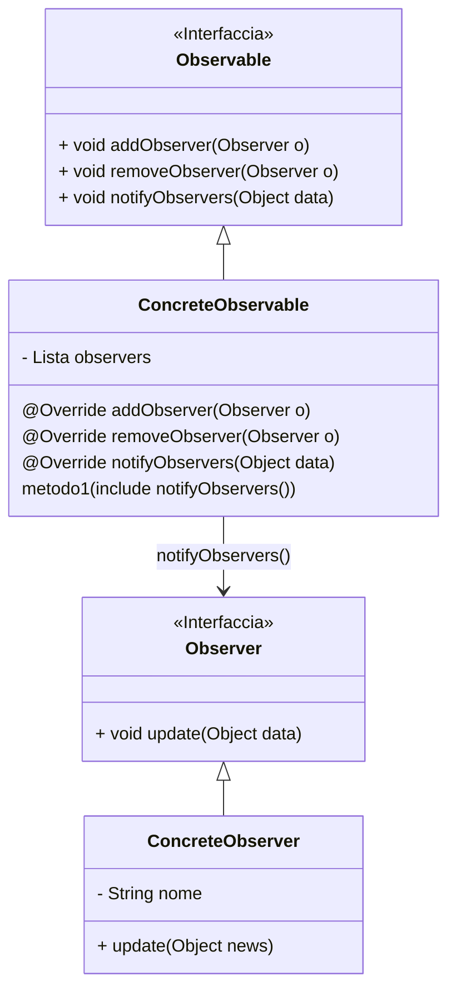

```java
//interfaccia osservatore
public interface Observer {
    void update(Object data);
}
//interfaccia soggetto osservabile
public interface Observable {
    void addObserver(Observer o);
    void removeObserver(Observer o);
    void notifyObservers(Object data);
}
//classe concreta soggetto osservabile
public class Agenzia implements Observable {
    //lista di osservatori
    private List<Observer> observers = new ArrayList<>();
    private String msg;

    @Override
    public void addObserver(Observer o) {observers.add(o);}

    @Override
    public void removeObserver(Observer o) {observers.remove(o);}

    @Override
    public void notifyObservers(Object data) {
        for (Observer o : observers) {
            o.update(data);
        }
    }
    //metodo con stato che vogliamo comunicare
    public void setMsg(String notizia) {
        this.msg = notizia;
        notifyObservers(notizia);
    }

//classe osservatore
public class Quotidiano implements Observer {
    private String nome;
    //costruttore
    public Quotidiano(String nome) {this.nome = nome;}

    //metodo update
    @Override
    public void update(Object news) {
        System.out.println(nome + ":" + news);
        }
    }
}

public class client{
    public static void main(String[] args){
        Agenzia agenzia = new Agenzia();

        Quotidiano q1 = new Quotidiano("Giornale1");
        Quotidiano q2 = new Quotidiano("Giornale2");

        agenzia.addObserver(q1);
        agenzia.addObserver(q2);

        agenzia.setMsg("Notizia importante!");
    }
}
```

#### DECORATOR

Aggiunge responsabilità/comportamenti dinamicamente mediante classi

- interfaccia comune I generale per tutti oggetti
- classi concrete che implementano l'interfaccia
- classe astratta decorator che implementa interfaccia e contiene attributo `protected` a tipo I
- classi concrete decorator con attributo super e override metodi per aggiungere funzionalità

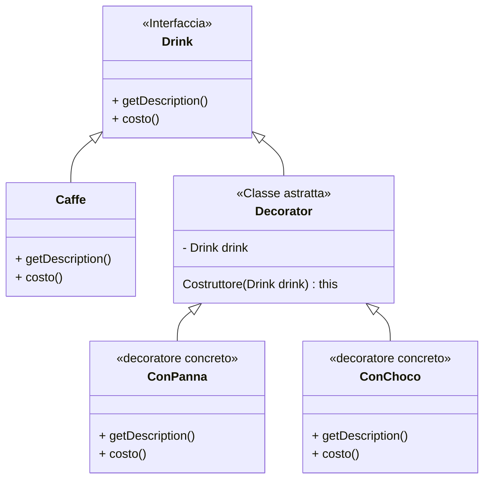

```java
//interfaccia componente I
public interface Drink {
    String getDescription();
    double costo();
}

//classe concreta componente O implementa I
public class Caffe implements Drink {
    @Override
    public String getDescription() { return "Caffe"; }
    @Override
    public double costo() { return 1.50; }
}

//classe decoratore astratta D implementa I
public abstract class Decorator implements Drink {
    protected Drink drink;
    public Decorator(Drink drink) {this.drink = drink;}
}

//classe decoratore concreta estende D
public class Panna extends Decorator {
    public Panna(Drink drink) {super(drink);}
    @Override
    public String getDescription() {return drink.getDescription() + ", Panna";}
    @Override
    public double costo() {return drink.costo() + 0.50;}
}

public class Choco extends Decorator {
    public Choco(Drink drink) {super(drink);}
    @Override
    public String getDescription() {return drink.getDescription() + ", Choco";}
    @Override
    public double costo() {return drink.costo() + 0.70;}
}

//uso del decorator
Drink myDrink = new Espresso();
myDrink = new Panna(myDrink);
myDrink = new Choco(myDrink);

System.out.println(myDrink.getDescription() + " $" + myDrink.costo());
>>> Espresso, Panna, Choco $2.70
```

#### COMPOSITE

Compone oggetti in strutture ad albero per rappresentare gerarchie parte-tutto

- interfaccia componente comune a foglie e compositi
- classe foglia: oggetti finali senza figli
- classe composita: contiene una variabile d'istanza lista di componenti (foglie o altre compositi)

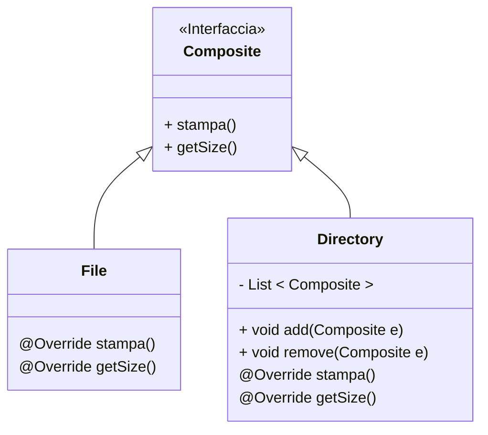

```java
//interfaccia componente
public interface FileSysComp{
    void stampa();
    int getSize();
}

//classe foglia
public class File implements FileSysComp{
    private String nome;
    private int size;

    //costruttore
    public File(String nome, int size){...}

    @Override public void stampa(){stampa nome + dim;}
    @Override public int getSize(){return size;}
}

//classe composita
public class Directory implements FileSysComp{
    private String nome;
    private List<FileSysComp> contenuto = new ArrayList<>();

    //costruttore
    public Directory(String nome){...}

    public void add(FileSysComp componente){contenuto.add(componente);}

    @Override
    public void stampa(){ stampa el. contenuto};}

    @Override
    public int getSize(){somma dim. contenuto;}
}

//uso del composite
FileSysComp f1 = new File("a.txt", 1);
FileSysComp f2 = new File("b.txt", 200);
FileSysComp dir1 = new Directory("dir1");
((Directory) dir1).add(f1);
((Directory) dir1).add(f2);

}
```

#### BRIDGE

Serve a disaccoppiare astrazione da implementazione, nei casi in cui rischio di creare una gerarchia di classi moltiplicata per un’altra gerarchia

- astrazione: tipo apparente lato client

```java
Abstraction a = new RefinedAbstraction(new ConcreteImplementor());
```

- interfaccia implementazioni concrete e relative classi concrete
- classe astratta con riferimento a interfaccia con attributo `protected`
- classi concrete astrazione che estendono

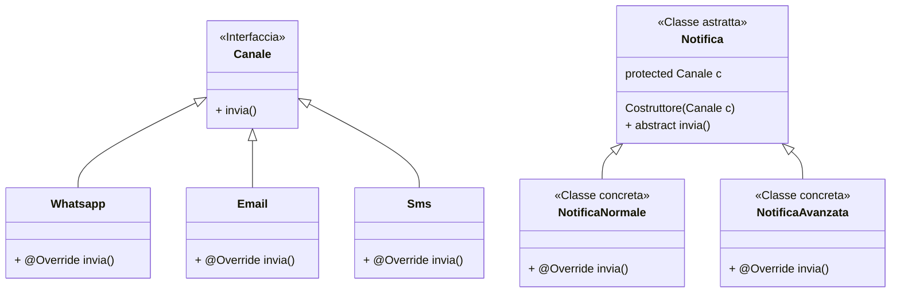

```java
//interfaccia implementazione
public interface Canale{ {
    void invia();
}

//classe concreta implementazione
public class Whatsapp implements Canale{
    @Override public void invia(){...}
}

//classe concreta implementazione
public class Email implements Canale{
    @Override public void invia(){...}
}

//classe concreta implementazione
public class Sms implements Canale{
    @Override public void invia(){...}
}

//classe astratta astrazione
public abstract class Notifica{
    protected Canale canale;
    public Notifica(Canale canale){...}
    public abstract void invia();
}

//classe concreta astrazione
public class NotificaNormale extends Notifica{
    public NotificaNormale(Canale canale){super(canale);}
    @Override public void invia(){...}
}

//classe concreta astrazione
public class NotificaAvanzata extends Notifica{
    public NotificaAvanzata(Canale canale){super(canale);}
    @Override public void invia(){...}
}

//uso del bridge
Canale whatsapp = new Whatsapp();
Notifica notifica = new NotificaNormale(whatsapp);
notifica.invia();
```

#### VISITOR

due interfacce:

- per operazioni (visitor), con metodo `visit(tipo element)` per ogni tipo concreto
- per elementi (element), con metodo `accept(visitor v)`

Poi classi concrete per implementare elementi e operazioni

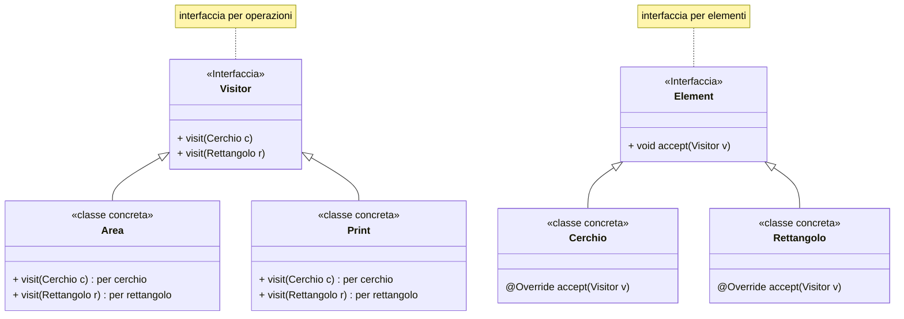

```java
//interfaccia visitor, implementa metodo visit per ogni tipo
public interface ShapeVisitor{
    void visit(Cerchio c);
    void visit(Rettangolo r);
}

//interfaccia elementi
public interface Shape{
    void accept(ShapeVisitor visitor);
}

//elementi concreti
public class Cerchio implements Shape {
    private double raggio;
    public Cerchio(double raggio) {this.raggio = raggio;}
    public double getRaggio() {return raggio;}

    @Override
    public void accept(ShapeVisitor visitor) {visitor.visit(this);}
}

public class Rettangolo implements Shape {
    private double base; 
    private double altezza;
    public Rettangolo(double base, double altezza) { ...}
    public double getBase() {...}
    public double getAltezza() {..}

    @Override
    public void accept(ShapeVisitor visitor) {
        visitor.visit(this);
    }
}

//visitor concreti, ovvero implementazioni operazioni
public class AreaVisitor implements ShapeVisitor {
    @Override
    public void visit(Cerchio c) {formula area; stampa area;}
    @Override
    public void visit(Rettangolo r) {formula area; stampa area;}
}

public class PrintVisitor implements ShapeVisitor {
    @Override
    public void visit(Cerchio c) {print get.raggio();}
    @Override
    public void visit(Rettangolo r) {stampa;}
}

//uso all'interno del main(String[] args)
Shape[] shapes = {
            new Cerchio(3),
            new Rettangolo(4, 5)
        };

        ShapeVisitor areaVisitor = new AreaVisitor();
        ShapeVisitor printVisitor = new PrintVisitor();

        for (Shape s : shapes) {
            s.accept(areaVisitor);
            s.accept(printVisitor);
        }
```

#### STRATEGY

definisce famiglia di algoritmi incapsulati in classi separate e intercambiali in runtime.

-tipo apparente: Strategy
-tipo reale: classi concrete che implementano algoritmi

- interfaccia generica Strategy che funge da base a tutti gli algoritmi
- classi concrete che implementano algoritmi
- classe selettore con attributo `private` Strategy, metodi per settare strategia e usare algoritmo

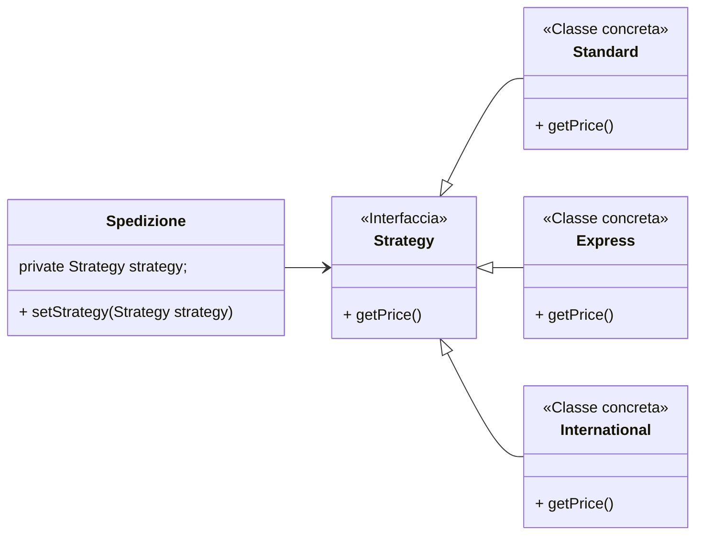

```java
//interfaccia
public interface Strategy {
    double getPrice(double peso);
}

//classi concrete che implementano algoritmo

public class Standard implements Strategy {
    @Override public double getPrice(double peso) {return peso * 2;}
}

public class Express implements Strategy {
    @Override public double getPrice(double peso) {return peso * 3;}
}

public class International implements Strategy {
    @Override public double getPrice(double peso) {return peso * 4;}
}

//classe che usa strategia
public class SetSpedizione {
    private Strategy strategy; //strategia
    public void setStrategy(Strategy strategy) {
        this.strategy = strategy;
    }

    public double costo(double peso) {
        return strategy.costo(peso);
    }
}

//uso nel main(String[] args)
//inizializzo classe che usa strategia
SetSpedizione spedizione = new SetSpedizione();
//imposto e uso diverse strategie, basta cambiare classe nell'argomento
spedizione.setStrategy(new Standard());
System.out.println(spedizione.costo(5));
>> 10.0
```

### TIPI, METODI E COSE UTILI

#### DTO

- classe che incapsula i dati per il trasferimento tra sottosistemi
- solo variabili d'istanza private e metodi getter/setter

```java
public class UserDTO {
    private Tipo var1;
    private Tipo var2;
    //costruttore
    public UserDTO(Tipo var1, Tipo var2){ ... }
    //getter
    public Tipo getVar1(){ return var1; }
    public Tipo getVar2(){ return var2; }
    //setter
    public void setVar1(Tipo var1){ this.var1 = var1; }
    public void setVar2(Tipo var2){ this.var2 = var2; }
}
```

#### STREAM

- sequenza di dati che può essere letta o scritta in modo continuo

#### S.O.L.I.D. PRINCIPLES

##### SINGLE RESPONSIBILITY PRINCIPLE

- una classe deve avere una sola responsabilità

```java
//esempio errato
class GestioneDipendente {
    void calcolaStipendio(Dipendente d) { /* ... */ }
    void salvaSuDatabase(Dipendente d) { /* ... */ }
}

//esempio suddivisione
class CalcolatoreStipendio {
    void calcola(Dipendente d) { /* ... */ }
}

class RepositoryDipendente {
    void salva(Dipendente d) { /* ... */ }
}
```

##### OPEN/CLOSED PRINCIPLE

- le classi devono essere aperte per estensione ma chiuse per modifica, ereditarietà o composizione

```java
//esempio errato, classe dipende da implementazione
class Notificatore {
    void invia(String tipo, String messaggio) {
        if(tipo.equals("EMAIL")) { /* invia email */ }
        else if(tipo.equals("SMS")) { /* invia sms */ }
    }
}

//esempio corretto con interfaccia

interface Notifica {
    void invia(String messaggio);
}

class EmailNotifica implements Notifica {
    public void invia(String messaggio) { /* invia email */ }
}

class SMSNotifica implements Notifica {
    public void invia(String messaggio) { /* invia sms */ }
}
```

##### LISKOV SUBSTITUTION PRINCIPLE

- i sottotipi devono essere sostituibili ai loro supertipi senza alterare il comportamento del programma

```java
/*errato, un Rettangolo con concreto Q 
non potrebbe settare b,h diversi */

class Rettangolo{
    int b, h; 
    int area(){return b*h;}
    void set H(int h){this.h = h;}
    void set B(int b){this.b = b;}
}

class Quadrato extends Rettangolo{ 
    void set H(int h){this.h = this.b = h;}
    void set B(int b){this.b = this.h = b;}
}

//corretto, interfaccia Forma

interface Forma{int area();}
class Rettangolo implements Forma{int area();}
class Quadrato implements Forma{int area();}
```

##### INTERFACE SEGREGATION PRINCIPLE

- interfacce piccole e specifiche, nessun client dovrebbe dipendere da metodi che NON utilizza

```java
interface StampanteMultifunzione {
    void stampa();
    void scansione();
    void fax();
}

class StampanteSemplice implements StampanteMultifunzione {
    public void stampa() { /* ok */ }
    public void scansione() { /* non serve */ }
    public void fax() { /* non serve */ }
}
//soluzione: interfacce specifiche
interface Stampante { void stampa(); }
interface Scanner { void scansione(); }
interface Fax { void inviaFax(); }

class StampanteSemplice implements Stampante {
    public void stampa() { /* ok */ }
}
```

##### DEPENDENCY INVERSION PRINCIPLE

- le astrazioni non dovrebbero dipendere dai dettagli/implementazioni, ma le implementazioni dovrebbero dipendere dalle astrazioni

```java
//ServizioOrdini dipende da EmailNotifica
class ServizioOrdini {
    EmailNotifica emailNotifica = new EmailNotifica();
    void inviaConferma() {emailNotifica.invia("confermato");}
}

//corretto, ServizioOrdini dipende da interfaccia Notifica
class ServizioOrdini {
    private Notifica notifica;
    ServizioOrdini(Notifica notifica) { this.notifica = notifica; }
    void inviaConferma() { notifica.invia("confermato"); }
}

// Uso:
ServizioOrdini servizio = new ServizioOrdini(new EmailNotifica());
```