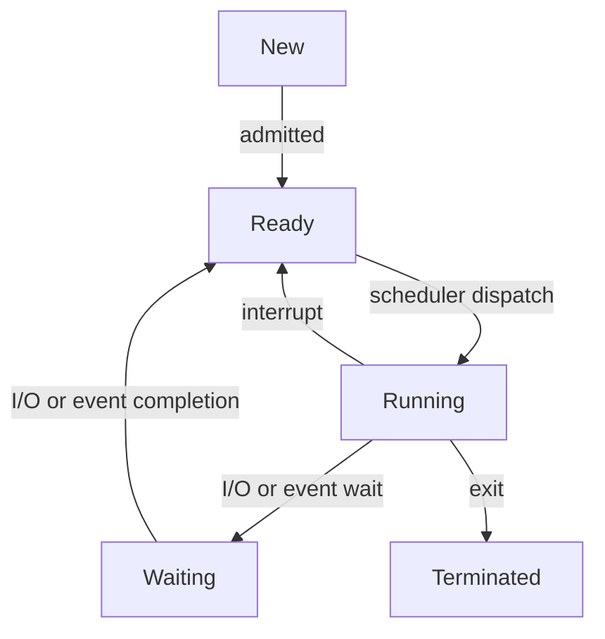
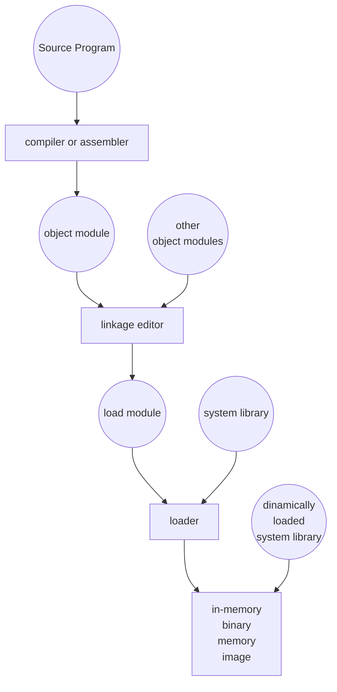
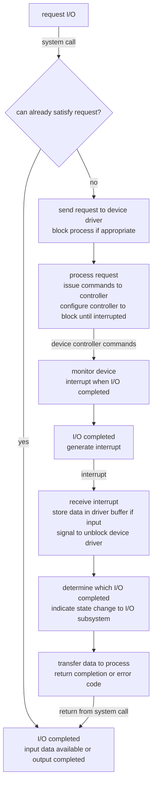

SISTEMA OPERATIVO:

- **Intermediario**: programma che agisce come intermediario tra utente e hardware del calcolatore
- **Assegnatore di risorse**: gestisce e alloca efficiente le risorse finite della macchina
- **Programma di controllo**: controlla esecuzione dei programmi e le operazioni sulle risorse del sistema di calcolo, condivisione corretta rispetto tempo e spazio.

LIVELLI DEL SISTEMA OPERATIVO:

**hardware**: risorse del calcolatore, periferiche I/O, controller, CPU, bus di memoria

**kernel**: parte del sistema operativo dedito a gestire correttamente l'hardware fornendo servizi agli strati superiori

**programmi di sistemi**: programmi che forniscono servizi generali, basati su quelli del kernel, attraverso le chiamate di sistema

**programmi applicativi**: programmi utilizzati dagli utenti che si appoggiano ai programmi di sistema ed al kernel

**utente**: utilizzatore del pc, programmatore/altro calcolatore

OBBIETTIVI SISTEMA OPERATIVO:

- Realizzare una **macchina astratta**, implementando funzionalità di alto livello e nascondendo i dettagli di basso livello
- Eseguire programmi utente e rendere **più facile la soluzione** dei problemi dell'utente
- Rendere il sistema di calcolo **più facile da utilizzare** e programmare
- Utilizzare l'hardware del calcolatore in **modo sicuro ed efficiente**

SERVIZI SISTEMA OPERATIVO:

**SISTEMA BATCH**: sistema che riduce il tempo di setup **raggruppando job simili**, che siano I/O e CPU bound, oppure fortran/assembler (schede di controllo nei primi sistemi)

**SPOOLING**: tecnica di gestione dell'I\\O che permette di **sovrapporre** operazione di I/O di un job con la computazione di un altro job, migliorando **l'efficienza** del sistema, tramite l'utilizzo di un **buffer intermedio** e uno **spooler** che si occupa di trasferire i dati alla periferica. I processi mandano i dati allo spool, daemon spooler trasferisce alla periferica. SI basa sulla **job pool**, ovvero coda di job dal quale il SO scegli il successivo job da mandare in esecuzione

**MULTIPROGRAMMAZIONE**: consente l'**esecuzione di più processi** (tipicamente batch) **contemporaneamente** in modo da **aumentare l'utilizzo delle CPU** che può essere assegnata ad un altro processo mentre quello corrente inizia un'operazione di input/output. Più processi in memoria per tenere occupate le cpu.

**TIME-SHARING**: sistema operativo **multiprogrammato** che **sfrutta la condivisione del tempo**, assegnando ciclicamente un **quanto** di tempo ad ogni processo. In questo caso la natura dei processi è interattiva e più utenti contemporaneamente accedono al sistema direttamente attraverso dei terminali: il sistema operativo **commuta** rapidamente l'assegnamento della CPU da un processo all'altro per un breve periodo di tempo (detto quanto), **abbassando i tempi di risposta** in modo da dare l'illusione ad ogni utente di avere la macchina a propria totale disposizione, (tramite una comunicazione on-line tra l'utente e il sistema, attende il prossimo "statement di controllo" dalla tastiera. Computazione interattiva)

SISTEMA OPERATIVI DI RETE: la computazione viene distribuita tra più processori "isolati", in quanto ognuno ha la propria memoria, i nodi sono separati.

SISTEMA OPERATIVO DISTRIBUITO: utente ha visione unitaria del sistema, le risorse (dati e computazionali) sono condivisi.

Vantaggi: velocità, bilanciamento carico e tolleranza ai guasti

SISTEMI REAL-TIME: sistemi con vincoli temporali fissati e ben definiti (hard rt, soft rt)

HARDWARE

| memoria              | tempo di accesso |     capacità |
| -------------------- | -----------      | ------------ |
| REGISTRI             | < 1 ns           | <1kb         |
| CACHE                | < 2,3 ns         | 64kb ~ 64MB  |
| RAM                  | <10-80 ns        | 512MB ~16GB  |
| MEMORIA STATO SOLIDO | 0,05-0,5 ms      | 4 ~ 512GB    |
| DISCHI MAGNETICI     | 5 - 20 ms        | 100GB ~ 4TB  |
| MEMORIE OTTICHE      | 200 ms           | 700MB ~ 50GB |
| NASTRI MAGNETICI     | 100 s            | 20GB ~ 1TB   |

CACHING: metodo che prevede di duplicare i dati usati più frequentemente in una memoria più veloce

OPERAZIONI DEI SISTEMI DI CALCOLO:

- I/O possono funzionare concorrentemente
- Ogni tipo di dispositivo è gestito da un controller con un buffer locale, che comunica con la CPU la quale a sua volte funge da intermediario tra controller e memoria principale
- I\\O avviene tra il dispositivo il buffer locale
- Controller genera un interrupt quando termina

INTERRUPT: segnali hardware che indicano la necessità di attenzione da parte della cpu. Servono a gestire eventi hardware asincroni. Trasferiscono il controllo alla routine di servizio dell'interrupt, tramite

- Polling: è la cpu a controllare attivamente lo stato di un dispositivo o componente
- vettore degli interrupt: contiene gli indirizzi delle routine di servizio

GESTIONE INTERRUPT: hardware salva indirizzo istruzione interrotta, mentre il SO salva lo stato della cpu, ovvero program counter e registri. La gestione poi passa a una sezione di codice specifica in base al tipo di interrupt, mentre quelli in arrivo vengono disabilitati.

TRAP: tipologia di interrupt generate da software, o per errore nell'esecuzione oppure per una richiesta di servizi kernel da parte dell'utente.

I/O sincrono: il controllo torna all'utente solo al termine dell'operazione di I/O ( wait() oppure busy wait)

I/O asincrono: controllo ritorna all'utente senza aspettare che I/O venga completato (system call e sospensione del processo in attesa, SO accede a tabella dei dispositivi per determinare stato e mantenere informazioni relative agli interrupt)

DIRECT MEMORY ACCESS: in caso di dispositive estremamente rapidi i controller trasferiscono dati direttamente alla memoria senza intervento CPU, ciò riduce considerevolmente il numero di interrupt. Richiede un controller DMA

DUAL MODE: condivisione delle risorse richiede che il SO assicuri che un programma scorretto non possa portare inconsistenze oppure altri programmi a funzionare scorrettamente. Implementata tramite del supporto hw specifico, ad esempio con un mode bit (0 supervisor, 1 user) che indica lo stato della cpu.

- **Kernel mode**: cpu esegue codice del sistema operativo, generalmente operazioni pericolose e istruzioni privilegiate che non devono essere richiamate in modo erroneo
- **User mode**: cpu esegue codice utente, nel caso processo necessiti di servizio di sistema meccanismo di chiamate di sistema

PROTEZIONE MEMORIA: il SO ha accesso a tutti gli indirizzi mentre i programmi hanno accesso a un range determinato da indirizzo registro base + range di memoria indicato da registro limite:. Se cpu consegna un indirizzo non valido si genera una trap (addressing error). Serve a proteggere le parti sensibili della memoria (es vettore degli interrupt)

PROTEZIONE CPU: bisogna impedire che un programma monopolizzi la CPU, si mediante

- timer: ogni tick (1/50 sec) viene decrementato, a 0 si genera un interrupt

COMPONENTI E STRUTTURA SISTEMA OPERATIVO

PROCESSO: è un **programma in esecuzione**, che necessita di certe **risorse** per assolvere al suo compito: tempo di cpu, memoria, file, dispositivi di I/O

MEMORIA PRINCIPALE:

MEMORIA SECONDARIA:

GESTIONE DI SISTEMA I/O:

PROTEZIONE:

NETWORKING:

INTERPRETI COMANDI:

SERVIZI DEI SISTEMI OPERATIVI/FUNZIONALITA'

- **esecuzione dei programmi**: caricamento dei programmi in memoria e loro esecuzione;
- **operazioni di I/O**: il sistema operativo deve fornire un modo per condurre le operazioni di I/O, dato che gli utenti non possono eseguirle direttamente;
- manipolazione del **file system**: capacità di creare, cancellare, leggere, scrivere file e directory;
- **comunicazioni**: scambio di informazioni **tra processi** in esecuzione sullo stesso computer o su sistemi diversi collegati da una rete (implementati attraverso memoria condivisa o passaggio di messaggi);
- individuazione di **errori**: garantire una computazione corretta individuando errori nell'hardware

**SYSTEM CALLS**: formano **l'interfaccia** tra programma in esecuzione e sistema operativo. Generalmente sono implementate come istruzioni assembler oppure chiamate di sistema nei linguaggi pensati per sistema operativi. Posso passare i parametri tramite registri, in memorizzare i parametri in una tabella in memoria e poi passare indirizzo come parametro, push/pop sullo stack.

Svolgono diverse funzioni:

- controllo di processi (fork)
- gestione dei file (open)
- gestione dispositivi
- informazioni di sistema (stat)
- comunicazioni (send, receive)

**PROGRAMMI DI SISTEMA**: forniscono un ambiente per lo sviluppo e l'esecuzione dei programmi. SI dividono in base ai compiti (gestione file, stato del sistema, linguaggi di programmazione, caricamento/esecuzione programmi, comunicazioni)

**STRUTTURA SO SEMPLICE**: non diviso in moduli, interfacce e livelli funzionali non ben separati (es MS-DOS, UNIX - due livelli: programmi di sistema / kernel)

**STRUTTURA SO STRATIFICATA**: sistema operativo diviso in diversi livelli, ognuno costruito su quelli inferiori (0: hardware, più alto: interfaccia utente), ovvero ognuno utilizza soltanto servizi/operazioni/funzionalità degli strati inferiori

**KERNEL**: parte del sistema operativo tra system calls e hardware. Implementa file system, scheduling cpu, gestione della memoria e altre funzioni del sistema operativo. Generalmente non prelazionabile (esclusione dei sistemi real-time, con punti di prelazionabilità)

MACCHINE VIRTUALI: forniscono interfaccia identica all'hardware sottostante a diversi ambienti di esecuzioni, a ogni processo guest viene fornita una copia dell'host. Il VMM impiega le risorse fisiche del calcolatore per creare macchine virtuali: scheduling crea illusione processo dedicato, gestione memoria illusione di memoria virtuale, spooling per stampanti virtuali, spazio disco per dischi virtuali.

- vantaggi: protezione completa delle risorse (isolamento), emulazione protetta
- svantaggi: non c'è condivisione diretta delle risorse, implementazione complessa

EXOKERNEL: tipologia di kernel che fornisce un'interfaccia molto minimale dell'hw, consentendo alle applicazioni di avere un controllo più diretto sulle risorse di sistema. Si distingue per la sua **separazione tra meccanismi e politiche**. Si concentra sulla **fornitura di risorse**, tracciandone l'utilizzo. Molto flessibile, inoltre semplifica l'uso delle risorse allocate, dato che si occupa di tenere separati i domini delle risorse.

MECCANISMI: come fare qualcosa

POLITICHE: cosa deve essere fatto

KERNEL MONOLITICO: inglobano tutto ciò che sta tra hardware e chiamate di sistema. Non distingue tra politiche e meccanismi, poco flessibile ma molto efficiente. Al massimo può essere stratificato.

MICROKERNEL: tipologia di kernel minimale, fornisce soltanto **meccanismi di comunicazione** tra processi, minima gestione della memoria e dei processi e driver per gestione hw. Il resto dei processi vengono gestiti in spazio utente. Si occupa della gestione di base di processi e memoria.

- Vantaggi: molto flessibile, scalabile in ambiente di rete
- Svantaggi: meno efficiente

KERNEL PRELAZIONABILE: kernel che può essere prelazionato durante una system call, adatto ai sistemi real-time. Può essere implementato mediante

- Punti di prelazionabilità: punti sicuri in cui si può saltare allo scheduler per verificare presenza processi a maggiore priorità
- Kernel prelazionabile: processo può essere sempre interrotto, tutte le strutture dati sono protette con semafori

PROCESSI E THREAD

**PROCESSO**: **programma in esecuzione** sequenziale, include tutte le risorse di cui necessita: programma stesso, program counter, stack, sezione dati, dispositivi, file aperti, variabili globali, ecc...

Processo: spazio indirizzamento, variabili globali, file aperti, figli, timer, segnali e gestione dei segnali, informazione di accounting

Thread: pc, registri, stato di esecuzione, stack

**STATI PROCESSO**: new, running, waiting, ready, terminated

**I/O-BOUND**: lunghi periodi di I/O e brevi computazione

**CPU-BOUND**: lunghi periodi di computazione e brevi di I/O

**CREAZIONE**: boot sistema, esecuzione di una system call, richiesta di un utente, inizio job batch. Induce una gerarchia detta albero dei processi, padre e figlio sono in esecuzione concorrente.

**PADRE/FIGLI**: possono o non possono condividere le risorse, nel caso della fork() duplicano lo spazio indirizzi, invece CreateProcess() carica un programma.

**TERMINAZIONE**: **volontaria** (exit) con padre che ha ricevuto output, **involontaria** ovvero errore, **uccisione** da parte di un altro processo o **terminazione** da parte del kernel. Le eventuali risorse vengono deallocate

**GERARCHIA**: possibilità di **gruppi** in cui figli sono collegati al processo padre. (esempio UNIX tutti figli di init) oppure come in windows il task creatore ha un **handler** che può essere passato.

**CONTEXT SWITCH**: arriva interrupt o system call, salvo il pcb del processo che stavo eseguendo, carico il pcb del nuovo processo, lo eseguo, ricarico il pcb del precedente. Porta **overhead**.

**STATI DI UN PROCESSO**: passaggio attraverso interruzioni, richieste risorse, scheduler

**PROCESS CONTROL BLOCK (PCB):** contiene le informazioni associate a un processo

- Stato e dati identificativi del processo/utente
- Program counter e registri della cpu
- Informazioni su scheduling cpu e gestione memoria
- Informazioni sull'utilizzo delle risorse: tempo di cpu, memoria, file, eventuali limiti
- Stato dei segnali

**INTERRUZIONE HW**: Hardware salva program counter e stato corrente, poi carica il nuovo program counter dal **vettore degli interrupt**, che contiene la routine per la gestione dell'interrupt. Viene eseguita la routine (che può essere passaggio di dati a/da un buffer intermedio per I/O). Gestito l'evento vengono ripristinati i dati del processo precedente e la cpu continua da dove era stata interrotta.

**JOB QUEUE**: insieme di tutti i processi

**READY QUEUE**: processi in memoria principale

**CODA DEI DISPOSITIVI**: processi in attesa di un dispositivo di I/O

**JOB SCHEDULER**: scheduler di lungo termine che porta i processi in coda ready. Invocato raramente, molto sofisticato e controlla il grado di multiprogrammazione e il job mix (= equilibrio I/O e CPU bound)

**SWAP SCHEDULER**: scheduler di medio termine non sempre presente, sospende temporaneamente alcuni processi per abbassare il grado di multiprogrammazione

**CPU SCHEDULER**: scheduler di breve termine, che assegna la cpu al processo da eseguire, pescandolo dalla coda ready. Molto veloce poiché invocata frequentemente. Decisione quando

**No** **prelazione**:

- Running -> waiting (non prelazionato)
- Termina

**Prelazione:**

- Running -> ready
- Waiting/new -> ready

**MODELLO ESECUZIONE dei PROCESSI**:

In base a come processi interagiscono con il kernel:

- kernel separato: spazi indirizzi separati e diversi, system call, protezione stabilità
- kernel interno: codice kernel eseguito stesso spazio indirizzi, efficiente ma meno sicuro
- microkernel + processi di sistema: le decisioni vengono prese da processi di sistema in user space

2 COMPONENTI:

**unità allocazione risorse**: codice, variabili globali, heap, risorse mantenute dal kernel (file, I/O), controlli accesso (UID, GID)

**unità di esecuzione**: percorso di esecuzione attraverso più programmi: PC, registri, stack (variabili locali), stato, priorità, scheduling…

PROCESSI IN UNIX

Processo: programma in esecuzione + risorse, identificato dal PID (process identifier)

**Stati processi in unix**: User running, kernel running, ready to run in memory, ready to run, swapped, asleep in memory, sleeping swapped, preempted, zombie.

Ogni processo ha uno **spazio indirizzi** separato, in tre segmenti:

- **Stack**: stack di attivazione subroutine, cambia dinamicamente
- **Data**: contiene **heap** e **dati inizializzati** al caricamento programma, cambia su richiesta
- **Text**: codice eseguibile

L'utente può creare e manipolare direttamente più processi, rappresentati dal PCB.

**PCB** è memorizzato in parte

- nel **kernel** (process structure e text structure)
- nello **spazio di memoria** del processo (user structure)

Le informazioni contenute servono al kernel per controllo e scheduling dei processi

**PROCESS STRUCTURE** (**kernel**): struttura base che contiene dati come **stato** del processo, **puntatori** a sezioni utili di memoria, **identificatori** del processo e dell'utente, informazioni di **scheduling** e segnali **non** gestiti

**TEXT STRUCTURE** (**kernel**): sezione residente in memoria che **memorizza quanti processi** stanno utilizzando il segmento text (user space), **dati** per la **gestione memoria** virtuale del segmento text

**USER STRUCTURE (memoria)**: **informazioni** sul processo che sono **richieste** solo quando il processo è residente in memoria, read-only (scrivibile dal kernel)

Contiene: UID, GID, gestione dei **segnali**, terminale di controllo, **risultati/errori** system call, tabella **file** aperti, **limiti** del processo, mode mask

**KERNEL STACK**: kernel separato rispetto quello utente, utilizzato quando il processo è eseguito in modalità supervisore

**SEGMENTO DATI SISTEMA**: è l'insieme del **kernel stack** e dell'**user space** (variabili globali e heap)

**PCB**: user structure(memoria) + text structure(kernel) + process structure(kernel)

**System data structure**: user structure + kernel stack

**User space**: stack + data + text

FORK(): alloca una **nuova process structure** per il figlio, con **copia** del **segmento dati e stack** in nuove aree di memoria, puntano alla **stessa text structure**

VFORK(): **condivide** i segmenti dati e lo stack, figlio cambia spazio di indirizzamento virtuale con execve, ma prima execve rischio perché condivisione ricade sul padre

EXECVE(): **rimpiazza** segmenti **dati e stack** dei processi

**THREAD**: è una **unità di esecuzione** all'interno di un processo che **condivide** il suo spazio di indirizzamento e le **risorse** del processo a cui appartiene. Ottimi per processi cooperanti su strutture dati condivise o che devono cooperare

- Stesso segmento dati e text structure, risorse richieste al sistema operativo
- Diversi **program counter, stack , set di registri, stato**

Vantaggi: maggiore **efficienza**, minor informazione da duplicare cancellare ecc, migliori performance

Svantaggi: maggiore **complessità**, minor information **hiding, sincronizzazione**, scheduling all'utente

Ottimi per: lavoro foreground/background oppure elaborazione asincrona, task intrisecamente paralleli

**STATI THREAD**: running, ready, blocked

**OPERAZIONI THREAD**: creazione (spawn), blocco (volontario-yield o richiesta evento), sblocco, cancellazione

TASK: unità di risorse più thread che vi accedono

USER LEVEL THREAD: stack, pc e operazioni in librerie livello utente

- Efficienza, no system call, semplice, portabili e scheduling specifico
- Scheduling non automatico (rischio monopolio cpu), accesso kernel sequenziale, NO multiprocessore, poco utile per I/O bound

KERNEL LEVEL THREAD: il kernel gestisce direttamente i thread, operazioni ottenute tramite system call

- Scheduling kernel per thread non per processo, di conseguenza non blocca intero processo, adatto per processi I/O bound e multiprocessori
- Meno efficiente (system calls), meno portabile, scheduling decisa dal kernel, riscrittura delle system call del kernel

IMPLEMENTAZIONI IBRIDE: permettono sia thread di livello utente che di livello kernel, con tutti i vantaggi e alta flessibilità, ma a costo di portabilità e complessità

THREAD POP-UP: thread creati in modo asincrono da eventi esterni

- Utili in contesti **distribuiti** e come servizio a eventi esterni, **bassa latenza**
- Complicazione decidere dove eseguirli

SCHEDULING CPU

**DISPATCHER**: modulo che dà effettivamente il controllo al processo selezionato dallo scheduler della cpu. Context switch -> cpu passa da kernel a user mode -> salto alla locazione del programma utente

Il tempo per compiere il passaggio è detto latenza di dispatch

CRITERI DI VALUTAZIONE DELLO SCHEDULING:

- Utilizzo cpu
- Throughput: numero di processi completati nell'unità di tempo
- Tempo turnaround: tempo totale impiegato per esecuzione di un processo
- Tempo di attesa: quanto tempo processo ha atteso in ready
- Tempo di risposta: quando tempo si impiega per ricevere una risposta dopo richiesta
- Varianza tempo di risposta

OBIETTIVI ALGORITMO SCHEDULING CPU

Generali (tutti sistemi):

- **Equità**: ogni processo giusta quota cpu
- **Applicazione politiche**: garantire che le politiche vengano rispettate
- **Bilanciamento**: mantenere tutte le parti del sistema attive

Sistemi batch:

- **Throughput**: massimizzare numero di lavori completati
- **Tempo turnaround**: minimizzare tempo completamento di un lavoro
- **Utilizzo cpu**: mantenere cpu occupata più possibile

Sistemi interattivi

- **Tempi di risposta**: minimizzare in modo da rendere reattivo
- **Proporzionalità**: soddisfare aspettattive utenti

Sistemi real-time:

- **Rispetto delle scadenze**: evitare perdita di dati
- **Predicibilità**: prevenire degrado qualità nei sistemi multimediali

**CONTEXT SWITCH**: passaggio da un processo in esecuzione a un altro, salvando lo stato del vecchio processo e caricando quello del nuovo. Questa operazione comporta un certo **overhead**, con rischio di collo di bottiglia in caso di alto parallelismo.

**Effetto convoglio**: processi I/O bound si accodano dietro processo CPU-bound, rendendo il sistema meno reattivo e aumentando i tempi di risposta

**Starvation**: processo a bassa priorità viene bloccato da un flusso costante di processi a priorità maggiore

**Aging**: tecnica per cui i processi che rimangono in attesa vedono incrementare la loro priorità periodicamente

**Prelazione**: quando un processo può essere interrotto e costretto a **rilasciare la cpu** a favore di un altro processo che è entrato in ready

- Vantaggi: **tempi di risposta** migliori, **no monopolio** cpu
- **Inconsistenze** e necessità di implementazioni di uso primitive, possibile **starvation**

**Inversione delle priorità:** un processo ad alta priorità deve accedere a risorse attualmente allocate ad un processo a priorità inferiore

- Protocollo di ereditarietà delle priorità:

**FCFS: first-come, first served**

Primo arriva, primo servito

Vantaggi: no prelazione, no starvation

Svantaggi: effetto convoglio, inadatto time-sharing (tempo riposta)

**SJF: shortest job first**

Si associa a ogni processo la lunghezza del suo prossimo burst cpu. I processi vengono schedulati per tempi crescenti. L'SJF puro non prevede prelazione

Vantaggi: fonisce il minimo tempo di attesa per un dato insieme di processi

Svantaggi: starvation

**SRTF: shortest remaining time first**

É come SJF con prelazione, si associa a ogni processo lunghezza del suo prossimo burst cpu, se durante esecuzione di un processo arriva in ready un processo con cpu-burst minore al tempo rimanente del processo corrente allora viene prelazionato.

Formula di stima:  

$$\tau_{n+1} := \alpha t_n + (1-\alpha) \tau_n$$

Generica:

$$
\tau_{n+1} = \alpha t_n + (1-\alpha) \tau_{n-1} + (1-\alpha)^2 \tau_{n-2} + \cdots + (1-\alpha)^{n+1} \cdot \tau_0
$$

$\alpha = 1$ conta storia recente
$\alpha = 0$ non conta storia recente

SCHEDULING CON PRIORITA'

Numero intero di priorità associato a ogni processo, allocando la cpu al processo con priorità maggiore.

- Svantaggio: starvation
- Aging come soluzione

**RR: round robin**

Simile al **fcfs ma con prelazione quantizzata**, quanto tipicamente di 10-100ms, dopo il processo viene rimesso in coda ready.

Con n processi e quanto _q_, ogni processo _1/n_ tempo di cpu e processo dovrà aspettare al max _(n-1)q_

Vantaggio: minor tempo di risposta

Svantaggio: maggior tempo di turnaround,

**quanto grande**: degenera in fcfs, **quanto piccolo**: alto overhead. 80% burst < q

**CODE MULTIPLE:**

ogni coda ha il suo meccanismo di scheduling, per gestire scheduling tra code:

- **Priorità fissa**: eseguire i processi di una coda se quelle a priorità superiore sono vuote (starvation)
- **Quanti di tempo**: ogni coda riceve un certo ammontare di tempo cpu

CODE MULTIPLE CON FEEDBACK

Processi **spostati dinamicamente** da una coda all'altra (es. per implementare aging - sposto processo da una coda all'altra)

- Scheduler definito da: numero di code, algoritmo di scheduling, meccanismo/politiche di promozione/degradazione e di nuovo accesso

SCHEDULAZIONE GARANTITA

si promette **a ogni utente** un certo quantità di tempo di cpu

per ogni processo Tp si tiene contro del tempo di cpu utilizzato _Tp_

il tempo a cui avrebbe diritto è **tp = T/n**, con T = tempo trascorso dall'inizio del processo

priorità di **P = Tp / tp** - più è bassa, maggiore è la priorità (tempo utilizzato / tempo diritto)

SCHEDULAZIONE A LOTTERIA

Implementa schedulazione garantita, ci sono dei **biglietti** per ogni risorsa, di cui ogni utente/processo acquisisce un determinato **sottoinsieme**, e poi si **estrae** un biglietto. Per legge dei grandi numeri l'accesso diventerà **proporzionale** al numero di biglietti, per cambiare priorità si possono trasferire

SCHEDULAZIONE MULTI-PROCESSORE

Sistema omogeneo: indifferente processore del prossimo task, ma si può fare **pinning** (scelta del prossimo processore)

Per bilanciare il carico tutti i processori prendono dalla stessa coda ready

- Problema di accesso alle strutture condivise del kernel: **multiprocessing asimmetrico**, un processsore per volta, ma sbilancia il carico, **multiprocessing simmetrico** condivisione, ma necessità di sincronizzazione

SCHEDULING REAL-TIME

- Hard real time: task critic completato entro tempo ben preciso e garantito
- Soft real time: processi critici prioritari, possono coesistere con time-sharing

Eventi possono essere **periodici** o **aperiodici**

Dati m eventi periodici, sono schedulabili se la sommatoria del tempo di cpu per gestire evento i / periodo dell'evento i, con i = 1, … , m è minore o uguale a 1

**SCHEDULING RMS Rate Monotonic Scheduling**

A priorità statiche proporzionali alla frequenza, con prelazione. Adatto solo a processi periodici, costo costante. Semplice da implementare

$$
\sum_{i=1}^{m} \frac{C_i}{P_i} \leq m(2^{1/m}-1)
$$

**SCHEDULING EDF - Earliest Deadline First**

Priorità dinamiche, in base a chi scade prima, adatto a processi non periodici, permette anche 100% cpu

**CORSA CRITICA**: si verifica una **race condition** quando più processi accedono **concorrentemente agli stessi dati** e il risultato dipende dall'ordine di interleaving dei processi. Sono frequenti nei sistemi operativi multitasking, sia per quanto riguarda i dati in user space che in kernel space. Portano al malfunzionamento dei processi cooperanti, o anche dell'intero sistema.

COOPERAZIONE TRA PROCESSI

PROCESSO INDIPENDENTE: non può essere modificato da esecuzione di un altro processo

PROCESSO DIPENDENTE: può modificare o essere modificato dall'esecuzione di altri processi

IPC (InterProcess Communication): meccanismi di comunicazione e interazione tra processi, regolano e sincronizzano accesso a strutture condivise per evitare inconsistenze

CORSA CRITICA (RACE CONDITION): più processi accedono concorrentemente agli stessi dati, il risultato dipende dall'ordine di interleaving dei processi

SEZIONE CRITICA: segmento di codice in cui si accede ai dati condivisi. Generalmente protetta con apposito codice di controllo prima e dopo la sez. critica (entry section - exit section)

**CRITERI PER SOLUZIONE SEZIONE CRITICA:**

MUTUA ESCLUSIONE - se un processo sta eseguendo la sua sezione critica, allora nessun altro processo può eseguire la propria sezione critica

PROGRESSO: nessun processo in esecuzione fuori dalla sua sezione critica può bloccare altri processi che desiderano entrare in sezione critica

ATTESA LIMITATA: se un processo P ha richiesto di entrare in sezione critica, allora il numero di volte che si concede ad altri processi di accede alla propria sezione critica prima di P deve essere limitato

**SOLUZIONI**

**BUSY WAIT**: attesa **attiva** di un evento (testando valore variabile), usando cpu **ciclicamente** per controllare se si sia verificato. semplice da implementare ma consuma CPU, meglio evitarlo

**SPIN LOCK:** processo che attende attivamente su una variabile, porta a **busy wait** (= alto consumo cpu) e **inversione di priorità** (processo a bassa priorità che blocca una risorsa viene bloccato all'infinito da una processo ad alta priorità che si trova in busy wait sulla stessa risorsa)

**INVERSIONE DI PRIORITA':**

CONTROLLO INTERRUPT: processo disabilita tutti gli interrupt n entry section

- Vantaggi: semplice da implementare
- Pericolosa, rischio di alta latenza, solo per brevissimi segmenti di codice kernel

SOLUZIONI HW

ERRATO (uso di una variabile 1,0 semplice) - non garantisce mutua esclusione

ALTERNANZA STRETTA (uso della variabile turn) - non garantisce progresso

ALGORITMO DI PETERSON (uso di **turn** + **interested** su 2 processi) ~ soddisfa tutti

ALGORITMO DEL FORNAIO (generalizzazione di Peterson) ~ soddisfa tutti

ISTRUZIONI TEST&SET se lock = 0 entro in regione critica, altrimenti no

SOLUZIONI SENZA BUSY WAIT

SLEEP(): system call in cui il processo si autosospende in wait

WAKEUP(PID): il processo pid viene messo in ready, se era in wait.

PRODUTTORE-CONSUMATORE CON SLEEP/WAKEUP: risolve busy wait, race condition su count e rischio deadlock per perdita segnale

SEMAFORO: strumento di sincronizzazione generale. Si tratta di una variabile intera, accessibile con 2 operazioni atomiche: up() e down(). Memorizza il numero di wakeup eseguiti.

In realtà si tratta di un record una variabile intera su cui operano up e down, e una lista che serve a memorizzare i processi in waiting sulla variabile semaforo.

up(s): incrementa S, eventualmente processi in attesa messi in ready

down(s) : wait fino a S>0, quindi decrementa S

l'implementazione di up e down è sufficientemente breve da poter essere

MUTEX: semaforo binario con due valori possibili (lock, unlock) e due primitive mutex_lock() e mutex_unlock()

**MONITOR**: è un tipo di **dato astratto** che fornisce **mutua esclusione**, costrutto gestibile implementato ad alto livello (ad esempio con mutex), formato da una collezione di **dati privati e procedure**/funzioni per accedervi. Il monitor garantisce che **un solo processo** alla volta può eseguire del codice del monitor. Implementazione livello compilatore

- Monitor hoare: signal(c) si autosospende
- Monitor brinch-hansen: signal(c) deve essere ultima istruzione

Vantaggi: gestione molto semplice di mutua esclusione

Svantaggi: necessità di memoria fisica condivisa e modifica dei compilatori stessi

PASSAGGIO DI MESSAGGI: non necessita di memoria condivisa, basato su

- send(dest, &messaggio): NON bloccante
- receive(source, &messaggio): bloccante in attesa del messaggio

vantaggi: adatto a sistemi distribuiti

svantaggi: affidabilità, autenticazione, sicurezza, efficienza

BARRIERE: costrutto per sincronizzare gruppi di processi, ogni processo a fine computazione chiama barrier(), quando tutti i processi la raggiungono vengono sbloccati

**GRANDI CLASSICI**

FILOSOFI A CENA: n processi, n risorse, il processo necessita di 2 risorse. Processo può pensare, avere fame, mangiare

- prendere forchetta sx e controllare se dx disponibile, rilascio in caso (starvation, riduco con ritardo casuale)
- mutex per sezione critica (take fork, tark fork) ~ 1 filosofo alla volta

SOL: tengo traccia intenzione di mangiare, processo in eating se è in hungry e non ha vicini eating

- **3 stati:** THINKING, HUNGRY, EATING
- **STATE:** vettore che raccoglie lo stato di ciascun processo
- **mutex** per sezione critica e proteggere state
- **vettore di semafori:** un semaforo per ogni processo

Ogni processo è in un ciclo (think(),take_fork(),eat(),put_fork().

- (inizio take_forks) Processo quando deve prendere le forchette entra in sez. critica e cambia il proprio stato in HUNGRY, più fa test(i) …
- Test(i) se ci sono le condizioni (state\[i\] hungry + vicini non eating) porta il proprio stato in eating e fa up sul proprio semaforo.
- …esce sez. critica e down sul proprio semaforo. (fine take_forks)
- Mangia e poi put_forks(), ovvero riporta lo stato in thinking e fa test(sx) e test (dx) per eventualmente farli mangiare, infine rilascia sezione critica

LETTORI - SCRITTORI: insieme di dati condiviso tra processi scrittori e lettori

- lettori: accesso contemponeao
- scrittori: accesso esclusivo

maggiore priorità ai lettori, se ci sono lettori gli scrittori non accedono

SOL:

- **reader_counter** (condivisa): variabile intera, numero processi lettori
- **mutex_rc**: semaforo mutex a protezione di reader_counter
- **semaphore_db**: semaforo a protezione del database

**lettore**: si segnala su rc, se quando entra è il primo blocca db, legge, se quando esce è l'ultimo sblocca db

**scrittore**: prova a ad accedere a db(down), scrive, rilascia db (up)

BARBIERE CHE DORME processo in wait se non ci sono clienti, se ci sono ne serve uno alla volta, ci sono tot posti per attesa

SOL:

- **customers:** semaforo, numero di clienti in attesa
- **barbers**: semaforo 0,1, indica presenza barbiere
- **mutex_waiting**: semaforo mutex a protezione di waiting
- **waiting**: variabile che rappresenta numero di processi in attesa
- **max_chairs**: costante che rappresenta il numero massimo di processi attesa

**barbiere**: se non ci sono clienti si blocca(down), altrimenti abbassa waiting, segna che si è svegliato, taglia i capelli

**cliente**: se ci sono spazi disponibili occupa uno spazio, indica che è in attesa, attende un barbiere, viene tagliato, altrimenti up su waiting

DEADLOCK: insieme di processi si trova in deadlock se ogni processo dell'insieme è in attesa di un evento che solo un altro processo dell'insieme può provocare.

RISORSA: componente di sistema a cui i processi possono accedere in modo **esclusivo** per un certo periodo, mentre gli altri richiedenti vengono messi in attesa. Un processo può aver bisogno di molte risorse contemporaneamente (rischio stallo, sia su risorse distribuite che locali, software e hardware). Il protocollo di utilizzo classico prevede: richiesta, uso, rilascio.

- **prerilasciabile**: può essere tolta al processo
- **non prerilasciabile**: non può essere tolta al processo (rischio deadlock)

4 CONDIZIONI DI COFFMAN (necessarie ma non sufficienti per deadlock)

- **mutua esclusione:**
- **hold & wait:** processo può richiedere altre risorse
- **mancanza prerilascio:** risorse possono essere rilasciate soltanto dal processo
- **catena di attesa circolare dei processi:** processi {P1, … Pn} | Pi è in attesa di una risorsa assegnata a P (i+1) mod n.

GRAFI DI ALLOCAZIONE DELLE RISORSE

`[ ]` risorsa, `( )` processo,

assenza ciclo: nessun deadlock

se grafo contiene ciclo: 1 istanza per risorsa deadlock, più istanze per risorsa rischio

4 METODI DI GESTIONE:

- ignoro il problema
- riconosco il deadlock e lo risolvo
- evito dinamicamente di entrarci tramite algoritmi
- nego una delle 4 condizioni di condizioni di coffman

IGNORO IL PROBLEMA: in caso in cui rapporto costi/benefici non sia conveniente, bassa probabilità deadlock (fork(), ethernet)

IDENTIFICAZIONE DEADLOCK: utilizzo di un algoritmo per la ricerca del deadlock ~ O(m x n^2)

- finish$[i]$ = false
- cerco i | Ri <= A (risorse disponibili possono soddisfare processo)
- se esiste tale i: finish$[i]$ = true, A=A+Ci (risorse di Pi diventano disponibili) e ricerco altro processo soddisfacibile
- se non esiste Pi soddisfacibile (finish$[i]$ = false), allora Pi è in stallo

RISOLUZIONE DEADLOCK:

- prerilascio risorsa allocata, scelgo quella più facilmente rilasciabile
- uso di check-point nei processi con conseguente rollback (rilascio risorse allocate successive al checkpoint), alcuni termino altri proseguono. Scelta complessa
- terminazione ovvero rollback iniziale

EVITARE DINAMICAMENTE DEADLOCK:

- processo dichiara fin da subito massimo numero di risorse (matrice M)
- algoritmo di deadlock-avoidance esamina stato di allocazione delle risorse affinché non ci siano code circolari (es. algoritmo del banchiere)

stato allocazione delle risorse: numero di risorse allocate, disponibili e richieste massime dei processi

STATO SICURO: stato in cui esiste una sequenza sicura per tutti i processi, per cui non c'è possibilità di deadlock. Se lo stato non è sicuro allora esiste possibilità di deadlock

SEQUENZA SICURA: data una sequenza di processi &lt;P1,P2,…,Pn&gt;, la sequenza è sicura se per ogni Pi, la risorsa che Pi può richiedere è soddisfatta dalle risorse disponibili più tutte le risorse mantenute dai processi **precedenti**.

Algoritmo del banchiere: a fronte di una richiesta da parte di un processo, controlla se accettandola si rimane in uno stato sicuro, se non è così la richiesta viene negata. Funziona sia con istanze che con risorse multiple, ogni processo deve dichiarare a priori il max delle risorse, quando processo chiede risorse può essere messo in attesa, se le risorse vengono allocate il processo deve restituirle in un tempo finito.

NEGAZIONE 4 CONDIZIONI DI COFFMAN

MUTUA ESCLUSIONE: uso dello spooling (utilizzo di un buffer intermedio), minimizzazione tempo di allocazione delle risorse

HOLD & WAIT: quando un processo ottiene un insieme di risorse, non può richiederne altre finché non rilascia quelle che ha.

- Metodo transazionale: processo dichiara tutte le risorse necessarie, se disponibili il sistema operativo le alloca tutte, altrimenti nessuna e il processo va in attesa (rischio di starvation, basso uso risorse).
- Two phase locking: processo prova ad allocare tutte le risorse, se fallisce rilascia e riprova, se ha successo completa (ok database, no real-time), richiede che il programma sia scritto in modo da essere rieseguito da capo

NEGARE PRERILASCIO: impraticabile per molte risorse

IMPEDIRE ATTESA CIRCOLARE:

- Allocare unicamente una risorsa per processo
- Imporre un ordinamento totale su tutte le classi delle risorse (fattibile ma difficile da implementare e poco flessibile)

NOTE DI VARI SISTEMI OPERATIVI

MS DOS: approccio semplice, kernel monolitico con minima strutturazione

UNIX ORIGINALE: approccio semplice, debole strutturazione in 2 parti

- Kernel: molte funzioni, file system, scheduling cpu, gestione ram
- programmi di sistema: shell, compilatori, interpreti, libreria sistema

UNIX MODERNO - SCHEDULING CPU

- Separazione meccanismo e politiche

Meccanismo:

160 livelli di priorità (maggiore priorità numero grande), gestiti separatamente e in caso con politiche differenti

Classi di scheduling: per ogni classe posso definire politica diverse (intervallo livelli priorità, quanto, politiche, algoritmo, passaggio di livello)

Default 3 classi:

- Real-time: quanto e priorità fissa, prelazionano kernel (159 - 100)
- Kernel: priorità e quanto di tempo fisso, FCFS (99 - 60)
- Time shared: processi normali, RR, quanto si riduce a priorità maggiore, priorità variabile (scendo dopo aver usato il quanto)

Limitazione tempi di latenza per real-time:

- Kernel con punti di prelazionabilità oppure completamente prelazionabile

LINUX MODERNO

Gira in tempo costante O(1), adatto per symmetric multiprocessing

Scheduling con prelazione basato su priorità (valori più bassi corrispondono a valori più alti)

- Real-time (0-99): task con priorità statica
- Nice (100-140): task con priorità dinamica basata su valore **nice** +/-5 secondo grado interattività, priorità più basse corrispondono quanti più lunghi per favorire processi interattivi
- Ogni processore una **runqueue** con lista task **attivi** e task **scaduti**, ordinate secondo priorità. Quando task attivo esaurisce il quanto viene spostato in lista scaduti ricalcolandone la priorità. Svuotata la lista attivi, si invertono i ruoli.

SCHEDULING WINDOWS

THE OS: approccio stratificato in 6 strati

MAC OS X: approccio stratificato con microkernel

WINDOWS VISTA: approccio stratificato senza microkernel

**GESTIONE DELLA MEMORIA**

Gerarchia della memoria, gestita dal **gestore della memoria.**

- Registri (<1ns), cache (<2-3ns), ram(<10-80ns), stato solido(<0,05-0,5 ms), dischi ferromagnetici (5-20 ms), ottiche, nastri magnetici

La gestione della memoria risponde ai requisiti di:

- **Organizzazione logica**: offrire visione astratta della gerarchia, ovvero allocare e deallocare memoria processi su richiesta
- **Organizzazione fisica**: tracciare cosa è allocato a chi, effettuare scambi con disco
- Rilocazione, protezione(tra processi, SO), condivisione (aumento efficienza)

Tipologie:

- Monoprogrammazione: un solo programma per volta in ram, non sfrutta la CPU
- Multiprogrammazione: più programmi contemporaneamente in memoria.

Multiprogrammazione:

$$
\text{utilizzo CPU} = 1 - p^n
$$

$p$: percentuale del tempo in attesa di I/O di un processo

$n$: numero di processi

[immagine]

Con un maggior grado di multiprogrammazione aumenta l'uso della cpu

**Caricamento dinamico:** segmento di codice caricato solo se necessario, realizzabile complementamente a livello di linguaggio/programma, SO non deve fornire supporto specifico ma può favorire con librerie apposite

**Collegamento dinamico:** librerie di sistema vengono collegate al momento dell'esecuzione. Nell'eseguibile si inseriscono delle **stub** ovvero delle porzioni di codice utili a localizzare la routine. Alla prima esecuzione si carica il segmento e si sostituisce alla stub l'indirizzo della routine. Permette di condividere il segmento di una libreria tra più processi, utile negli aggiornamenti di libreria ma richiede un supporto da parte del SO per far condividere più processi

**SPAZIO DEGLI INDIRIZZI**

**Spazio indirizzi logico:** insieme degli indirizzi generati dalla CPU, detti anche indirizzi virtuali

**Spazio indirizzi fisico:** indirizzo visto dalla memoria

Nel caso il binding avvenga in compile o load time, indirizzi fisici e logici coincidono. Invece nel caso di binding in tempo di esecuzione possono essere diversi.

**MMU:** Memory-Management Unit. È il dispositivo che associa al runtime indirizzi logici a quelli fisici (caso semplice: somma indirizzo richiesto dal processo con valore indirizzo rilocazione). Programma utente non vede MAI indirizzo fisico. Contiene i registri di rilocazione e limite, che vengono caricati dal kernel ad ogni context switch

La memoria è generalmente suddivisa in due porzioni: sistema operativo residente (zona bassa degli indirizzi, insieme al vettore degli interrupt) e spazio per processi utente (resto della memoria)

**Registro di rilocazione:** contiene il primo indirizzo fisico del processo

**Registro limite:** contiene il range degli indirizzi logici

**MODI DI ALLOCAZIONE**

**Allocazione a partizione singola:** processo contenuto in una singola partizione, protezione effettuata mediante registri di rilocazione e limite

**Allocazione contigua:** la memoria viene suddivisa in parti

**Partizionamento statico:** la memoria è divisa in partizioni fisse, di dimensione uguale oppure diversa. Il SO mantiere informazioni su quelle occupate e quelle libere, assegnandole ai processi in arrivo. Porta a **frammentazione interna** (assegnare più memoria di quella necessaria a un processo, quindi parte viene sprecata).

Come gestire la coda di input?

- Una coda per ogni partizione (rischio di inutilizzo memoria)
- Una coda singola per tutte partizioni: scelta del job mediante
  - **First-fit**: primo job che entra nella partizione
  - **Best-fit**: job più grande che entra nella partizione. Penalizza job piccoli (magari interattivi)

**Partizionamento dinamico:** partizioni vengono decise a runtime. Il SO mantiene informazioni su partizioni allocati e **hole** (blocchi di memoria libera), allocando spazi liberi ai processi che arrivano. Porta a **frammentazione esterna** (la c'è abbastanza memoria per un processo ma non è contigua).

La frammentazione esterna può essere ridotta mediante **compattazione** (richiede rilocazione dinamica), ricompattando i buchi in un hole unico. Questo non è possibile con buffer in operazioni DMA: lascio fissi processi con I\\O oppure eseguo I\\O in buffer del kernel.

Politiche di allocazione dinamica di un processo:

- **First-fit**: primo buco sufficientemente grande
- **Next-fit**: primo buco sufficientemente grande a partire dall'ultimo usato
- **Best-fit:** alloca più piccolo buco sufficientemente grande (scandire intera lista salvo sia ordinata) - frammenta molto
- **Worst-fit**: alloca più grande buco sufficientemente grande - più lento

**SWAPPING**

Un processo può essere spostato da ram a memoria secondaria

**Swapping**: procedura di spostamento da ram a rom

**Backing store/ swap area**: area della memoria secondaria in cui vengono riversati i processi in esecuzione. Devono essere dischi veloci e larghi per copia immagini memoria dei processi che si intende swappare.

Lo swapping è gestito dallo scheduler di medio termine. Salvo binding dinamico, allo swap-in il processo deve essere ricaricato nelle stesse regioni di memoria. Il tempo principale è quello di trasferimento verso il disco. Il processo deve essere inattivo: buffer I\\O asincrono rimanere in memoria, strutture kernel rilasciate. Lo swapping standard non viene generalmente impiegato a causa dei costi elevati.

**OVERLAY**

L'overlay consiste nel mantenere in memoria soltanto le istruzioni e i dati che servono in un dato istante. Necessario nel caso il processo sia maggiore della memoria allocatagli. Sono implementati a livello utente, non richiede supporto da parte del sistema operativo.

**ALLOCAZIONE NON CONTIGUA**

Quando lo spazio logico di un processo viene distribuito in modo non contiguo, ovunque ci sia spazio in memoria. La memoria fisica viene suddivisa in **frame**, mentre la memoria logica in **pagine**. Entrambi sono blocchi di dimensione fissa (generalmente una potenza di 2), generalmente con la stessa dimensione, in quanto ogni pagina viene mappata in un frame. Per la traduzione da indirizzi logici a fisici si utilizza una **page table**. La **frammentazione interna** ridotta, non c'è frammentazione esterna.

**Paging e traduzione degli indirizzi**

La CPU genera un indirizzo (virtuale) che viene suddiviso in:

- **numero di pagina _p,_** ovvero l'indice in una page table in cui è contenuto il numero del frame (fisico) contenente la pagina _p_ stessa.
- **Offset di pagina _d,_** combinato con il numero di frame fornisce l'indirizzo fisico da inviare alla memoria

Tramite la paginazione è possibile condividere porzioni di codice, condividendo una copia di codice read-only (codice deve essere rientrante). Codice condiviso nelle stesse locazioni fisiche per tutti, ma ogni processo mantiene copia separata dei propri dati.

Ogni processo ha una page table dedicata, le pagine dei dati condivisi avranno lo stesso frame di riferimento, mentre le pagine contenenti i propri dati avranno un riferimento a frame diversi.

Per implementare la protezione si associa un **valid bit** a ogni entry nella page table, che indica se la pagina è associata o meno allo spazio logico del processo.

**Segmentazione**

È uno schema che supporta la visione utente della memoria, in quanto ogni programma è una collezione di segmenti.

L'indirizzo logico consiste in &lt;segment-number, offset&gt;

**Segment table** mappa gli indirizzi bidimensionali virtuali in indirizzi fisici. Ogni entry della segment table ha **base** (indirizzo inizio segmento) e **limit** (lunghezza del segmento).

Il **segment-table base register STBR** punta all'inizio della tabella dei segmenti, mentre il **segment-table length register STLR** indica il numero di segmenti usati. Se il segmento s è superiore al STLR allora non è un numero di segmento valido.

L'hardware richiesto per la segmentazione è quello necessario a confrontare la validità del numero di segmentazione.

Rilocazione: dinamica mediante segment table

Condivisione: condivisione dei segmenti

Allocazione: algoritmi di allocazione contigua (best-fit, first-fit, ...), frammentazione esterna (i segmenti sono della dimensione corretta)

Protezione: bit di validità, privilegi rwe

Allocazione dinamica di memoria in quanto i segmenti possono cambiare di lunghezza durante l'esecuzione

**PAGE TABLE**

Idealmente dovrebbe stare in registri veloci della MMU, tuttavia sarebbe tremendamente costoso in termini di context switch e soprattutto improponibile in caso di alto numero di pagine. Per questo motivo viene mantenuta in memoria principale grazie a un **PTRB (Page Table Base Register)** che indica l'indirizzo base, e un **PTLR (Page Table Length Register)** che indica il numero di entry della page table.

Una cosa del genere però richiederebbe un doppio accesso in memoria, un accesso per la page table e uno per il frame contenente i dati, portando a un degrado del 100%.

Per risolvere questo problema abbiamo i **TLB (translation look-aside buffer)**, che formano una cache apposita dedicata alle entry delle page table.

**TLB HIT**

Una volta che generato l'indirizzo virtuale (page + offset), questo viene confrontato con il contenuto di tutti i TLB contemporaneamente, in caso di TLB hit si accede direttamente all'indirizzo corretto in memoria.

In caso di TLB miss, la MMU accede alla page-esima entry della page table in memoria, da cui si ricava il frame fisico corretto e mediante l'offset si accedere all'indirizzo esatto in memoria, sostituendo una delle entry della TLB con quella nuova.

Il SO viene informato soltanto in caso di page fault.

**Gestione mediante software TLB**

I TLB miss vengono gestiti direttamente dal sistema operativo.

MMU manda un interrupt di **TLB fault** al processore, attivando così un'apposita routine che gestisce page table e TLB

La gestione mediante software è abbastanza efficiente con TLB sufficientemente grandi, semplificando la componentistica hw

**TEMPO EFFETTIVO DI ACCESSO CON TLB (calcolo EAT)**

L'effective access time è il tempo effettivo di accesso ai dati ed è dato dalla formula

$$
EAT = (2 - \alpha)t + \epsilon = (t + \epsilon)\alpha + (2t + \epsilon)(1 - \alpha)
$$

$\epsilon$= tempo lookup associativo

$t$= tempo accesso in memoria

$\alpha$= hit ratio

In casi ho TLB hit accedo soltanto a TLB e ai dati in memoria, ovvero $(t + \epsilon)$, da cui $(t + \epsilon)\alpha$

In $1 - \alpha$ casi invece ho TLB miss, quindi accedo sia a TLB che alla page table in memoria che poi al frame fisico in memoria, ovvero $(2t + \epsilon)$, da cui il fattore $(2t + \epsilon)(1 - \alpha)$.

**TABELLA INVERTITA**

Uso di una tabella unica che mappa ogni frame della memoria principale, in cui ogni entry corrisponde al numero di page virtuale e informazioni riguardo al processo che possiede la pagina. Per ridurre i tempi di accesso si usa una funzione di hash per limitare l'accesso a poche entry.

**COMBINAZIONI DEI METODI**

**Segmentazione con paginazione:** il MULTICS ha risolto la frammentazione esterna paginando i segmenti. Nella segment table ci sono indirizzi base della page table dei sementi Combina i vantaggi di entrambi gli approcci

**Segmentazione con paginazione a 2 livelli:** la IA32 ha invece optato per questa opzione

**MEMORIA VIRTUALE**

La memoria virtuale consiste nella separazione tra memoria logica (utente/programmatore) e memoria fisica.

**Resident set**: parte del programma e dei dati che devono stare in memoria affinché il processo possa eseguito

L'uso di una memoria virtuale ha molti vantaggi:

- Spazio logico può essere maggiore di quello fisico
- Minor consumo di memoria, incrementando il grado di multiprogrammazione
- Minor I/O per caricare in memoria i programmi

Il costo è la necessità di caricare/salvare a runtime parte della memoria dei processi nel disco. L'implementazione avviene mediante

- **Paginazione su richiesta:** schema di paginazione in cui si carica una page in ram solo se necessario.

Permette minor I/O, minor spazio in ram, maggior velocità e più utenti processi. Una pagina è richiesta quando vi si fa riferimento

- **Segmentazione su richiesta**

**SWAPPING VS PAGING**

**Swapping:** scambio di interi processi da/per il backing store (swap area), effettuato dallo **swapper**, processo dedicato a implementare politica di scheduling di medio termine

**Paging:** scambio di gruppi di pagine (sottoinsiemi di processi) in swap area, effettuato dal **pager**, processo dedicato a implementare una politica di gestione delle pagine

**POLITICA DI PAGINAZIONE**

**Valid bit:** in page table, se asserito (= 1) allora la pagina è in memoria, altrimenti no. Se una pagina viene riferita e non è presente in memoria, MMU lancia un interrupt alla CPU, si genera così un **page fault**.

**GESTIONE DEL PAGE FAULT (CASO DEMAND PAGING - PAGINAZIONE SU RICHIESTA)**

Per prima cosa il SO controlla che l'accesso sia valido, altrimenti abortisce il processo **(segment fault).**

Altrimenti il SO procede allo **swap out** di una pagina in memoria, liberando spazio per uno **swap in** della pagina riferita caricandola in memoria e aggiornando le page table.

Ovviamente l'istruzione che ha causato il page fault deve essere rieseguita in modo consistente.

Effective Access Time

$$
EAT = (1 - p) \cdot \text{memory access time} + p \cdot \text{(page fault overhead + ...}
\\
\text{... + swap out time + swap in time + restart overhead)}
$$

Dove

$p$ = page fault rate (0 no page fault, 1 ogni riferimento è page fault), casi in cui devo eseguire la routine

$$
p \cdot \text{page fault overhead + swape page out + swap page in + restart overhead}
$$

Ovvero a ogni page fault ho

$\text{page fault overhead}$ = il tempo di gestione da parte del SO

$\text{swap out time}$ = tempo di swap out, effettuato soltanto se la pagina è stata modificata rispetto all'immagine su disco, altrimenti si sovrascrive risparmiando tempo

$\text{swap in time}$ = tempo di caricamento della pagina riferita dal disco alla memoria principale

$\text{restart overhead}$ = tempo per ripristinare il tutto e far riprendere i processi

$(1 - p)$ = page hit, sono i casi in cui devo accedere alla memoria (da cui$(1-p) \cdot \text{memory access time}$ )

Il page fault è una procedura molto costosa in termini di tempo pertanto è necessario:

- minimizzare il numero di page fault con un algoritmo di rimpiazzamento adatto
- avere un'area di swap il più veloce possibile: separarla dal file system, magari su device dedicato (nota blocchi fisici = frame in memoria)

La memoria virtuale con demand paging porta benefici anche in fase di creazione dei processi

**COPY-ON-WRITE**

Procedura che permette al processo padre e figlio di condividere le stesse pagine in memoria, venendo copiata in caso di accesso in scrittura.

In questo modo si possono creare processi più rapidamente. Ovviamente le pagine libere vanno allocate su set di pagine azzerate. Generalmente un SO mantiene un **pool di pagine libere** per ogni evenienza (es windows ha processo **azzeratore** ripulisce pagine disponibili nel pool)

**MEMORY MAPPED I/O**

Ogni blocco di un file viene **mappato su una pagina** di memoria virtuale, permettendo l'I/O di un file come accessi in memoria, semplificandone la gestione e permettendo la condivisione tra processi condividendone i frame. Il file viene letto con demanding paging

**SOSTITUZIONE DELLE PAGINE**

All'aumentare del grado di multiprogrammazione, la memoria viene **sovrallocata** con più spazi logici di quelli presenti fisicamente in memoria.

Pertanto, è necessario dover sostituire le pagine, liberando un frame occupato (**frame vittima**).

La presenza di un **dirty bit** segnala le pagine che son state modificate e devono essere salvate su disco

La sostituzione permette di implementare una grande memoria logica in una piccola memoria fisica

**ALGORITMI DI RIMPIAZZAMENTO DELLE PAGINE**

L'obbiettivo è quello di minimizzare i page fault. La soluzione più istintiva sarebbe quella di aumentare la memoria fisica per aumentare i frame disponibili

**Anomalia di Belady:** un algoritmo la soffre quando all'aumentare di frame disponibili il numero di page fault NON diminuisce

- **FIFO (First In First Out):** si rimpiazza la pagina che è da più tempo in memoria, soffre dell'anomalia di Belady
- **OPT / MIN (Ottimale):** si rimpiazza la pagina che non verrà riusata per il periodo più lungo (ovviamente teorico), non soffre dell'anomalia di Belady
- **LRU (Last Recently Used):** si rimpiazza la pagina che non viene utilizzata da più tempo. Non soffre di anomalia di Belady in quanto _algoritmo di stack_. Richiede notevole assistenza hw

**Matrice di memoria $M(m,r)$:** matrice che rappresenta insieme delle pagine all'istante _r_ con _m_ frame a disposizione

**Algoritmo di stack:** data una reference string $r$ e memoria $m$: $M(m,r) \subseteq M(m +1,r)$ Non soffrono dell'anomalia di Belady

**IMPLEMENTAZIONI DI LRU**

- **Implementazioni a contatori:** MMU ha un contatore che viene incrementato dopo ogni accesso in memoria, ogni entry in page table ha un registro (**reference time**). A ogni riferimento si copia il contatore nella entry corrispondente. Si libera il frame con la pagina con il contatore più basso. Dispendioso
- **Implementazione a stack:** utilizzo di una lista doppiamente concatenata come stack di numeri di pagina, a ogni riferimento si sposta la pagina sul top dello stack. Si libera il frame della pagina in fondo allo stack. Implementabile con microcodice software, ma costoso in termini di tempo
- **Reference bit:** a ogni pagina si associa un bit R = 0, se pagina riferita si porta a 1. Se esiste si rimpiazza pagina con R = 0
- **NFU (Not Frequently Used):** a ogni pagina si associa un contatore, a intervalli regolari (**tick**) si somma il reference bit al contatore. Il problema è che le pagine usate tempo fa contano come quelle recenti (se ho usato molto una pagina in passato e ora non la uso più avrà comunque un valore elevato)

**LRU mediante aging**

A ogni pagina si associa un array di bit, inizialmente settato a 0. Se una pagina viene riferita, il **reference bit** viene asserito

A intervalli regolari, un interrupt del timer fa shiftare gli array immettendovi i bit di riferimento nel bit più significativo, rimuovendo quello meno significativo. I reference bit vengono azzerati.

In caso di necessità si rimpiazza la pagina con numero più basso nell'array

Buona approssimazione, anche se non si distingue tra pagine accedute nello stesso tick e la memoria è limita al numero di tick pari alla lunghezza dell'array

(foto)

**LRU mediante CLOCK (o "Second chance")**

Ordine a orologio e uso del reference bit. Se la pagina candidata al rimpiazzo ha il reference bit = 0, viene rimpiazzata. Se è uguale a 1, viene posto a 0 e si passa alla successiva.

NOTA: con tutti i bit = 1 degenera in un FIFO

Rappresenta una buona approssimazione

**LRU mediante CLOCK MIGLIORATO**

Ordine a orologio e uso di due bit, reference bit $r$ e dirty bit $d$.

Inizia cercando una pagina con (r = 0, d = 0) da sacrificare. Se non la trova cerca una pagina con (r = 0, d = 1), mentre controlla azzera tutti i reference bit. Se non la trova ricomincia cercando (r = 0, d = 0).

**TRASHING**

In caso di eccessivo grado di multiprogrammazione, c'è il rischio che i processi impieghino la maggior parte del loro tempo a swappare pagine a seguito di numerosi page fault. Avviene quando la memoria fisica è inferiore alla somma delle località dei processi in esecuzione.

**Località:** insieme di pagine utilizzate attivamente assieme dal processo. Un processo durante l'esecuzione mira da una località all'altra, talvolta possono sovrapporsi

**WORKING-SET**

**Working-set window:** numero fisso di riferimenti a pagine (es. pagine a cui han fatto riferimento le ultime 10k istruzioni).

WWSi = working set del processo Pi, ovvero numero totale di pagine riferite nell'ultimo periodo, cioè nell'ultima finestra di working-set. Se la working-set window è troppo piccola non copre l'intera località, se troppo grande copre più località. Una workins-set window tendente all'infinito copre l'intero programma

Con D indichiamo la sommatoria dei working-set dei singoli processi, rappresentando la stima dei frame di cui avrò bisogno

Se D è maggiore al numero di frame disponibili (m), otterrò trashing.

Il sistema monitorizza il working-set per ogni processo, allocandogli frame a sufficienza e ammettendo in coda ready soltanto processi i cui working-set sono compatibili con il numero di frame disponibili.

Nel caso D > m, allora si sospende uno dei processi per liberare la memoria (abbasso il grado di multiprogrammazione)

In questo modo si impedisce il trashing, massimizzando uso della cpu.

**Working-set con registri a scorrimento**

Si approssima con un timer e il reference bit, più due bit aggiuntivi.

Data una working-set window, ogni working-set window / 2 il timer manda un interrupt e shifta il reference bit in uno dei due bit aggiuntivi, azzerandolo. Quando si sceglie una vittima, se uno dei 3 bit è asseriti allora fa parte del working set.

Si può migliorare aumentando la "risoluzione": più bit in memoria e intervalli più brevi, aumentando però i costi

**Working-set con tempo virtuale**

Si mantiene un **tempo virtuale corrente** del processo (ovvero numero di tick consumati dal processo), eliminando le pagine più vecchie di τ tick.

L'**età** viene calcolata come differenza tra tempo corrente e tempo di ultimo riferimento

Presenza del **reference bit**

Quando si cerca una vittima, se il reference bit è 1, si copia il TVC nel registro della pagina e si azzera il reference bit

Se il reference bit è 0 e la pagina ha un'età maggiore a τ, si rimuove la pagina

Se il reference bit è 0 e la pagina ha un'età minore o uguale di τ, si segna quella più vecchia (con TVC minore) e alla peggio si elimina quest'ultima

**Working-set con WSClock**

Variante dell'algoritmo di sostituzione Clock, che tiene conto del working set. Invece di contare i riferimenti, si tiene conto di una finestra temporale di fissata.

- **Contatore** T del tempo di CPU impiegato da ogni processo
- Pagine organizzate a orologio, lista vuota
- Ogni entry contiene **reference bit**, **dirty bit** e **registro Time of Last use**
- **Età:** differenza tra registro TLU e contatore

In caso di page fault si guarda alla prima pagina indicata dal puntatore

- Reference bit = 1, lo si azzera e si copia il contatore corrente nel TLU
- Se refence bit = 0 e l'età minore o uguale alla finestra , si passa avanti (working set)
- Se reference bit = 0 e l'età è maggiore di , si controlla il dirty bit. Se asserito si schedula un pageout e si passa avanti, altrimenti si libera la pagina

Se si completa il giro, o si aspetta il compimento del pageout (= salvataggio pagina su disco) oppure se tutte le pagine sono nel working-set si rimpiazza una pagina pulita, o alla peggio, quella corrente

**FREQUENZA DI PAGE-FAULT**

Si decide di stabile un page-fault rate accettabile compreso tra un upper and lower bound

- Se il page-fault rate è troppo basso, il processo perde un frame assegnatogli
- Se invece il page-fault rate è troppo alto, il processo guadagna un frame

**SOSTITUZIONE GLOBALE VS LOCALE**

**Sostituzione locale:** ogni processo può rimpiazzare soltanto i propri frame

- Mantiene fisso numero di frame allocati a un processo
- Comportamento processo indipendente da quello degli altri

**Sostituzione globale:** processo sceglie frame tra tutti quelli disponibili del sistema

- Sfruttamento migliore della memoria
- Processo può rubare frame ad altri
- Comportamento processi è dipendente da quello degli altri

La scelta tra le due dipende dall'algoritmo di rimpiazzamento scelto

- Algoritmo con working-set: sostituzione locale
- Altrimenti: globale

**ALGORITMI DI ALLOCAZIONE DEI FRAME**

Bisogna anche decidere quanti frame allocare a ogni processo, generalmente l'architettura impone un numero minimo di pagine per far funzionare un processo

- **Allocazione libera:** ogni processo ottiene quanti frame desidera, funzionale finché ci sono sufficienti frame liberi (generalmente non conviene)
- **Allocazione equa:** stesso numero di ogni frame per ogni processo, sprechi elevati
- **Allocazione proporzionale:** numero di frame allocati dipende da dimensione e priorità del processo

**BUFFERING DI PAGINE**

Presenza di una **free list** di frame liberi. Dopo aver salvato la pagina su disco, si sposta il frame sulla free list senza cancellarne il contenuto

In caso di page fault se la pagina è su free list si genera un **soft page fault**, altrimenti si carica la pagina dal disco in un frame della free list (**hard page fault**)

**Prepaging:** caricare in anticipo le pagine che probabilmente verranno utilizzate

**Dimensione ottimale della pagina:** risposta non univoca, dipende da molti fattori spesso antitetici

- Frammentazione: piccola (minor frammentazione)
- Dimensioni page table: grande (meno entry)
- Quantità di I/O: meglio piccola (più facile fare piccoli I/O frequenti)
- Tempo di I/O: meglio grande (più rapida)
- Località: meglio piccola, approssima meglio in quanto più precisa
- Numero di page fault: meglio grande, minor numero di pagine minori page fault

Il page-fault rate può essere influenzato dalla struttura del programma

Le operazioni di I/O richiedono che i frame contenenti buffer non vengano swappati

- Se opero I/O solo in memoria di sistema è costoso
- **I/O interlock** (ovvero lockare i frame dedicati) può essere delicato in quanto rischio che frame non venga più rilasciato

**SISTEMI DI INPUT/OUTPUT**

suddivisione logica nel modo di accesso a un dispositivo

- dispositivo **a blocchi**: permette l'accesso diretto ad un insieme finito di blocchi di dimensione costante. Trasferimento si basa sui blocchi
- dispositivo **a carattere:** generano/accettano uno **stream** (flusso) di dati non strutturati. Non accettano indirizzamento
- ci sono dispositivi che non si adattano alle due categorie (es. timer, nastri)

COMUNICAZIONE CPU - I/O

\[\[\[Si basa sul concetto di porta, bus (daisychain o accesso diretto condiviso), controller.\]\]\]

Due modi per comunicare con il controller del dispositivo:

- **CPU DEDICATA:** insieme di istruzioni di I/O dedicate: facili da controllare, ma richiede passaggio per kernel
- **MAPPATURA IN MEMORIA:**
  - **I/O mappato in memoria:** parte dello spazio indirizzi è collegato ai registri del controller (efficiente e flessibile), controllo mediante tecniche gestione memoria
  - **I/O separato in memoria:** segmento **distinto** dello spazio indirizzi è collegato ai registri del controller

**MODI PER FARE INPUT/OUTPUT**

trasferimento attraverso il processore:

**PROGRAMMED I/O** (I/O A INTERROGAZIONE CICLICA): cpu manda un comando di io e poi attende termine operazione testando lo stato del dispositivo con un loop busy-wait, ovvero **polling.** Efficiente se velocità dispositivo vicina a quella della cpu

**I/O a interrupt:** il processore manda un comando di I/O, il processo viene sospeso in attesa. Finito i/o, segnale di **interrupt** quando i dati sono pronti e processo può ripartire. Nel frattempo la cpu può far eseguire altri processi, o altri thread dello stesso processo.

**vettore di interrupt:** tabella (in spazio kernel) che associa ad ogni interrupt l'indirizzo di una corrispondente routine di gestione. Interrupt usati anche per indicare eccezioni.

Procedura: CPU richiama il driver &rarr; inizio procedura I/O &rarr; controller ricevere i dati da mandare alla cpu (input ready, output completo, errore) &rarr; I/O controller genera il segnale di interrupt &rarr; cpu ricevere interrupt e trasferisce il controllo alla routine di gestione &rarr; handler interrupt processa i dati e restituisce valori &rarr; cpu riesuma il processo sospeso

**DMA Direct Memory Access (richiedere controller DMA)**

Si evita di passare attraverso la cpu, trasferimento di dati tra dispositivo e **memoria** fisica.

Il canale dma contende alla cpu l'accesso al bus di memoria: **cycle stealing** &rarr;il controller DMA sottrae un singolo ciclo di bus alla cpu. Vengono trasferiti pacchetti di dati, alla fine di ogni pacchetto il bus viene sbloccato così nel caso la cpu può riprendere il controllo del bus.

**DVMA Direct Virtual Memory Access:** l'accesso diretto nello spazio indirizzi virtuale del processo e non in quello fisico (esempio nelle gpu con GART)

FUNZIONAMENTO I/O DMA:

CPU imposta registri DMA (tipo di operazione, indirizzo di memoria, conteggio byte da trasferire) &rarr; DMA manda richieste a controller dispositivo &rarr; dispositivo esegue I/O e appena ha caricato in memoria il dato corretto manda segnale a controller DMA &rarr; DMA incrementa indirizzo memoria e decrementa byte mancanti, ripetendo richiesta operazione al controller dispositivo (per far questo occupa un singolo ciclo di bus alla cpu) &rarr; vengono caricati tutti i dati completando l'operazione &rarr; interrupt alla cpu

conveniente quando le perifiche hanno una velocità paragonabile a quella della cpu, che verrebbe interrotta troppe volte. Il tempo che occupa il controller DMA facendo **cycle stealing** è minore rispetto a quello che occuperebbe la cpu in caso di numerosi context switch.

GESTIONE DEGLI INTERRUPT

All'arrivo di un interrupt è necessario **salvare** lo stato della cpu:

- su copia dei registri: impedisce interrupt annidati
- su stack in spazio utente: problemi di sicurezza in quanto possono scriverci i processi e page fault (swapping)
- su stack in spazio kernel: sicuro ma pesante per context switch, mmu e cache (ovviamente ai swappato su disco)

Problema ulteriore:

- nelle pipeline il pc identifica l'istruzione successiva, non il punto da cui riprendere
- nelle cpu superscalari le istruzioni possono essere già state eseguite, ma fuori ordine

**INTERRUZIONI PRECISE**

- PC salvato in un posto noto
- tutte le **operazioni** **precedenti** a quella puntata dal PC sono state **eseguite** **completamente**
- **nessuna** operazione **successiva** a quella puntata dal PC è stata eseguita
- stato dell'esecuzione dell'istruzione puntata dal PC è noto

CPU deve tener traccia dello stato interno &rarr; hardware complesso, minor spazio cache e registri; svuotare le pipeline causa **latenza** + **bolle** di inutilizzo

INTERRUZIONI IMPRECISE

- difficile riprendere esattamente esecuzione hardware
- CPU riversa il suo stato interno sullo stack e SO cosa deve essere ancora fatto
- rallenta ricezione interrupt e aumenta le latenze

**EVOLUZIONE I/O**

- cpu direttamente hardware dispositivo
- cpu comunica con controller e attesa attiva (programmed i/o)
- controller dotato di linee di interrupt (I/O interrupt driven)
- controller diventa cpu a sé stante
- controller ha cpu e memoria completo

**INTERFACCIA I/O**

Per maggiore flessibilità è necessario avere un trattamente uniforme dei dispositivi di I/O, le chiamate di sistema incapsulano il comportamento in alcuni tipi generali. Le differenze tra dispositivi sono contenute nei **driver**

**driver:** moduli del kernel dedicati a controllare ogni diverso dispositivo, ovvero frammenti di codice che conoscono come funziona il controller.

**chiamate di sistema:** uniformano modi di accesso raggruppando i dispositivi in poche classi generali (i/o a blocchi, i/O a carattere, accesso mappato in memoria, socket di rete). Solitamente c'è una chiamata aggiuntiva in cui rientra tutto ciò che esula dalla classificazione precedente (ioctl di unix - per timer e orologi)

**dispositivi a blocchi:** comprendono i dischi (ferromagnetici o a stato solido). Chiamate come **read, write, seek**. I/O attraverso **file system e cache**, oppure **raw** per applicazioni particolari (partizione del disco). I file possono essere **mappati in memoria** (ovvero parte dello spazio indirizzi virtuale viene fatto coincidere con il contenuto di un file)

**dispositivi a carattere:** la maggior parte. Generano o accettano uno stream di dati (mouse, tastiera, porte seriali). Chiamate del tipo **get, put**. Spesso si stratificano delle librerie per filtrare l'accesso agli stream.

**dispositivi di rete:** hanno un'interfaccia separata. Unix e windows/NT le gestiscono con le **socket**. Permettono collegamento tra due applicazioni separate da una rete, astraggono le operazioni di rete dai protocolli, chiamata di sistema select per rimanere in attesa di traffico. Generalmente supportati almeno i collegamenti **connection-oriented** e **connectionless** (esempio passaggio di messaggi). Implementazioni variano notevolmente.

**TIPOLOGIE DI INPUT/OUTPUT**

- **bloccante**: processo si sospende finché i/o non è completato. Facile ma insufficiente
- **non bloccante**: chiamata legge dati disponibili e li ritorna, anche se I/O non è ancora terminato. Facile da implementare in sistemi multi-thread con chiamate bloccanti (blocca thread ausiliario)
- **asincrono**: il processo continua mentre attende risultato dell'I/O; il sistema avvisa una volta che i/O è terminato. Difficile da implementare

**SOTTOSISTEMA DI I/O DEL KERNEL**

- **scheduling:** specifica ordine in cui le system call devono essere eseguite, con politiche diverse per ogni dispositivo, in modo da aumentare efficienza. In alcune casi si mira anche all'equità (fairness)
- **buffering:** mantenere i dati in memoria mentre sono in transito, per gestire diverse velocità e diverse dimensioni del blocco di trasferimento.
- **caching:** mantenere copia dei dati più usati in una memoria più veloce
- **spooling:** buffer per dispositivi che non supportano I/O interleaved (ovvero accesso parallelo, es. stampanti)
- **accesso esclusivo:** per dispositivi che possono essere usati soltanto da un processo alla volta (syscall per allocazione/deallocazione
- **gestione degli errori:** SO deve proteggersi da malfunzionamento dei dispositivi, errori transitori o permanenti. Nel primo caso SO può tentare il recupero. Le syscall segnalano errore quando non vanno a buon fine dopo ripetuti tentativi. I dispositivi possono fornire spiegazioni dettagliate di cosa è successo, le diagnostiche possono essere registrate dal kernel in appositi log di sistema.

**STRATIFICAZIONE DEL SISTEMA DI INPUT/OUTPUT**

Stratificazione del software in interfacce per maggiore modularità.

- User level I/O software + Device-independent operating system software
- Device Drivers
- Interrupt handlers
- Hardware

**DRIVER DELLE INTERRUZIONI**

Comunica direttamente con l'interrupt handler, fondamentale nei sistemi time-sharing o con I/O interrupt driven

Funziona con le seguenti procedure:

- Salvare **registri** CPU
- **Impostare correttamente contesto** per procedura di servizio, riconoscendo la natura dell'interrupt (**TLB, MMU, stack**…)
- Eventuale **acknowledge** al controllore degli interrupt (eventualità interrupt annidati)
- Copiare la **copia dei registri** nel PCB
- **Eseguire la procedura** di servizio, richiamando il codice del **driver dispositivo**
- Eventuale cambio a uno stato di un **processo in attesa** (e nel caso chiamare scheduler breve termine)
- Organizzare **contesto (MMU e TLB) per processo successivo**
- Caricare registri del **nuovo processo** dal PCB
- Continuare processo selezionato

**DRIVER DEI DISPOSITIVI**

Software che accede al controller dei dispositivi, realizzato da terze parti

- Cononoscono funzionamento effettivo dei dispositivi
- Implementano funzionalità standardizzate
- Eseguiti in spazio kernel
- Per includere un driver potrebbe essere necessario ricompilare o rilinkare un kernel, mentre attualmente si usa un meccanismo di caricamento run-time

I driver dei dispositivi eseguono i seguenti passi

- Controllo dei parametri
- Accodano richieste a una coda di operazioni
- Eseguono operazioni accedendo al controllo
- Passare il processo in **wait** (I/O interrupt driven) o attendere fine operazione se **busy-wait**
- Controllare stato operazione nel controller
- Restituire risultato

Driver devono essere **rientranti:** è possibile lanciare una nuova esecuzione a metà di un'altra, in quanto il risultato del codice deve essere deterministico.

I driver non eseguono system call ma possono accedere ad alcune funzionalità del kernel (esempio allocazione memoria per buffer I/O)

**SOFTWARE I/O INDIPENDENTE**

Implementa funzionalità comuni a tutti i dispositivi di una certa classe

- Interfacia uniforme per i driver a livelli superiori (file system, sosftware utente)
- Bufferizzazione I/O
- Segnalazione errori
- Allocazione e rilascio dispositivi ad accesso dedicato
- Uniformizzazione della dimensione dei blocchi (blocchi logici)

L'**interfacciamento uniforme** è facilitato se anche l'interfaccia dei driver è standardizzata, per far ciò

- Specifiche comuni agli scrittori di driver
- **Denominazione uniforme**, flessibile e generale
- Implementazione meccanismo di protezione per strati utente (legato al meccanismo denominazione)

In linux troviamo questo nella struttura file_operations

**BUFFERIZZAZIONE I/O**

- I/O non bufferizzato: inefficiente (processo swappato, rischio perdita dati, ecc)
- Bufferizzazione in spazio utente: rischio swap, memoria virtuale
- Bufferizzazione in kernel:
- Doppia bufferizzazione

La bufferizzazione è utile in quanto permette di disaccoppiare la chiamata di sistema di scrittura con l'istante di effettica uscita dei dati (**outout asincrono**), ovviamente un eccessivo uso della bufferizzazione incide sulle prestazione, aumentando la latenza.

**GESTIONE DEGLI ERRORI**

- Errore di programmazione: richiesta impossibile, inconsistente - abortire chiamata e segnalare al chiamante
- Errore del dispositivo transitorio - cercare di ripetere l'errore
- Errore del dispositivo - abortire la chiamata in situazioni non interattive o errori non recuperabili
- Errore del dispostivo riparabili con intervento esterno - segnalare e far intervenire utente/operatore (es. manca la carta nella stampante)

**SOFTWARE I/O LIVELLO UTENTE**

- Non gestisce direttamente I/O
- Dipende dal linguaggio di programmazione
- Realizzato anche da processi di sistema (es. demoni per spooling)

Traduzioni richieste di I/O in operazioni hardware

- Determinare quale dispostivo contiene il file
- Tradurre nome file nella rappresentazione dispositivo
- Leggere fisicamente i dati dal disco in un buffer
- Rendere i dati disponibili al processo
- Ritornare il controllo al processo

Parte della traduzione avviene nel file system, parte nel resto dell'I/O

Es UNIX: dispostivi sono dei file in /dev e coppie di numeri (**major,minor**)

- **Major:** tipo di dispositivo
- **Minor:** dispositivo

**PERFORMANCE I/O**

Le performance sono molto importanti in quanto sono estremamente incisive sulle performance del SO

- Consumano tempo cpu per esecuzione driver e codice kernel
- Context switch per avvio I/O e gestione interrupt
- Trasferimento dati nei buffer e in memoria
- Traffico di rete è pesante

Dei modi per migliorare le performance sono i seguenti

- Limitare context switch
- Ridurre spostamenti di dati tra dispositivi e memoria, mem e mem
- Ridurre numero interrupt, preferendo grossi trasferimenti, controller intelligenti e interrogazione ciclica
- Usare canali DMA o bus dedicati
- Implementare primitive in hw per aumentare parallelismo
- Bilanciare performance componenti hw

**LIVELLO DI IMPLEMENTAZIONE I/O**

Inizialmente gli algoritmi possono essere implementati ad alto livello, in modo più sicuro e flessibile, ma inefficiente

Successivamente può essere spostato a livello kernel e, in ultima istanza, nel firmware o microcodice del controller

**STRUTTURA DEI DISCHI**

I dischi sono indirizzati come array monodimensionali di **blocchi logici**.

Blocco logico = più piccola unità di trasferimento con il controller

La mappatura avviene in modo sequenziale, partendo dal primo settore della prima traccia del cilindro più esterno, dal più esterno al più interno

Il SO si occupa dell'uso efficiente dell'hw, in particolare per i dischi

- **tempi di accesso** (seek time + latenza rotazionale: tempo affinché settore corretto passi sotto testina)
- **banda di utilizzo**

Per minimizzare i tempi di accesso si tende a operare su

- **seek time:** tempo medio per spostare la testina sul cilindro del settore richiesto

La **banda di disco** è il totale dei byte trasferiti / tempo totale da prima richiesta a completamento trasferimento

**ALGORITMI DI SCHEDULAMENTO DEI DISCHI**

**FCFS (First Come First Serviced):** segue l'ordine delle trace

**SSTF (Shortest Seek Time First):** servo prima la richiesta con minor tempo di seek (**cilindro più vicino**), rischio **starvation.** Semplice da implementare e relativamente efficiente

**SCAN:** scandisce l'**intero disco** a zig zag, servendo tutte le richieste che incontra. Ottimo per grande carico di I/O

**LOOK:** scandisce a zig zag fino alle **richieste più estreme**, non l'intero disco.

**C-SCAN:** scandisce in senso ascendente o discendente l'intero disco, per poi tornare in posizione inziale e riprendere a scandre, **serve soltanto in un senso**, il tempo di rientro è diverso da 0. Tempo di attesa più uniforme e equo di scan

**C-LOOK:** scandisce in senso ascendente o discendente fino alla **richiesta più estrema**, poi ritorna alla **richiesta minima**, serve **soltanto in un senso.** Miglioramento del C-SCAN

Buona norma che l'algoritmo di scheduling sia un modulo separato del kernel facilmente rimpiazzabile se necessario

**GESTIONE AREA DI SWAP**

Area del disco utilizzata dal gestore di memoria come estensione della memoria principale, può essere ricavata o dal file system oppure da una partizione separata

**AFFIDABILITÀ E PERFORMANCE DISCHI**

I dischi soffrono di affidabilità, in quanto tendono ad avere un **MTBF (Medium Time Between Failure)** elevato.

Per migliorare l'affidabilità, ad esempio, si possono usare le strutture **RAID (Redundant Array of Inexpensive/Indepent Disks)**

La ridondanza può essere gestita da

- RAID hardware: controller
- RAID software: driver

Esistono diversi tipi di ridondanza:

0 - **striping:** dati vengono affettati e parallelizzati distribuendoli su più dischi, zero ridonandanza ma alte performance

1 - **mirroring** o **shadowing**: duplicazione di interi dischi. Ottima resistenza ai crash, ma basse performance in scrittura

5 - **block interleaved parity**: utilizza lo striping ma per ogni stripe un disco (a turno) contiene un'informazione di parità. Alta resistenza, discrete performance in quanto malgrado la parallelizzazione in caso di aggiornamento va ricalcolata parità dello stripe

**TIPOLOGIE DI RAID**

**RAID 0 -** i dati vengono suddivisi in blocchi (**stripe**) che vengono parallelizzati nei dischi del raid, senza ridondanza. Altissime performance (min. 2 dischi)

**RAID 1 -** i dati vengono duplicati su più dischi, raddoppiando la velocità in lettura e mantenendo inalterata quella in scrittura. Forte ridondanza, ma notevole spreco di spazio (min. 2 dischi)

**RAID 2 -** utilizzo del codice di hamming a 7 dischi per tutti quei dischi che non possedevano meccanismi di gestione errore lettura e scrittura

**RAID 3 -** i dati vengono distribuiti su più dischi, organizzandoli a livello di bit o byte (stripe molto piccole) e caricando su un disco i byte di parità con **ECC** (Error-Correcting Code) XOR. Prestazione elevate, ottima tolleranza ai guasti, una richiesta per volta in quanto coinvolge tutti i dischi (min 3 dischi)

**RAID 4 -** i dati sono suddivisi in blocchi invece che in strisce, ogni blocco suddiviso in un disco diverso, con un disco di parità. Prestazioni elevate in lettura e tolleranza ai guasti, disco di parità rappresenta bottleneck. La lettura coinvolge un disco, ovviamente però tante piccole scritture richiedono ogni volta accesso a disco di parità. (min 3 dischi)

**RAID 5 -** analogo al RAID 4, ma i blocchi di parità vengono distribuiti in tutti i dischi. Migliora le prestazioni in scrittura, ma il sistema è complesso da realizzare (min 3 dischi)

**RAID 6 -** analogo al RAID 5, ma vengono utilizzati due tipi di controllo di dati. Questo garantisce molta ridondanza e sicurezza nei dati, ma la ricostruzione è lenta a causa del doppio controllo ECC

**RAID 1+0 -** top level RAID 0, ovvero I dati vengono suddivisi in stripe e distribuiti su sistemi RAID 1 (ogni stripe ripetuta su più dischi) (A1 + A1 - A2 + A2)

**RAID 0+1 -** top level RAID 1, ovvero i dati vengono duplicati in due o più raid 0 che distribuiscono lo stesso dato in stripe sui dischi (A1 + A2 - A1 + A2)

**SSD**

Le ssd (solid state drive) hanno un accesso più veloce e ricordano le memorie flash. Non necessitano degli algoritmi tradizionali di scheduling e

- Soffrono di **write amplification**
- Necessitano di **supporto esplicito** (es. istruzione **TRIM**) da parte del SO

**Pagina =** unità minima leggibile e scrivibile. Tuttavia per riscrivere una pagina necessito di dover cancellare l'intero blocco. Se quest'ultimo contiene altre pagine valide, devo spostarle in un altro blocco.

**Write amplification** \= dati scritti nella memoria / dati inviati dal SO

Per mantenere le performance alte, sorge la necessità di un **garbage collector** e dell'istruzione **trim** per informare il controller della SSD delle pagine non più in uso, ottimizzando il lavoro del garbage collector

**FILE SYSTEM**

I processi devono memorizzare e trattare grandi quantità di informazioni, spesso condivise tra più processi e devono essere accedute in modo consistente e possibilmente con una qualche forma di protezione. Per questo motivo l'accesso diretto ai dispositivi di massa non è sufficiente.

**File:** sono degli archivi, ovvero un insieme di blocchi / informazioni a cui è stato assegnato un nome. Rappresentano una forma di astrazione. Sono la più piccola porzione unitaria di memoria logica secondaria allocabile dall'utente o dai processi di sistema.

Gli attributi di un file sono i seguenti:

- **nome**: identificatore del file, umanamente leggibile
- **tipo:**
- **locazione:** puntatore alla posizione del file
- **dimensioni:** attuale
- **protezioni:** chi può e come può agire sul file
- **identificatori dell'utente:** chi ha creato / possiede il file
- **varie date e timestamp:** data di creazione, modifica, aggiornamento

L'astrazione dei file è realizzata dal SO mediante il **file system**, ovviamente facente parte del kernel. È sicuramente uno degli aspetti più evidenti di un SO in quanto son spesso _documentocentrici_. Il file system si appoggia alla gestione dell'I/O per implementare ulteriori funzionalità.

**Denominazione dei file**

Il file system ha il compito di fissare le regole per la denominazione dei fil (NON IL SO!). Queste possono essere molto variabili (lunghezza caratteri, case sensitive, preserving, metadati come il tipo, ecc)

**Tipo dei file**

Può essere: eseguibile (pronto da eseguire in linguaggio macchina), oggetto (compilato ma non linkato), codice sorgente, batch (script per interprete comandi), testo, word processor, librerie, grafica, archivi (file raggruppati)

UNIX non forza tipo di file, in quanto tipo e contenuto di un file sono slegati dal nome o dai permessi. Sono le applicazioni come comportarsi con ogni file. La presenza di **magic numbers** nei primi byte di un file può aiutare a capire il tipo di cui si tratta, matchando con una tabella

MacOS Classic invece ha file composti da 3 componenti:

- data fork: sequenza non strutturata
- resource fork: strutturato, con codice immagini, etichette, ecc
- info: metadati sul file, tra cui **applicativo creatore** e tipo (doppio click esegue applicativo che genera il file)

**Struttura dei file**

La struttura è generalmente una sequenza di dati (bit, byte, inee, record…) a cui viene assegnato un significato da parte del suo creatore.

A seconda della tipologia di file varia il tipo di struttura che un file può avere (nessuna, sequenza di record - blocchi di determinata lunghezza, complessa - documenti formattati, archivi ad albero, eseguibili rilocabili)

La struttura può essere impostato a livello di

- sistema operativo: più astratto, specificato il tipo viene impostato il file (struttura e accesso)
- utente: più flessibile, il programma è responsabile di struttura e tipo, mentre SO file non strutturati

**Operazioni sui file**

Le operazioni che devono essere realizzabili su un file sono:

- **creazione /cancellazione**
- **apertura/chiusura**
- **lettura/scrittura/append**
- **riposizionamento(seek)/troncamento**
- **lettura/scrittura dei metadati**

creazione: consiste nell'allocare dello spazio sul dispositivo per poi collegarlo al file system

cancellazione: operazione inversa, consiste nel scollegare il file dal file system e poi deallocare lo spazio assegnato

apertura: caricamento di alcuni metadati in memoria principale

chiusura: deallocare le strutture caricate in apertura in memoria principale

lettura:dato file e rispettivo puntatore di posizione, trasferimento dei dati dal media a un buffer in memoria

scrittura: dato file e rispettivo puntatore di posizione, trasferimento dei dati sul media

riposizionamento(seek):

troncamento: azzerare lunghezza di un file

lettura e scrittura dei metadati: leggere e poter modificare informazioni come nome, timestamp, ecc

Per effettuare queste operazioni servono le informazioni contenute nelle directory. Tuttavia per evitare un continuo accesso, si è preferito optare per una **tabella dei file aperti**

**Tabella dei file aperti:** all'apertura dei file si alloca un **file descriptor o file control block**, ovvero una stuttura dati in memoria contenente le informazioni di un file (deallocata in chiusura dopo aver trasferito ogni dato su disco). A ciascun file aperto si associa:

- puntatore al file: posizione raggiunta in lettura/scrittura
- contatore dei file aperti: numero di processi che utilizzano il file
- posizione su disco

**Metodi di accesso**

Ci sono diversi modi per accedere a un file

- **sequenziale:** puntatore per posizione corrente in r/w, si accede o progressivamente oppure tornare all'inizio del file (operazioni: read next, write next, reset, rewrite)
- **diretto:** puntatore può essere spostato ovunque nel file (read n, write n, seek n, read next, write next, rewrite n), tipico per file su dispositivi a blocchi, può simulare accesso sequenziale
- **indicizzato:** un secondo file funge da indice con parte dei dati e puntatore ai blocchi (record) del primo file. Ricerca su indice e poi blocco, implementabile in termini di file ad accesso diretto, tipico database mainframe
- **mappato in memoria:** accesso ai file viene reso simile a gestione della memoria, facile da implementare in sistemi segmentati, in cui il file viene visto come swap area per il segmento mappato. Basta una chiamata mmap. Tuttavia possono insorgere problematiche legate principalmente alla dimensione del file, in quanto non è nota al SO, l'accesso condiviso con modalità diverse e il file potrebbe aver lunghezza maggiore rispetto alla dimensione massima dei segmenti

**DIRECTORY**

Collezione di nodi contenente informazioni sui file (ovvero metadati, o almeno puntatori ai metadati). Risiedono su disco come i file

**Operazioni sulle directory**

- ricerca di un file
- creazione/cancellazione file
- listing (elenco file)
- rinomina
- navigazione del file system

**Organizzazione logica**

Le directory devono essere organizzate per soddisfare requisiti di efficienza (trovare rapidamente i file), nomi mnemonici (file differeni con nomi uguali in punti diversi, nomi diversi per uno stesso file) e raggruppamento di file logicamente collegati

- **directory flat**: unica dir per tutti gli utenti, problema di raggruppamento e denominazione, esiste variante a due livelli (una dir flat per ogni utente)
- **directory ad albero**: permette raggruppamento, ricerca efficiente, la wd (working directory) è una proprietà del processo. Nomi assoluti relativi, operazioni su file e director sempre relative alla wd. Se cancelli una cartella cancelli intero sottoalbero (cartella come nodo)
- **directory a grafo aciclico**: permette di condividere file e cartelle tra più directory, permette aliasing in quanto due nomi diversi per stesso file. Possibilità di puntatori dangling (a file cancellati). Per ovviare al problema: puntatori all'indietro - ma dimensione dei record nelle dir è variabile, puntatoi a daisy chain oppure contatore di puntatori per ogni file (adottato da UNIX)
- **directory a grafo:** problema di presenza di cicli, sia per visita che per cacnellazione creando garbage.

Soluzioni possibili sono permettere link soltanto a file (UNIX hard link) oppure limitare il numero di link attraversabili (limite UNIX link simbolici), altrimenti implementare garbage collection (costosa!) o verificare assenza cicli a ogni aggiunta di link (algoritmi costosi)

**Protezione**

La protezione è un aspetto importante per tutti quei file che vengono condivisi tra più utenti, chi crea/possiede il file deve poter decidere cosa può essere fatto e da chi.

Tra le tipologie di accesso soggette a controllo abbiamo:

read, write execute, append, delete, list (Unix possiede le prime 3 chmod rwe)

La protezione può essere garantita e gestita mediante **matrice di accesso** dove per ogni coppia (processo, oggetto) si associano le operazioni permesse. Essendo una matrice molto sparsa, bisogna implementarla come **access control list** (oggetto -> lista di chi può fare cosa) oppure **capability tickets** (ogni processo ha un insieme di tokens he indicano cosa si può fare)

**chmod**

I modi di accesso (rwe) e gruppi (owner, groups, public) in UNIX sono una versione semplificata di ACL.

Ogni processo possiede UID (User IDentifier) e GID (Group IDentifier)

Un gruppo di utenti viene aggiunto al gruppo G, poi al file vengono attribuiti deteminati permessi e infine si assegna il gruppo al file tramite _chgrp nome_gruppo nome_file_

**Effective User e Group ID**

Poiché in UNIX il dominio di protezione viene ereditato dai figli di un processo, tutti i processi di un utente girano con suo GID e UID.

Per concedere temporaneamente privilegi speciali si possono modificare EUID e EGID da root durante la durata dell'esecuzione di un processo. La modifica avviene attraverso due bit comlementari (setuid e setgid) che se asseriti permettono a un processo che esegue un programma di avere lo stesso EUID o EGID del possessore del file, senza modificare UID e GID.

**IMPLEMENTAZIONE DEL FILE SYSTEM**

Generalmente i dispositivi utilizzati sono i **dischi**, caratterizzati da trasferimento **a blocchi**, con **accesso diretto** (in scrittura e lettura) e dimensione finita.

Ad alto livello la struttura è la seguente:

- **programmi applicativi:** applicazioni / comandi (ls, dir)
- **file system logico:** diversi file system come struttura unica, implementa protezione
- **organizzazione dei file:** allocazione dei blocchi fisici e corrispondenza logici, traduzione indirizzi logici in fisici
- **file system di base:** utilizzo dei driver corretti per accedere ai blocchi fisici
- **controllo I/O:** driver dei dispositivi che gestiscono il passaggio dei dati
- **dispositivi fisici:** controller hardware dei dispositivi

**Tabella dei file aperti**

Risiede in memoria in spazio kernel, mantiene i metadati dei file aperti permettendo di non accedere ogni volta nel disco (riducendo latenza). Tutte le operazioni vengono fatte riferendosi al **file control block**, ovvero l'elemento della tabella corrispondente. Una volta terminati tutti i processi che vi accedevano, le informazioni vengono copiate su disco e viene deallocato il blocco.

Alla prima chiamata **open** vengono caricati in ram i metadati relativi al file e viene restituito un intero, ovvero il puntatore al file descriptor in tabella.

Ovviamente in caso di arresto anomalo, c'è il rischio di perdita dei dati.

**Mounting del file system**

Ogni file system fisico deve essere montato nel file system logico. Il montaggio può avvenire al boot (tramite regole implicite oppure configurabili) oppure dinamicamente (supporti rimovibili, remoti …)

Il punto di montaggio può essere fissato (es C:\\ in Windows) oppure configurabile in un qualsiasi punto del file system logico (Unix).

Il kernel esamina il file system fisico per riconoscerne struttura e tipo, prima della rimozione/spegnimento il file system deve essere smontato per evitare gravi inconsistenze.

**Tipologie di allocazione**

- **contigua**
- **concatenata**
- **indicizzata**
- **inodes (Unix)**

**Allocazione Contigua**

I file occupano insiemi di blocchi contigui.

È un sistema semplice, in quanto basta cononoscere il blocco iniziale e la lunghezza, anche per l'accesso random

Comporta **frammentazione esterna**, (problema di allocazione dinamica) ovvero dopo inserimenti e cancellazioni rischio di trovarmi tanti buchi sparsi per il disco.

I file salvo deframmentazione non possono crescere.

Nel caso allochi a priori tutto lo spazio necessario possibile, mi troverei dinnanzi a un problema di frammentazione interna.

La traduzione avviene tramite la seguente divisione intera: _Logic Address / dim. Blocco in Byte_

Il _quoziente + blocco di partenza_ mi restituiscono il blocco da accedere

Mentre il _resto_ mi restituisce l'offset all'interno del blocco

VANTAGGI: implementazione semplice, anche per accesso random

SVANTAGGI: frammentazione, a seconda dell'implementazione può essere interna o esterna

**Allocazione concatenata**Ogni file è una lista concatenata (linked list) di blocchi che possono essere sparpagliati nel disco

I blocchi vengono allocati alla fine del file.

L'implementazione è semplice, in quanto basta l'inidirizzo al primo blocco

Impedisce la frammentazione esterna, tuttavia non è possibile avere l'accesso diretto (seek)

La traduzione per l'indirizzo logico è la seguente:

_Logical Address / dim. In Byte blocco - 1_

Con _quoziente_ indice del blocco da accedere (q-esimo)

E _resto + 1_ l'offset all'interno del blocco (prima posizione riservata al puntatore del blocco successivo)

In realtà è un sistema fragile, in quanto la perdita di un puntatore porterebbe alla perdita dei dati.

Inoltre i tempi di accesso sono lunghi in quanto obbliga all'accesso sequenziale.

**Allocazione concatenata con FAT (MS-DOS e Windows)**

Mantiene la lista concatenata in una struttura dedicata, ovvero la File-allocation table, all'inizio di ogni partizione. La FAT può funzionare in memoria, questo viene fatto per evitare eccessivi movimenti di testina dei dischi dalla FAT al blocco fisico effettivo. La FAT è una tabella in cui ogni entry corrisponde al blocco fisico e mappa il blocco successivo fino alla fine del file. In pratica si può scorrere in memoria gli indici dei blocchi e poi una volta trovato il blocco fisico che ci interessa lo si può raggiungere direttamente con un singolo accesso su disco.

**Allocazione indicizzata**

Ogni file possiede una **tabella indice** che mantiene tutti i puntatori a ogni blocco del file

Permette il supporto random (seek) e l'allocazione dinamica senza frammentazione esterna.

La traduzione da indirizzo logico a indirizzo fisico avviene nel seguente modo:

_Logical Address / dim in byte del blocco_

Con _quoziente_ pari all'offset nella tabella indice (ovvero entry da guardare in tabella)

E con il _resto_ pari all'offset all'interno del blocco fisico indicato dalla tabella

Nascono delle problematiche legate alla struttura della tabella:

se utilizzi un blocco fisico, l'estensione massima del file è collegata alla dimensione massima del blocco (cosa che non avveniva con le altre tipologie di allocazione

**Allocazione indicizzata con tabella indice di blocchi concatenati**  
Esiste la possibile di implementare il blocco indice come struttura complementare (ad esempio lista di blocchi indice concatenati), tuttavia comporta un certo overhead e costo di accesso, ma elimina il problema della dimensione massima.

Nel caso di blocchi concatenati, in cui ultima entry è puntatore al blocco successivo

_Logical Address / (dim. Byte blocco - 1) x (dim Byte blocco)_

Nota: la prima tabella ha la dimensione del blocco - 1 perché contiene anche il puntatore alla seconda tabella, che invece occupa l'intera dimensione del blocco.

Si effettuano quindi delle divisioni successive, in cui il primo resto

**Allocazione indicizzata a più livelli**

Implementa una struttura ad albero, tabelle innestate

**Caso Unix, INODE**

In unix i file sono rappresentati da inode (index node), ovvero un nodo contenente degli indici:

- **mode:** bit di protezione
- **owners:** UID e GID del possessore
- **timestamps:** ultimo accesso (atime - access), ultima modifica (mtime - modified), ultimo cambiamento inode (ctime - change)
- **size block:**
- **count:** conteggio dei blocchi totali
- **direct blocks:** puntatore ai primi 12 blocchi del file
- **single indirect:** puntatore al primo blocco indice dei primi indiretti
- **double indirect:** puntatore al blocco indice dei secondi indiretti
- **triple indirect:** puntatore al blocco indice dei terzi indiretti (file enormi)

Gli indici indiretti vengono allocati su richiesta nel caso di grandi file, ovviamente quindi l'accesso è più veloce per file piccoli che non li sfruttano.

**GESTIONE DELLO SPAZIO LIBERO**

Si può utilizzare una **block map** ovvero un vettore di bit che mappa tutti i blocchi, asserendo i blocchi liberi.

La block map è comoda per operazioni assembler, tuttavia occupa spazio, anche se permette di trovare facilmente blocchi liberi.

Un'alternativa meno pesante a livello spaziale è la **free list** (linked list), che tuttavia si rileva inefficiente se si tratta di trovare blocchi liberi contigui (costo lineare della visita)

**IMPLEMENTAZIONI DELLE DIRECTORY**

Permettono di passare dal nome dei file ai suoi attributi. In Windows gli attributi sono all'interno delle directory, mentre in UNIX contengono i puntatori alle strutture dei metadati (inodes)

**Directory a dimensioni fisse:** ogni entry ha un numero fisso di byte per il nome

**Directory a heap:** ogni file ha puntatore al nome e struttura attributi. Tutti i puntatori ai nomi dei file puntano a un'area comune (simil heap). Il nome rappresenta la parte variabile

**Directory a lista lineare:** lista lineare con puntatore ai blocchi dati (semplice ma lenta, migliorata se in cache)

**Directory a tabelle di hash:** lista lineare con struttura hash per accesso veloce

**Directory a b-tree:** generalizzazione albero ricerca binario, bassi tempi di accesso ma bisogna tenere bilanciamento. Generalmente la struttura più utilizzata

**EFFICIENZA E PERFORMANCE**

L'efficienza da

- algoritmi di allocazione spazio disco e gestione directory
- tipo di dati contenuti
- grandezza blocchi

**Gestione della grandezza dei blocchi**

Poché la grandezza dei blocchi ha influenza sulle prestazioni:

- blocchi piccoli aumentano efficienza in termini di frammentazione interna (in quanto approssima meglio il file)
- blocchi grandi aumentano le performance
- considerare anche la paginazione

Misurazioni empiriche hanno notato che dimensione ideale è tra 1 - 4k

**Caching (…)**

Esiste anche la disk cache, ovvero bufferizzare i blocchi più usati su memoria ram.

Sia sul controller, come **buffer di traccia** per ridurre la latenza a 0, sia in gran parte della memoria principale, prelevando pagine dalla free list, anche riempiendo tutta la RAM

I buffer sono organizzati mediante coda con accesso hash, gestite con politiche diverse (LRU, CLOCK). Blocco viene salvato su disco quando deve essere liberato dalla coda. Se un blocco viene continuamente modificato non viene mai salvato su disco, questo lo espone a rischio crash. Particolarmente delicato su blocchi critici.

Variante di Last Recently Used: blocco riusato a breve viene messo in fondo alla lista, mentre se è critico per la consistenza del file system ogni modifica viene trasferita al disco

**Read-ahead**

Leggere i blocchi in cache prima che siano richiesti (aumenta throughput: numero processi completati unità), ottimo per file letti in modo sequenziale (es. video), inoltre file system può tracciare modo di accesso al file per migliorare scelte

**Riduzione movimento disco**

Sistemare vicini blocchi a cui si accede di seguito in fase di scrittura (facile con bitmap, meno con liste)

Raggruppare i blocchi in cluster

Collocare i blocchi con metadati (es. inode) nelle vicinanze dei dati)

**AFFIDABILITÀ DEL FILE SYSTEM**

I dispositivi di massa hanno MTBF (medium time between failure) relativamente breve e i crash di sistema rischiano di far perdere i dati non salvati in memoria rom

- affidabilità dei dati: certezza dati salvati possano venir recuperati
- affidabilità dei metadati: garantire che i metadati rimangano consistenti non vengano perduti

Per migliorare l'affidabilità dei dati si può:

- migliorare affidabilità dischi (es. RAID)
- backup dei dati da altro disco (dump fisico - direttamente dai blocchi del file system e dump logico )

Per garantire consistenza del file system

- curare inconsistenze (programmi che controllano consistenza, anche grazie ad eventuali ridondanze dei metadati)
- prevenire le inconsistenze mediante sistemi appositi (es. journalled file system)

**Journalled file system (o journalling)**

Si utilizzano strutture e tecniche da DBMS (B-tree e transazioni) per aumentare affidabilità e velocità. Le variazioni di metadati vengono scritte immediatamente in un'area a parte, il **log** o **giornale**, prima di essere effettuate

In questo modo basta ripercorrere il log per ripristinare la consistenza