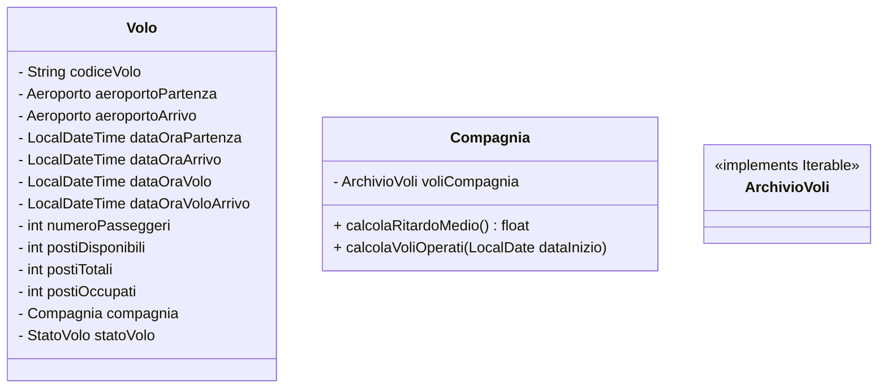

## Testo d'esame

## Grafico Classi

```mermaid
classDiagram
    class Volo{
        - String codiceVolo
        - Aeroporto aeroportoPartenza
        - Aeroporto aeroportoArrivo
        - LocalDateTime dataOraPartenza
        - LocalDateTime dataOraArrivo
        - LocalDateTime dataOraVolo
        - LocalDateTime dataOraVoloArrivo
        - int numeroPasseggeri
        - int postiDisponibili
        - int postiTotali
        - int postiOccupati
        - Compagnia compagnia
        - StatoVolo statoVolo
    }

    class Compagnia{
        - ArchivioVoli voliCompagnia
        
        + calcolaRitardoMedio() float
        + calcolaVoliOperati(LocalDate dataInizio)
    }

    class ArchivioVoli{
        <<implements Iterable>>
    }

```